# Détection de la dégradation continue (CODED)

## 1 Contexte

### 1.1 Dégradation des forêts

Il n'existe pas de définition mondialement reconnue de la dégradation des forêts, mais elle peut généralement être définie comme une perturbation dans une forêt qui réduit la biomasse, la productivité écologique et/ou la couverture de la canopée, mais qui n'entraîne pas de conversion de la couverture du sol. 

Dans le contexte des inventaires nationaux de gaz à effet de serre, la dégradation des forêts représente une source de perte de carbone au même titre que la déforestation. Parmi les exemples d'activités qui provoquent la dégradation des forêts, on peut citer l'exploitation sélective, les feux de forêt non naturels et la collecte de bois de chauffage à usage domestique. 

Si la déforestation a fait l'objet d'un débat très intense à l'échelle mondiale, la dégradation des forêts contribue également de manière significative aux émissions de gaz à effet de serre et réduit la capacité des forêts à fournir des produits et services essentiels et à atténuer le changement climatique. Cependant, la surveillance de la dégradation des forêts à l'échelle nationale et régionale s'est avérée difficile. Par conséquent, elle est fréquemment omise des inventaires nationaux de gaz à effet de serre et représente une source d'émissions de carbone et de dommages écologiques largement sous-estimée. 

Ce tutoriel présente une méthodologie de monitoring de la dégradation des forêts appelée Détection de la dégradation continue (CODED). La CODED a été créée dans le but spécifique de détecter la dégradation des forêts qui, comme nous le verrons dans les sections suivantes, s'est avérée difficile à mettre en œuvre en utilisant les approches traditionnelles de détection des changements. L'application du CODED est réalisée sur Google Earth Engine et démontrée dans le cadre d'études de cas en Colombie, au Mozambique et au Cambodge.  


## 2 Objectifs d'apprentissage

À la fin de tutoriel, vous serez en mesure de:

* Identifier les facteurs communs de dégradation des forêts sur des images satellite de moyenne à haute résolution. 
* Effectuer une analyse du mélange spectral avec des images optiques et calculer l'indice de fraction de différence normalisée (NDFI). 
* Paramétrer le CODED pour cibler différentes dynamiques de perturbation, différents types de forêts et la disponibilité des dates. 
* Utiliser le CODED pour créer des cartes de la dégradation et de la déforestation.

L'utilisation avancée comprendra également :

* Le post-traitement des résultats du CODED pour augmenter la précision de détection des changements.
* L'application d'une version modifiée du CODED pour utiliser l'imagerie radar Sentinel-1. 

### 2.1 Prérequis 

* Concepts de Google Earth Engine (GEE)
    * Obtenir un compte utilisateur
    * Manipulation des images dans GEE
    * Syntaxe de base des fonctions
    * Traitement de base des images, y compris le choix des images, le filtrage des nuages, la mosaïque et la composition.

> NOTE : Reportez-vous au processus "Pré-traitement" et à l'outil "GEE" ici sur OpenMRV pour plus d'informations et de ressources pour travailler dans Google Earth Engine. 

## 3 Tutoriel: Détection de la dégradation continue (CODED)

### 3.1 Motivation

En l'absence d'un inventaire de terrain robuste, la seule façon de le faire est d'utiliser les images d'observation de la terre, mais la dégradation des formes qui se produit dans le paysage apporte des considérations techniques qui doivent être prises en compte. Pour commencer, toute approche automatisée de la classification de ces images satellites contiendra inévitablement des erreurs. Ces erreurs peuvent provenir de nombreux facteurs, notamment des nuages non masqués et des ombres de nuages, des données manquantes (par exemple, en raison du problème de correction des lignes de balayage de Landsat 7) et des erreurs de classification (par exemple, une mauvaise classification de la couverture du sol). Nous savons également que les tropiques humides sont particulièrement sensibles aux données manquantes ou contaminées en raison des nuages. 

Bien que ce problème ne soit pas propre à la cartographie de la dégradation des forêts, il est important de tenir compte de ce contexte lorsque l'on tente d'automatiser une approche de surveillance de grandes zones. Ci-dessous, nous pouvons voir quelques années d'images Landsat dans une forêt exploitée en République centrafricaine. L'objectif est d'extraire des informations significatives sur les changements dans la forêt, malgré le fait que presque toutes les images soient partiellement ou entièrement couvertes par des nuages ou des données manquantes. Toute approche efficace pour cartographier les perturbations dans ce paysage doit tenir compte des observations bruitées tout en étant sensible aux changements subtils de la canopée forestière. 


Il existe de nombreuses approches pour traiter les observations bruitées, telles que le filtrage, la composition et la correction atmosphérique. Cependant, les approches basées sur le filtrage ou le lissage des données d'entrée ne sont pas bien adaptées à la détection de la dégradation, car celle-ci est souvent visible pendant une courte période et sur de petites zones. Notez l'exemple ci-dessous d'un incendie en Amazonie brésilienne. Le pixel surligné en rouge se trouve dans une forêt qui a brûlé vers 2008. Les signes de cet incendie ne sont pas visibles beaucoup plus tard en raison de la régénération. 


Si l'on reprend l'exemple de la République centrafricaine, on peut voir à quel point les dommages causés par la dégradation peuvent être éphémères. Ici, nous pouvons voir des signes d'exploitation forestière sur des images haute résolution de la planète. Cependant, quelques mois plus tard, la forêt s'est régénérée. La nature éphémère de la dégradation implique qu'un suivi continu est nécessaire plutôt qu'une analyse ou une composition à une seule date.


En outre, la dégradation des forêts se produit souvent à une échelle spatiale inférieure à l'échelle nominale de ces images, ce qui signifie que le lissage spatial, dans le but de réduire le bruit, peut encore mélanger des signaux de forêts stables et perturbées. Par exemple, voici un exemple d'exploitation forestière sélective aux Fidji. Bien que des chemins d'exploitation forestière soient visibles sur les images à haute résolution, la majorité du paysage reste forestière sur les images à résolution moyenne. 


Ces exemples montrent comment la nature même de la dégradation des forêts représente un défi important pour la cartographie utilisant les approches traditionnelles de l'analyse par télédétection. 

### 3.2 Suivi du changement

Ces dernières années, la communauté de suivi des modifications du sol a de plus en plus adopté l'idée que l'analyse des séries chronologiques peut atténuer bon nombre des problèmes qui se posent dans l'analyse à une seule date. Les approches par séries chronologiques permettent de suivre les tendances dans le temps, ce qui aide à distinguer les changements subtils de ceux qui sont bruités et à caractériser les changements tant abrupts que progressifs. Si le suivi des changements a une longue histoire dans des domaines tels que l'économétrie, le traitement des signaux, la reconnaissance des formes, la modélisation et les prévisions environnementales, l'application dans le domaine de la télédétection est relativement nouvelle. 

Les approches de suivi du changement par séries chronologiques ont grandement bénéficié de quelques développements dans les milieux de la télédétection, notamment :

  *  Accès gratuit et ouvert aux données d'agences telles que l'USGS, la NASA, l'ESA et la JAXA.
  * Des archives de données cohérentes et répétées s'étendant sur plusieurs années ou décennies.
  * Des environnements de cloud computing à haute performance tels que Google Earth Engine et Amazon Web Services.
  * Méthodologies de détection des changements basées sur des séries chronologiques de données volumineuses.
  * Prétraitement standardisé à l'appui des collectes de données. 

Les premières applications notables de l'analyse des séries chronologiques pour la surveillance des changements  comprennent LandTrendr (Kennedy et al., 2010), BFAST (Verbesselt et al., 2010), Vegetation Change Tracker<sup> </sup>(Huang et al., 2010), and Continuous Change Detection and Classification<sup> </sup>(Zhu and Woodcock, 2014). Ces approches présentent des avantages uniques et ont contribué à jeter les bases du CODED.

### 3.3 Aperçu des algorithmes

La méthodologie du CODED comporte trois composantes principales (voir Bullock et al., 2020 pour plus d'informations) :

1. Le prétraitement de l'imagerie optique pour masquer les nuages et transformer la réflectance en images de fraction spectrale des membres. 
2. Détection des changements à l'aide d'une détection de rupture basée sur la régression.
3.  Attribution de changement en déforestation ou dégradation en utilisant des données de training et un classificateur d'apprentissage machine. 

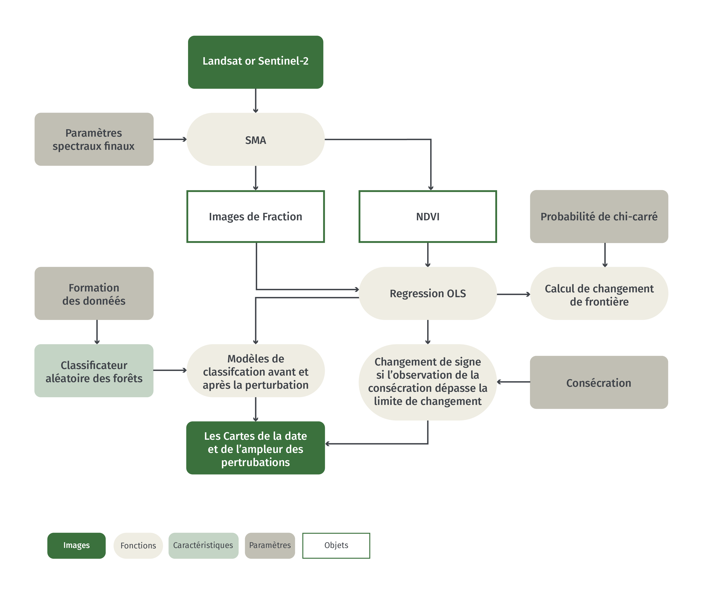

### 3.4 Analyse des mixages spectraux

Au cours du prétraitement, les données d'entrée sont transformées en images fractionnées des membres  (**les composantes spectrales**)à l'aide de l'analyse du mixage spectral (SMA). Il a été démontré dans divers environnements que le non-mélange spectral est sensible aux changements de sol sous le pixel, ce qui le rend idéal pour la détection des événements de dégradation à petite échelle. L'application de la SMA pour cartographier la dégradation a été démontrée en Amazonie brésilienne dans les travaux du Dr Carlos Souza Jr (par exemple, Souza et al., 2005) qui a introduit le modèle de mélange utilisé par défaut dans le CODED. 

Le modèle SMA utilisé dans le CODED transforme la réflectance en proportion à l'échelle du pixel de la végétation verte (GV), du sol, de la végétation non photosynthétique (NPV), de l'ombre et du nuage. Ces couches peuvent ensuite être utilisées pour calculer l'indice de fraction de différence normalisé (NDFI), qui est une transformation d'image fractionnaire introduite pour la première fois dans Souza et al. (2005) et dont la sensibilité aux dommages sub-pixels causés par l'exploitation forestière ou les incendies a été démontrée. 


**Essayez-le vous-même**

Avant de se lancer dans l'utilisation plus complexe du CODED, il est intéressant de regarder les résultats des images fractionnées du SMA sur des images individuelles. Le code Javascript suivant peut être utilisé dans le moteur Google Earth Engine. Le code complet pour SMA peut être trouvé dans le registre [Open-MRV](https://code.earthengine.google.com/?accept_repo=users/openmrv/MRV) dans le fichier "OpenMRV_français/Part2/CODED_fr/Unmix_fr". Vidéo complémentaire [ici](https://youtu.be/lOv88wkyEnY).

Tout d'abord, chargez une image Landsat 8 pour une région d'étude en Colombie et ajoutez-la à la carte. La zone d'étude est définie comme une collection de caractéristiques dans la variable "studyArea".

```javascript
var studyArea = ee.FeatureCollection('users/openmrv/MRV/ColombiaRectangle')

Map.addLayer(studyArea)
Map.centerObject(studyArea)
```

Ensuite, nous pouvons charger la collection Landsat 8 et appliquer le masque de nuage en utilisant une fonction définie 'maskL8sr'. 

```javascript
var landsat8 = ee.ImageCollection("LANDSAT/LC08/C01/T1_SR").filterBounds(studyArea)


function maskL8sr(image) {
  var bandList = ['B2', 'B3', 'B4', 'B5', 'B6', 'B7']
  var nameList = ['BLUE', 'GREEN', 'RED', 'NIR', 'SWIR1', 'SWIR2']
 
  var cloudShadowBitMask = 1 << 3;
  var cloudsBitMask = 1 << 5;
  var qa = image.select('pixel_qa');
  var mask = qa.bitwiseAnd(cloudShadowBitMask).eq(0)
	.and(qa.bitwiseAnd(cloudsBitMask).eq(0));
 	 
  return image.updateMask(mask).divide(10000)
	.select(bandList).rename(nameList)
	.copyProperties(image, ["system:time_start",'CLOUD_COVER']);
}

var l8Masked = landsat8.map(maskL8sr)
```

Pour trouver une image relativement exempte de nuages pour appliquer le SMA, nous pouvons trier la collection par 'CLOUD_COVER' la propriété des métadonnées et l'utilisation de la première image de la collection (c'est-à-dire l'image ayant la valeur la plus faible pour 'CLOUD_COVER'). 


```javascript
var l8Image = l8Masked.sort('CLOUD_COVER',true).first()
Map.addLayer(l8Image.select(['RED','GREEN','BLUE']), {min: 0, max: .14}, 'RGB Image')
```

Notez que l'image ne recouvre que partiellement notre zone d'étude. Pour cet exercice, cela ne pose pas de problème, car le but est juste de regarder n'importe quelle image d'une seule fraction. Pour ce faire, nous pouvons calculer des images de fraction en utilisant les composantes spectrales définis dans Souza et al. 2005 et ajouter chaque fraction à la carte.

```javascript
// Définir les composantes spectrales  en unités de réflectance
var endmembers = {
  gv: [.0500, .0900, .0400, .6100, .3000, .1000],
  shade: [0, 0, 0, 0, 0, 0],
  npv: [.1400, .1700, .2200, .3000, .5500, .3000],
  soil: [.2000, .3000, .3400, .5800, .6000, .5800],
  cloud: [.9000, .9600, .8000, .7800, .7200, .6500],
}

// Définir des palettes de couleurs pour la visualisation

var palettes = {
  gv: ['##ffffcc','##c2e699','##78c679','##31a354','##006837'],
  shade: ['##f7f7f7','##cccccc','##969696','##636363','##252525'],
  npv: ['##ffffb2','##fecc5c','##fd8d3c','##f03b20','##bd0026'],
  soil: ['##ffffd4','##fed98e','##fe9929','##d95f0e','##993404'],
  cloud: ['##ffffcc','##a1dab4','##41b6c4','##2c7fb8','##253494'],
  ndfi: ['##d73027','##fc8d59','##fee08b','##ffffbf','##d9ef8b','##91cf60','##1a9850']
}

// Procéder au démixage sur l'image Landsat 8.  
var unmixedImage = ee.Image(l8Image).unmix({
  endmembers: [endmembers.gv, endmembers.shade, endmembers.npv, endmembers.soil, endmembers.cloud],
  sumToOne: true,
  nonNegative: true
}).rename(['GV', 'Shade', 'NPV','Soil','Cloud'])

// Ajouter chaque image fractionnée à la carte pour chaque membre ou compsoante spectrale
Map.addLayer(unmixedImage.select('GV'), {min: 0, max: .6, palette: palettes.gv}, 'GV')
Map.addLayer(unmixedImage.select('Shade'), {min: 0, max: .6, palette: palettes.shade}, 'Shade')
Map.addLayer(unmixedImage.select('NPV'), {min: 0, max: .6, palette: palettes.npv}, 'NPV')
Map.addLayer(unmixedImage.select('Soil'), {min: 0, max: .6, palette: palettes.soil}, 'Soil')

Finally, we can calculate NDFI on the endmember fraction images and add the NDFI data to the map. 

var ndfi = unmixedImage.expression(
  '((GV / (1 - SHADE)) - (NPV + SOIL)) / ((GV / (1 - SHADE)) + NPV + SOIL)',
  {'GV': unmixedImage.select('GV'),
  'SHADE': unmixedImage.select('Shade'),
  'NPV': unmixedImage.select('NPV'),
  'SOIL': unmixedImage.select('Soil')}
)

Map.addLayer(ndfi, {min: 0, max: 1, palette: palettes.ndfi}, 'NDFI')

The example below is a zoom-in the results that can be navigated to by defining the image boundary as a geometry:


var geo = ee.Geometry.Polygon(
    	[[[-73.84809238658222, 2.093131559229626],
      	[-73.84809238658222, 2.047928319636153],
      	[-73.8027737830666, 2.047928319636153],
      	[-73.8027737830666, 2.093131559229626]]])

Map.centerObject(geo)
```

Notez la parcelle  perturbée au milieu de la géométrie. Les pixels clairement non forestiers ont une forte valeur de NDFI (rouge), faible Shade (blanc),  élevée  NPV (rouge) et modérée (vert clair), tandis que les pixels de forêt dégradée sur la droite ont un indice NDFI modéré (jaune), et la forêt dense a un indice NDFI élevé (vert), un GV élevé (vert) et levée shade (black). 


### 3.5 Trajectoires temporelles

CODED effectue un SMA pour chaque image Landsat disponible dans la région étudiée. Il effectue ensuite la détection des changements en utilisant les trajectoires des séries temporelles NDFI. Voyons quelques exemples de ce à quoi ressemblent les séries temporelles des NDFI pour la dégradation et la déforestation. Notez que dans ces figures, l'axe des y est mis à l'échelle de 10 000. 

Le NDFI est élevé (~1) pour les forêts denses, plus faible (0-1) pour les forêts ouvertes ou dégradées, et le plus faible (-1 - 0) pour les paysages non végétaux. La figure suivante montre la trajectoire du NDFI pour un événement de déforestation. Dans chacun des exemples suivants, les lignes verticales rouges et vertes sur la parcelle représentent respectivement l'année de l'événement de déforestation ou de dégradation. Notez qu'avant l'événement de déforestation, le NDFI est d'environ 1 car il s'agit d'une forêt dense et stable. Après la conversion de la forêt en pâturage, Le NDFI chute brusquement et oscille entre -1 et 1 selon les saisons. 

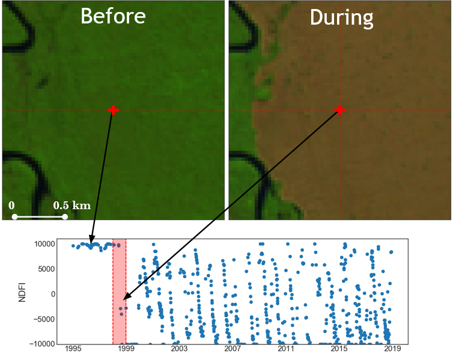

Comparons maintenant cela avec un exemple de dégradation due à l'exploitation forestière sélective. Notez que la variation de NDFI due à la perturbation est relativement faible, et qu'il y a un signal clair de reprise dû à la régénération des forêts.

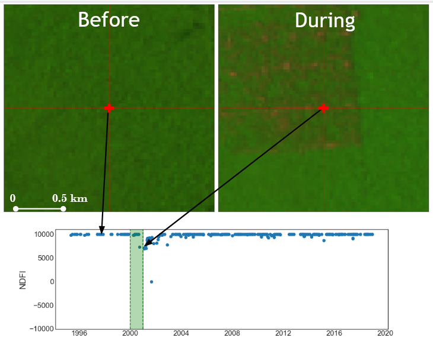

Finalement, nous voyons dans la figure suivante un exemple de forêt touchée par un incendie. Notez qu'ici, les dommages causés à la canopée ont été plutôt dramatiques, comme le montre la forte réduction du NDFI après la perturbation. Cependant, il y a une fois de plus un signal clair de régénération et il ressort clairement de la série chronologique qu'il n'y a pas eu de conversion de la couverture des sols


**Essayez-le vous-même**

Il est relativement simple de tracer les trajectoires temporelles du NDFI sur Google Earth Engine. Cela peut être un exercice utile pour comprendre l'historique de l'utilisation des sols d'un lieu, en plus de la réponse spectrale aux changements du paysage. Pour ce faire, il est nécessaire de calculer d'abord l'indice NDFI pour toute une collection d'images, puis de définir une fonction permettant de tracer l'indice NDFI à l'endroit choisi sur la carte. 

**Note** : Ce code peut être trouvé dans le repo MRV ouvert dans le script "COpenMRV_français/Part2/CODED_fr/Unmix Time Series_fr". Vidéo complémentaire [ici](https://youtu.be/chr626cFl78).

```javascript
// Définir une fonction pour SMA et  NDFI
var unmixAndNDFI = function(image) {
  var unmixedImage = ee.Image(image).unmix({
	endmembers: [endmembers.gv, endmembers.shade, endmembers.npv, endmembers.soil, endmembers.cloud],
	sumToOne: true,
	nonNegative: true
  }).rename(['GV', 'Shade', 'NPV','Soil','Cloud'])
 
  var ndfi = unmixedImage.expression(
	'((GV / (1 - SHADE)) - (NPV + SOIL)) / ((GV / (1 - SHADE)) + NPV + SOIL)',
	{'GV': unmixedImage.select('GV'),
	'SHADE': unmixedImage.select('Shade'),
	'NPV': unmixedImage.select('NPV'),
	'SOIL': unmixedImage.select('Soil')}
  ).rename('NDFI')
  return image.addBands([unmixedImage, ndfi])
}

// Faire une itération sur la collection Landsat 8 et calculer  NDFI
var ndfiCollection = l8Masked.map(unmixAndNDFI).select('NDFI')
```

The following code demonstrates how you can create a geometry from the location clicked on the map ("var point"), and plot the NDFI time series ("var chart") for all data intersecting that location. The plots have a callback function that will load the corresponding image to the map when an observation is selected on the plot. 

```javascript
// Fonction permettant de faire un graphique NDFI à l'endroit choisi par clic 
var makeImagePlot = function(col, region){
  var chart = ui.Chart.image.series(col, region, ee.Reducer.mean(), 30)
	.setOptions({
  	lineWidth: 0,
  	pointSize: 6,
 	});
	 
  // Fonction de rappel pour ajouter l'image cliquée à la carte.  
  chart.onClick(function(x, y, sName) {
	if(x) {
  	var im = l8Masked.filterMetadata('system:time_start','equals',x)
  	Map.addLayer(im.select(['RED','GREEN','BLUE']), {min: 0, max: .14}, 'Image ' + x)
	}
    
  });
  print(chart)
}

// Fonction de rappel en cliquant sur la carte. 
Map.onClick(function(coords) {
  var point = ee.Geometry.Point([coords.lon, coords.lat])
  makeImagePlot(ndfiCollection, point)
  Map.addLayer(point)
})

```

Pour aider à comprendre la réponse du NDFI aux différents événements de dégradation, nous avons constitué une bibliothèque de points d'exemples à travers le monde. Ces exemples continueront d'être mis à jour et montreront à quoi ressemble la série chronologique des différents événements de dégradation du NDFI dans différents environnements. 

**Essayez vous-même**

Un visualiseur de séries chronologiques des exemples de dégradation se trouve dans le répertoire "OpenMRV" dans le fichier "OpenMRV_français/Part2/CODED_fr/Time Series Examples_fr" : 

Une fois que vous avez chargé le script dans GEE, cliquez sur le bouton "Run" pour initialiser l'interface utilisateur graphique.

Il s'agit d'un outil relativement simple qui permet uniquement de visualiser des séries temporelles NDFI prédéfinies. Nous avons manuellement étiqueté le type de perturbation, qui peut être sélectionné à l'aide du premier menu déroulant. Le deuxième menu déroulant définit l'étendue de l'image à utiliser lors de l'ajout d'une image Landsat à l'interface cartographique. 

L'image ci-dessous décrit les fonctionnalités de l'outil :

Le type de perturbation peut être sélectionné à l'aide du premier menu déroulant. 
L'utilisateur peut naviguer dans les exemples en utilisant les boutons "Suivant" et "Précédent" dans le widget "Navigateur". 
Pour chaque série chronologique, les séries chronologiques correspondantes de NDFI  et de la SMA sont affichées à droite. En sélectionnant une observation sur la série temporelle, l'image correspondante sera chargée sur la carte.L'étendue de l'image peut être modifiée à l'aide du deuxième menu déroulant. 


L'exemple précédent est le même que celui utilisé dans l'introduction. Il s'agit d'un signal de dégradation typique dans une forêt tempérée avec de nombreuses observations Landsat. Avant la perturbation, l'indice NDFI est très stable et se situe autour de 1. Il y a une diminution évidente de l'indice NDFI pendant environ un an, mais la forêt se régénère rapidement et l'indice NDFI semble similaire à la forêt d'avant la perturbation vers 2012. 
Examinons quelques autres exemples tirés de cet outil de manière un peu plus détaillée.  L'exemple suivant montre une exploitation forestière sélective. Notez le changement bref et minime de NDFI dû à la perturbation. 


L'exemple suivant montre un premier défrichement pour l'exploration minière. Comme les arbres de la forêt sont entièrement défrichés, le signal de NDFI est spectaculaire. Cependant, le pixel est capable de se régénérer rapidement après le défrichement initial et, en deux ans,NDFI revient à un niveau similaire à celui d'avant la perturbation. 


Comparez l'exemple précédent d'une mine qui se régénère sous forme de forêt à l'exemple suivant d'une mine permanente. Notez que dans cet exemple, il n'y a aucun signe de régénération.


### 3.6 Détection des changements

Les modèles de régression sont utilisés pour prévoir les observations dans une fenêtre mobile. Si les résidus des observations dans la fenêtre dépassent une valeur critique, alors un changement est détecté. Notez que sous les triangles se trouvent les observations dans la fenêtre mobile. Les triangles bleus sont les observations prévues, tandis que les triangles jaunes et rouges représentent respectivement les changements de faible et de forte magnitude. Le processus se répète ensuite avec un nouvel ajustement de régression aux observations suivantes. 


Paramètres de détection des changements

La composante de détection des changements comporte deux paramètres importants, qui sont tous deux équivalents aux paramètres portant le même nom dans la mise en œuvre GEE de la détection et de la classification continues des changements (CCDC). CCDC est un algorithme de suivi des changements similaire qui est plus général à tous les types de changement de couverture et d'utilisation des sols. Le CODED peut être considéré comme une version modifiée du CCDC qui utilise le démixage spectral pour cibler les changements dus aux perturbations des forêts. 
Le premier paramètre de détection des changements, Consec, définit le nombre d'observations consécutives dépassant un seuil de changement nécessaire pour déclencher un changement. Si Consec = 5, alors il doit y avoir cinq observations consécutives dépassant le seuil de changement pour déclencher un changement.  Une valeur de Consec inférieure est recommandée pour les zones d'étude où les données sont peu disponibles ou pour trouver des changements qui sont visibles d'en haut pendant une courte durée. Un exemple de ce dernier cas serait un événement d'enregistrement sélectif qui, en raison de la régénération de la canopée, ne peut être vu d'en haut que pendant quelques semaines ou mois. La réduction du paramètre Consec peut aider à trouver des changements, mais rendra également les résultats plus susceptibles d'erreurs de mise en service dues à des nuages non masqués ou à des ombres de nuages. 
Le deuxième paramètre de détection des changements définit la statistique du test de changement et le seuil de changement. La statistique du test de changement <i>f<sub>i,mn</sub></i> pour le modèle m et l'observation yi peut être définie comme suit : 


Où  <i>y<sub>p</sub></i> est la valeur prédite de l'indice NDFI au moment <i>i</i>  et <i>RMSE<sub>m</sub></i>  est la moyenne quadratique de l'erreur du modèle de régression  *m*.  Une observation est identifiée comme un changement potentiel si : 

&space;*&space;-1))

Dans laquelle *chi2 ppf* est la fonction de densité de probabilité du *chiSquareProbability* avec 1 degré de liberté. Un changement est alors signalé s'il y a des observations de changement potentiel *Consec* dans une rangée. Un changement n'est détecté que lorsque  f<sub>i,mn</sub> est inférieur au  chi2 ppf négatif car le CODED ne signale que les changements qui entraînent une diminution de  NDFI (c'est-à-dire qui contiennent un test  statistique important et négatif). 
Une *chiSquareProbability* inférieure a pour effet d'augmenter la sensibilité du CODED au changement, ce qui permet de trouver plus de changements qu'en utilisant une *chiSquareProbability* supérieure.


### 3.7 Modification de l'attribution

Les perturbations sont attribuées à la déforestation ou à la dégradation en fonction d'occupation  des sols après la perturbation. S'il y a une conversion de la forêt en zone non forestière (par exemple, pâturages, habitats ou agriculture), la perturbation est considérée comme une déforestation. Si la régénération commence après la perturbation et qu'il n'y a pas de conversion de la couverture du sol, alors la perturbation est qualifiée de dégradation. Ce processus d'attribution peut généralement être décrit selon l'organigramme suivant :


## 4 Tutoriel: Exécution de CODED avec une interface utilisateur graphique

Le CODED peut être exécuté à l'aide d'une interface utilisateur graphique (GUI) appelée "OpenMRV_français/Part2/CODED_fr/Forest Disturbance Mapping GUI_fr", qui se trouve dans le [dépôt MRV](https://code.earthengine.google.com/?accept_repo=users/openmrv/MRV) ouvert. Notez que la version dans le répertoire est un "snapshot" dans le temps et la version la plus récente peut être trouvée ici : [https://coded.readthedocs.io](https://coded.readthedocs.io). 

**Note:** L'outil dépend également de bibliothèques externes. Si vous recevez une erreur "Cannot find required repo" qui indique qu'un lien vers un répertoire est rompu. Si c'est le cas, veuillez vous référer à la page CODED ReadTheDocs. 

Cette section donne un aperçu de l'application et de ses fonctionnalités, et la section suivante présente des exemples d'utilisation de l'application. Notez que les utilisateurs doivent utiliser cette section comme référence et suivre les exemples de la Colombie, du Cambodge et du Mozambique. 

Après avoir ajouté le repo, vous devriez voir un dossier "coded" dans votre panneau "Scripts" sous "Reader" :

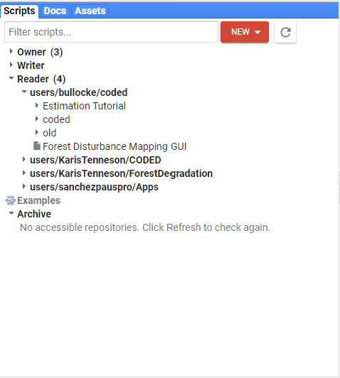

La figure 1 est une image de ce à quoi doit ressembler votre écran. Si vous ne la voyez pas, naviguez jusqu'à l'onglet "Scripts" dans le coin supérieur gauche de l'interface GEE. Développez l'onglet Reader, puis cliquez sur le script appelé **Forest Disturbance Mapping GUI**. 

Vous devrez peut-être ensuite cliquer sur Exécuter pour lancer le script à charger dans le navigateur. Notez qu'il peut prendre quelques instants pour que l'interface graphique apparaisse dans le navigateur. 


Ensuite, il vous demandera de choisir votre langue. Une fois la langue choisie, votre navigateur devrait ressembler à la figure suivante, mais B, D et E ne s'afficheront qu'après l'exécution de CODED.


Comme on peut le voir dans la figure 1, la demande contient divers éléments qui sont étiquetés selon les lettres entre parenthèses ci-dessous :

**Paramètre panel (A)**

*   On the right of the screen is the parameter panel. This panel contains widgets that control all aspects of the mapping process including the input data, pre-processing, change detection parameters, post-processing, visualization, and exporting.

**Panneau de cartes (B)**

*   La carte affiche les résultats de la détection des changements et peut être utilisée de manière interactive pour définir la zone d'étude à l'aide des commandes de la carte et afficher les trajectoires historiques des lieux choisis. 

**Panneau de Contrôles (C)**

*   Les commandes de la carte contiennent deux boutons : "Dessiner la zone d'étude" et "Basculer la visionneuse de séries chronologiques". Après avoir cliqué sur le premier bouton, une importation de géométrie est créée sous le nom de "StudyArea". Utilisez cette boîte pour définir la zone d'étude de votre analyse. La zone d'étude peut être réinitialisée en cliquant sur le bouton. Le deuxième bouton est utilisé pour afficher ou supprimer le panneau de séries chronologiques de la carte.

**Time series panel (D)**

*   Le panneau des séries temporelles affiche la trajectoire temporelle de la collection définie dans le panneau des paramètres. La bande qui est visualisée peut être définie sous les paramètres de visualisation. Chaque point du diagramme de dispersion représente une observation à partir de l'endroit cliqué sur la carte. En cliquant sur un point du nuage de points, l'image correspondante sera chargée sur la carte. Les options de combinaison de bandes et d'étirement de l'image affichée peuvent être modifiées dans la section de visualisation du panneau de paramètres. 

**Onglet Tâche (E)**

*   L'onglet "Tâches" est une fonction par défaut de l'interface web GEE. Il est utilisé pour soumettre les tâches à traiter. Les tâches peuvent être utilisées pour exporter des images et des collections de caractéristiques en tant qu'actifs ou vers un stockage externe tel que Google Drive..

## 5 Tutoriel : Paramétrage

### 5.1 Masque de forêt

On peut utiliser un masque de forêt qui détermine les pixels valables pour la cartographie des perturbations des forêts. Les zones définies comme non forêts n'auront aucune perturbation cartographiée. Il existe actuellement deux approches pour définir un masque forêt/non-forêt (FNF), ou vous pouvez choisir de ne pas utiliser de masque et supposer que tous les pixels de la région étudiée peuvent potentiellement contenir une perturbation. 

**Asset**

*   La première option vous permet d'utiliser une image existante comme masque forestier/non forestier. Spécifiez le chemin d'accès à l'image dans la zone de texte qui apparaît après avoir sélectionné "Asset" dans le widget déroulant "Forest Mask".
*   L'actif du masque FNF doit avoir des valeurs de 1 indiquant des pixels (forestiers) valides, et zéro ou nul indiquant des pixels (non forestiers) invalides. 
*   Par défaut, cette option utilise la géométrie de l'image comme région d'étude. La zone d'étude peut être remplacée manuellement à l'aide du widget de sélection de la zone d'étude. 

**Global Forest Watch (GFW)**

*   La deuxième option utilise la couche de 2000 de pourcentage de couverture des forêts de l'ensemble de données de Hansen et al (2013)/Global Forest Watch. Cette option vous oblige à définir manuellement la zone d'étude (section suivante).
*   La couche GFW est exprimée en unités de pourcentage de couverture des forêts pour l'année 2000. Après avoir sélectionné "GFW" dans le menu déroulant, indiquez la couverture de arbres minimale à considérer comme une forêt. Tous les pixels qui n'atteignent pas ce seuil sont affectés à la classe non forêt. 
*   Il existe une option permettant de "masquer avant la date de début". Ce masquage est effectué à l'aide des couches "perte de couverture de l'arbre" et "année" de GFW . L'objectif est de transformer tous les pixels cartographiés comme "perte de couverture forestière" avant la "date de début" en zones non forestières. En d'autres termes, si votre date de début est 2005, et que les cartes de l'ensemble de données de GFW changent entre 2000 et 2005, alors ces pixels ne seront pas inclus dans le masque de la forêt.  

### 5.2 Définir un domaine d'étude et une période de temps

*   La zone d'étude est définie en appuyant sur le bouton avec le texte "Draw Study Area’" sur le côté gauche de la carte (Figure 1). Une fois que vous avez appuyé sur ce bouton, une géométrie intitulée "StudyArea’" apparaît dans les importations de géométrie. Utilisez la carte pour dessiner une boîte de délimitation, qui sera l'étendue de l'analyse. 

**Conseil**: Une grande zone d'étude peut entraîner une perte de temps dans le calcul. Si cela se produit, essayez d'exporter les résultats en soumettant une tâche (voir la section Exportation ci-dessous).

<table>
  <tr>
   <td>

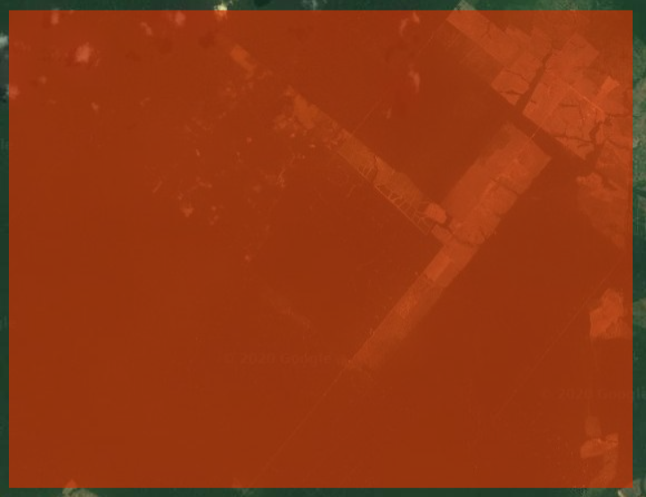

   </td>
   <td>


   </td>
  </tr>
  <tr>
   <td colspan="2" ><em>Un exemple de zone d'étude définie par la couche d'importation de géométrie "StudyArea" (à gauche) et le masque FNF correspondant utilisant l'option GFW avec un seuil de couverture des arbres de 80% (à droite). </em>
   </td>
  </tr>
</table>


*   Dans le panneau des paramètres (figure 1, A), vous pouvez spécifier les dates de début et de fin de l'analyse. Ces dates permettront de filtrer les données utilisées pour la détection des changements. Le lien "Jump to date" permet de sélectionner une date sur un calendrier. 


### 5.3 Inputs

*   Actuellement, l'application permet d'utiliser les données Landsat, Sentinel 2 ou Sentinel-1 comme base pour la détection et l'attribution des changements. Les entrées appropriées à utiliser pour votre étude dépendent des spécificités de votre étude et des données disponibles dans votre zone d'étude. De manière générale, Landsat sera plus sensible aux perturbations subtiles dans les zones disposant de données suffisantes, mais il est sujet à des données masquées ou faussées en raison des nuages.
*   Chaque collection d'entrée peut être filtrée par jour julien (DOY). Par exemple, un "Start DOY" de 152 et une "End DOY" de 244 utiliseront toutes les images entre le 1er juin et le 1er septembre et dans les années de la période d'étude. 
*   Les collections peuvent également être "lissées" temporellement à l'aide d'un ee.Reducer en sélectionnant les paramètres "Filtre temporel" et "Taille du filtre temporel". Par exemple, un "filtre temporel" de "moyenne" et de "taille du filtre temporel" de 2 créerait des composites sur 14 jours en calculant la moyenne de chaque pixel pour toutes les données de la période de 14 jours. 

### 5.4 Détection des changements

Le CODED peut être modifié à l'aide de trois paramètres : Ces paramètres sont affichés après avoir sélectionné "CODED" pour la méthode de détection des changements. 

<table>
  <tr>
   <td><strong>Paramètre</strong>
   </td>
   <td><strong>Description</strong>
   </td>
  </tr>
  <tr>
   <td>chiSquareProbability
   </td>
   <td>La probabilité chi-carré de détecter un changement [0-1]. 
   </td>
  </tr>
  <tr>
   <td>Consecutive Obs
   </td>
   <td>## observations consécutives au-delà de la probabilité de changement pour signaler un changement
   </td>
  </tr>
  <tr>
   <td>Change Band
   </td>
   <td>Bande à utiliser dans le test de détection des changements. Actuellement, seul le NDFI est pris en charge. 
   </td>
  </tr>
</table>

### 5.5 Changer l'attribution

**Échantillonnage**

*   Avec cette méthode, le masque FNF est échantillonné et utilisé comme données d'entraînement pour classer le segment de temps après la première perturbation. Les labels de classe sont définis à partir du masque FNF, tandis que les données prédictives sont échantillonnées à partir des résultats du CODED. 
*   Si le segment de temps après la perturbation est la forêt, la perturbation est qualifiée de dégradation. S'il ne s'agit pas d'une forêt, il s'agit alors d'une preuve de conversion de la couverture du sol et la perturbation est qualifiée de déforestation. Si le segment ne peut être classé en raison de données insuffisantes, il est alors qualifié de perturbation inconnue. 
*   Seuls deux paramètres doivent être spécifiés pour l'échantillonnage. Le premier est le nombre de points d'entraînement à attribuer à chaque classe (forestière et non forêt), et le second est l'année sur laquelle le classificateur doit se former. L'année doit se situer dans la période d'étude. Les pixels qui subissent un changement spectral ne seront pas utilisés pour l'apprentissage.
*   **Note:** Cette option doit être sélectionnée en l'absence de données d'entraînement définies manuellement. Cependant, comme elle est dérivée d'un ensemble de données mondiales, elle est susceptible d'être moins précise que la définition manuelle des données d'entraînement . 

**Données d'entraînement**

*   Avec cette méthode, les utilisateurs peuvent spécifier manuellement les données d'entraînement pour classer l'occupation du sol après la perturbation. . 
*   Cette option demande à l'utilisateur de spécifier un chemin d'accès aux données  d'entraînement sous la forme d'un ee.FeatureCollection de points avec des étiquettes d'occupation du sol. Il peut y avoir un nombre illimité de classes, mais une seule doit être une  forêt. 
*   L'année de référence représente l'année où les lieux de référence correspondent au label d'occupation des sols associé.

### 5.6 Post-traitement

*   Le post-traitement des résultats de la carte est un bon moyen de supprimer les changements parasites dus au bruit (comme les nuages non masqués) ou les changements réels qui ne sont pas dus à une perturbation. 
* Actuellement, la seule étape de post-traitement mise en œuvre est l'utilisation d'un seuil sur la grandeur des changements. L'ampleur du changement est liée au changement dans l'espace des données. Par exemple, une perturbation qui provoque un changement important de NDFI aura une ampleur de changement plus importante qu'un changement subtil qui entraîne un changement mineur de NDFI  Les unités de l'ampleur des changements sont les résidus pendant la fenêtre de changement du modèle, normalisés par l'erreur quadratique moyenne du modèle. 
* Les unités de changement de magnitude peuvent être difficiles à comprendre, mais en général, un seuil plus élevé éliminera plus de changements, et un seuil de 0 n'éliminera aucun changement.  Par exemple, une valeur de 1 filtrera les changements de très faible amplitude, tandis qu'une valeur de 8 filtrera tout sauf les changements d'amplitude élevée.

### 5.7 Visualization

**Ajouter une couche de masque de forêt**

*   Ajoutez la couche de masque Forêt/Non-forêt à la carte. Les pixels de la forêt apparaîtront en vert, tandis que ceux de la zone non forestière seront noirs. 

**Ajouter une date de séparation**

*   Ajoutez la date du premier changement détecté comme une couche sur la carte. 

**Ajouter une stratification**

*   Ajouter la stratification à la carte. 

**Centre Zoom**

*   Centrer le zoom de la carte sur la zone d'étude. 

**Résultats des masques**

*   Appliquez le masque Forest/Non-Forêt aux résultats. Toutes les zones étiquetées comme non forêts seront masquées dans les résultats. 

**Réinitialiser la carte**

*   Réinitialiser les couches de la carte. 

**Verbose**

*   Affichez les messages sur la console.

**Le Chemin de l'Asset **

*   Chemin vers une table ou une image de  Google Earth Engine qui peut être chargée sur la carte pour référence.

**Charger un asset**

*   Chargez l'asset spécifié dans le widget "Asset path" sur la carte.

### 5.8 Exportation

**Sortie brute (changement)**

*   Cela représente les sorties brutes exactement comme elles apparaissent à partir de l'algorithme de détection des changements (par exemple, CCDC). Aucun post-traitement n'est effectué, ni aucune sorte de classification de la couverture terrestre ou d'attribution des changements. 

**Information sur les changements de forêts**

*   Cela représente de multiples bandes liées aux pixels identifiés comme étant des perturbations de forêt. Les bandes contiennent la date de la perturbation (bande 1) et l'ampleur du NDFI (CODED), et du VH (Sentinel-1) (bande 2). 

**Stratification**

* Cette couche représente une stratification à bande unique de la zone d'étude en fonction des perturbations et de l'historique de la couverture terrestre sur la période d'étude. Les valeurs des pixels correspondent à la forêt stable (1), à la non forêt (2), à la déforestation (3), à la dégradation (4) et aux perturbations inconnues (5). 

**Utiliser la grille**

*   Pour les grandes zones d'étude, il est utile de répartir les tâches en sous-ensembles. Cette option divisera la zone d'étude en grilles d'environ 5x5 degrés pour permettre un traitement plus rapide. Lorsqu'on travaille à l'échelle nationale, il est recommandé d'utiliser cette option pour éviter de surcharger le système GEE.. 

### 5.9 Interprétation des résultats

**Time Series Viewer**

*   Le deuxième bouton du panneau de contrôle de la carte ("Toggle time series viewer") permet d'ajouter ou de supprimer le visualiseur de séries chronologiques de la carte.


*   La série chronologique avec l'ajustement du modèle peut être affichée pour n'importe quel endroit en cliquant sur la carte. Dans l'exemple ci-dessus, la couche de changement de date de Landsat/CODED est affichée sur la carte pour un lieu en République démocratique du Congo. 
*   Pour visualiser l'image pour une valeur de donnée spécifique sur la carte, il suffit de cliquer sur celle-ci dans la Visionneuse de séries chronologiques.
*   **Notes**
    * Le graphique peut prendre un certain temps à se générer. La fenêtre indiquera qu'elle est en cours de traitement avec le message "Processing, please wait". 
    * Si la carte n'affiche pas ce message et ne se met pas à jour, il se peut que votre curseur soit encore en mode d'édition de la géométrie - assurez-vous de désactiver l'édition de la géométrie et essayez de cliquer à nouveau sur la carte. 

**Interprétation de la carte**

*    Les couches sélectionnées dans les paramètres de visualisation seront ajoutées à la carte après avoir cliqué sur le bouton "Exécuter, Run". 

<table>
  <tr>
   <td>
<strong>Date de rupture</strong>
<br>
Vert : Forêt 
<br>
Noir : Non-forêt
<br>
Jaune (date de début) -> Rouge (date de fin)e)
   </td>
   <td><strong>Strata</strong>
<br>
Vert : Forêt 
<br>
Noir : Non-forêt
<br>
Rouge : Déforestation
<br>
Bleu : Dégradation
<br>
Jaune : Perturbation non classée
   </td>
  </tr>
  <tr>
   <td>

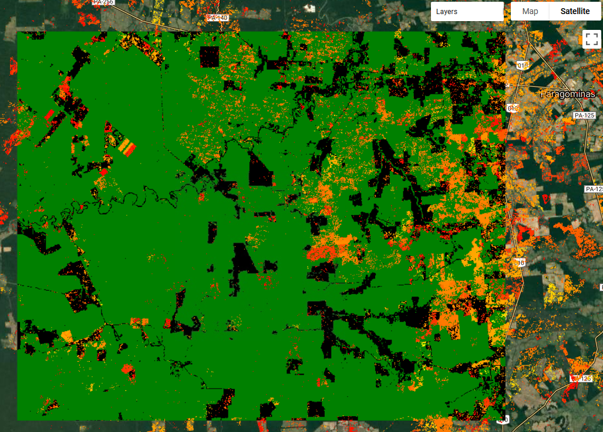

   </td>
   <td>

   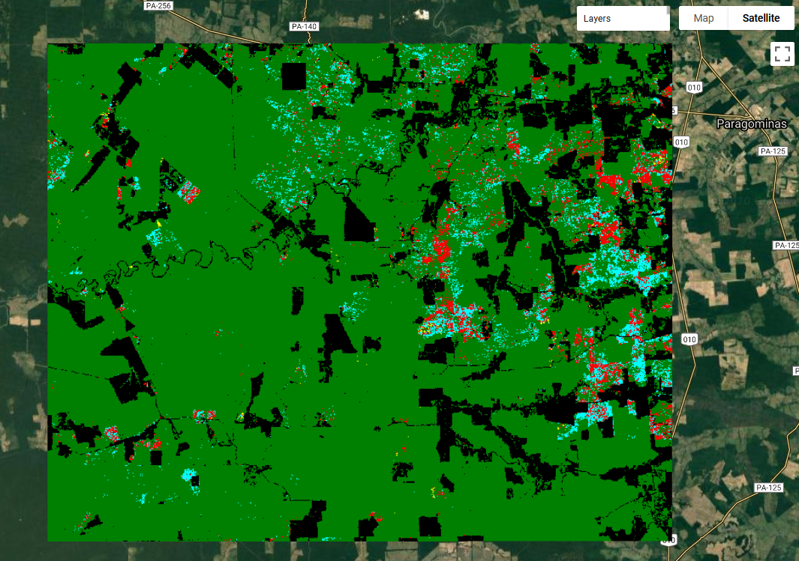
   
   </td>
  </tr>
</table>

## 6 Autres exemples : Colombie, Cambodge et Mozambique

### 6.1 Colombie

**Lancement de l'application**

1. Si vous ne l'avez pas encore fait, ajoutez le  [Open MRV repository](https://code.earthengine.google.com/?accept_repo=users/openmrv/MR) sur Google Earth Engine. 
2. Naviguez vers le script appelé  ‘OpenMRV_français/Part2/CODED_fr/Forest Disturbance Mapping GUI_fr.’ 
3. Cliquez sur  ‘Run’. 

    

4. Le panneau qui apparaît à côté de la carte permet de sélectionner une langue. Choisissez votre langue préférée. Actuellement, les seules options sont l'anglais, l'espagnol et le français. 

    

**Paramétrage**

Voici une recommandation de paramètres à utiliser basée sur le retour d'expérience. Tout peut et doit être réglé pour une analyse locale. 

- **Date de début et date de fin:** Changer les dates de début et de fin en "2000-01-01" et "2020-01-01", respectivement.
- **Masque de forêt** : Global Forest Watch (GFW) : Il utilise la couche de couverture du couvert forestier mondial  [Hansen et al. (2013)](https://doi.org/10.1126/science.1244693) pour 2000. Tout ce qui, dans la couche GFW, est supérieur à la couche seuil de la couverture forestière sera classé comme forêt.  
- **Seuil de couverture des arbres:** _80_. Ce seuil définit chaque pixel dont la couverture arborée est supérieure à 80 % comme étant une forêt.  
- **Inputs:** Utilisez _Landsat_ avec toutes les valeurs par défaut.
- **Méthode de détection des changements:** Actuellement, la seule méthode de détection des changements prise en charge par Landsat est _CODED_. Les paramètres par défaut sont bons pour les tests initiaux. 
- **Attribution des changements:** _Sample_ échantillonnera automatiquement la carte forêt/non-forêt pour l'attribution des changements. Après la détection d'un changement, les occupation du sol suivantes classées comme non forestières seront étiquetées _Déforestation_, tandis qu'une perturbation dans une forêt qui reste une forêt sera étiquetée _Dégradation_.
- **Post-traitement : ** Utilisez les paramètres de post-traitement par défaut, qui n'effectuent aucun post-traitement. 
- **Visualisation:** Permettre à _Verbose_ de lire les informations dans la console. 
- **Exportation:** _Stratification_. Comme nous travaillons sur une zone d'étude relativement petite, vous pouvez laisser l'option d'exportation à l'aide d'une grille non cochée. 

**Domaine d'étude**

1. Vous pouvez spécifier un chemin vers une table de Google Earth Engine, dont la limite sera utilisée comme zone d'étude. 
2. Sur le côté gauche de la carte, cliquez sur le bouton "Utiliser l'actif pour la zone d'étude" (voir figure ci-dessous)
3. Entrez le chemin d'accès au tableau dans la case située juste en dessous de la zone de texte sous le bouton : users/openmrv/MRV/ColombiaRectangle
4. Après avoir entré le chemin d'accès à la table, celle-ci devrait se charger sur la carte après avoir cliqué sur la carte ou appuyé sur "Entrée".  Si vous voulez confirmer le chargement, déplacez manuellement votre carte vers la Colombie et zoomez sur la zone du rectangle noir. 

    

**Exécuter le script**

1. Cliquez sur le bouton "Run" du panneau de contrôle sur la droite pour exécuter le script et afficher les résultats. Les options par défaut afficheront la date de changement de forêt et la stratification. 
2. La couche de la date de changement est affichée du début à la fin de la période d'étude, ce qui correspond au jaune au rouge de la carte. 
3. La stratification a la légende suivante (palette) :
   - Vert : Forêt stable
   - Noir : Non forestier
   - Rouge : Déforestation
   - Bleu : Dégradation
   - Jaune : Perturbation non classée
4. Les exportations peuvent être soumises comme une tâche GEE en utilisant l'onglet "Task" :

    

5. Après avoir cliqué sur "Run" dans l'onglet "Tasks" pour la tâche "Export_Stratification", donnez au fichier un nom d'exportation et cliquez sur "Run".

    

6. Après quelques minutes, vous devriez voir les couches "Change Date’" et "Stratification" ajoutées à la carte. La couche "Masque de forêt" est également disponible sur la carte.

    

7. Si jamais vous rencontrez un problème avec le chargement des résultats sur la carte, ou un chargement trop lent, vous pouvez exporter la couche "Stratification" à l'aide d'une tâche et l'ajouter à la carte.
    - Soumettre une tâche ("Export_Stratification") pour créer la stratification monocouche (comme décrit ci-dessus à l'étape 5).
    - Lorsque la tâche est terminée, elle devient bleue dans l'onglet "Task". 
    
    - Cliquez sur le point d'interrogation à droite de la boîte bleue et cliquez sur "View Asset.".
    
    - Copiez le chemin d'accès  sauvegardé dans l'asset. 
    
    - Sous "Visualisation", collez le chemin dans la case située à côté de "Chemin de l'Asset" et cliquez sur "Charger l'Asset". Trois couches doivent être ajoutées à la carte : une pour tous les pixels cartographiés comme dégradation, une pour tous les pixels cartographiés comme déforestation, et la stratification telle que stylisée avec la palette pour la légende à l'étape 3 ci-dessus.   
    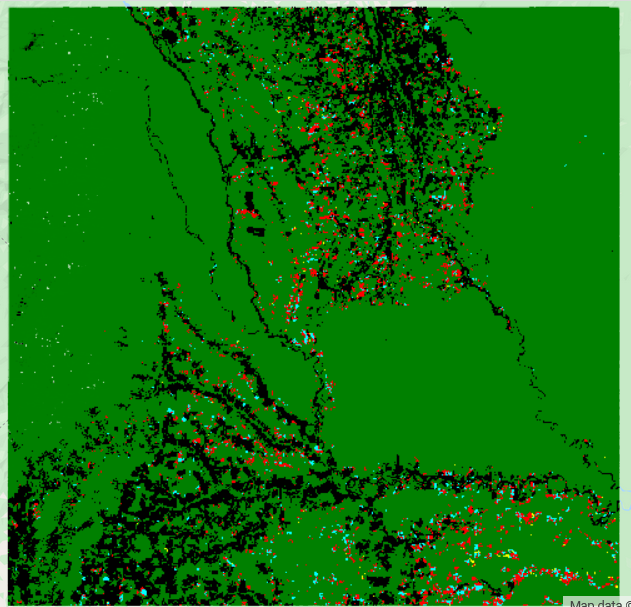
    - Sélectionnez "Toggle time series viewer" pour pouvoir cliquer sur la carte afin de visualiser les séries chronologiques de NDFI. 
    - Pour commencer à évaluer les résultats, essayez de cliquer sur la carte pour obtenir un pixel cartographié comme dégradation (bleu) ou déforestation (rouge). La série chronologique pour ce pixel devrait se charger sur la carte au bas de l'écran. Vous pouvez également utiliser les zones de texte "Y axis min/max" pour modifier l'axe des y. Quelques couches supplémentaires sont ajoutées à la carte, notamment une case indiquant l'endroit où vous avez cliqué, la collection d'images utilisée pour créer le tracé et les coefficients du modèle de régression.    
    

### 6.2  Cambodge (dans tout le pays)

L'exemple précédent a montré comment obtenir des résultats dans une petite zone d'étude en Colombie. Bien que cela soit utile pour le paramétrage car les résultats peuvent être créés rapidement, il arrive souvent que l'analyse doive être effectuée à l'échelle nationale.

#### Région d'étude

Pour ce tutoriel, nous utiliserons la limite géographique du Cambodge pour la région d'étude. Cela peut être fait de manière rudimentaire en utilisant le widget "Draw Study Area" de l'outil de cartographie en dessinant une boîte autour du pays. Mieux encore, cela peut être fait en créant une collection de éléments du domaine d'étude.

1. Ouvrez une nouvelle fenêtre de l'éditeur de code de Google Earth Engine. Une copie de ce script se trouve dans le répertoire Open-MRV intitulé "OpenMRV_français/Part2/CODED_fr/Create Cambodia boundary feature collection_fr". 
2. Chargement de la limite géographique du pays

    ```javascript
    var countries = ee.FeatureCollection("USDOS/LSIB/2017")
    ```

3. Filtrer le tableau par métadonnées pour récupérer uniquement la frontière du Cambodge

    ```javascript
    var cambodia = countries.filterMetadata('COUNTRY_NA','equals','Cambodia')
    ```

4. Ajoutez la couche à la carte et enregistrez-la dans le Asset.

    ```javascript
    Map.addLayer(cambodia)

    Export.table.toAsset({ 
          collection: cambodia,
          assetId: 'Cambodia_Extent',
          description: 'cambodia'
    })
    ```
Une fois que vous avez créé l'asset, vous pouvez utiliser l'étape suivante pour limiter la cartographie à la zone limite 

#### Paramétrage

Dans l'interface graphique "Cartographie des perturbations des forêts", définissez la zone d'étude en utilisant l'actif sauvegardé à l'étape précédente. 

1. Sélectionnez "Utiliser un atout pour la région d'études" sur le côté gauche de la demande. 
2. Copiez et collez le chemin d'accès à l'asset "Cambodia_Extent" dans la zone de texte située juste en dessous du widget "Utiliser l'asset pour la région d'étude". Après avoir navigué jusqu'au Cambodge, votre écran devrait afficher la zone d'étude chargée sur la carte :

    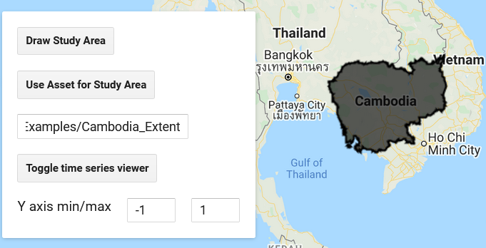

3. Pour commencer, définissez les paramètres suivants. La définition de ceux-ci nous permettra de visualiser les séries chronologiques et de régler les paramètres. 
    - début: 1er janvier 2001
    - Fin : 1er janvier 2020
    - Masque de forêt : GFW
    - Input : Landsat_ (paramètres d'entrée par défaut)
    - Détection des changements : 
    - Changer l'attribution : Échantillon (paramètres par défaut)
    - Post-traitement : Utiliser les valeurs par défaut
    - Visualisation : Ajouter une couche de masque forestier (autres non cochées)
    - Exportation : Aucune (toutes non cochées)
4. Pour identifier les zones possibles de changement des forêts, nous pouvons ajouter l'ensemble de données de Hansen sur la perte de couverture des arbres au niveau mondial (Hansen et al., 2013). 
    - Sous  _Visualization_, ajoutez le chemin ‘UMD/hansen/global_forest_change_2019_v1_7’ dans la case située à côté de  _Asset path_ et cliquez  _Load asset_. L' asset doit être ajouté à la carte.  
    - L'ensemble de données doit être chargé sur la carte sous le nom _Added Image_ sous _Layers_. 
    - Ouvrez la  _Visualization parameter_ toolbox en sélectionnant la boîte à côté du nom de la couche. 
    - Changez la visualisation en 1 bande (échelle de gris), avec la bande "lossyear", une gamme de 0 à 20, et une palette d'une couleur qui se distinguera bien sur la carte (dans l'exemple suivant, le rouge a été choisi). Cliquez sur  _Apply_. 
    
    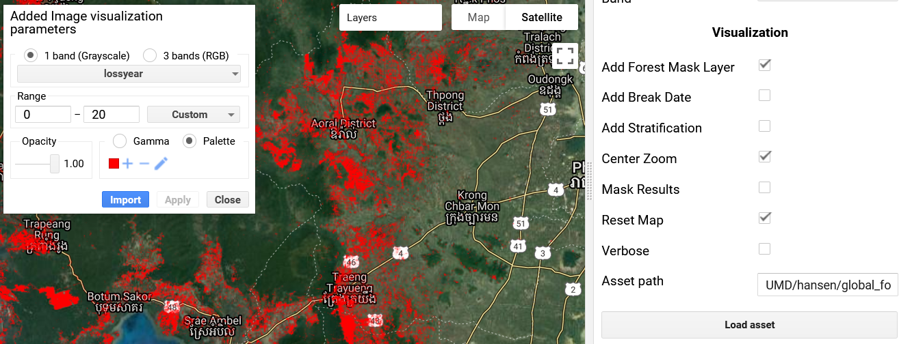

    **Note:** Cet ensemble de données n'est pas parfait et peut omettre les événements de perte de couvert forestier sans remplacement des peuplements. Cependant, il sert bien à des fins exploratoires.

5. Ajoutez le visualiseur de séries chronologiques à la carte avec _Toggle time series viewer_. Modifiez les min/max de l'axe des ordonnées de -1 à 1,5. 
6. Passez un peu de temps à cliquer sur les zones cartographiées comme perte de couverture forestière et à visualiser les séries chronologiques. C'est une bonne occasion de modifier les paramètres _Consecutive Obs_ et _chiSquareProbability_. 
    L'exemple ci-dessous se trouve à l'adresse suivante : Latitude, Longitude 13.307, 104.587. Vous pouvez ajouter ce point à la carte de la même manière que la couche de suivi des forêts mondiales en utilisant le chemin d'accès "users/openmrv/MRV/Cambodia_Example_Point". Notez la diminution spectaculaire de NDFI qui n'est pas prise en compte comme un changement.

    
    
    On peut voir la perturbation en cliquant sur l'observation dans le graphique à côté de l'erreur indiquant l'erreur d'omission. Notez que les données manquantes sont dues au problème du correcteur de ligne de balayage avec Landsat 7.  

      

    Expérimentez avec différentes valeurs pour _Consecutive Obs_ et _chiSquareProbability_ pour essayer de détecter correctement ce changement. Les plages typiques pour l'obs_ consécutif vont de 3 (plus de changement) à 8 (moins de changement), tandis que la _chiSquareProbability_ devrait typiquement aller de 0,9 (plus de changement) à 0,999 (moins de changement). Après avoir modifié un paramètre, cliquez sur _Run_ pour qu'il entre en vigueur. Assurez-vous que _Reset Map_ et _Center Zoom_ ne sont pas cochés sous _Visualization_. De cette façon, vous pouvez modifier les paramètres sans qu'aucune des couches de la carte ne soit réinitialisée ou que la vue de la carte ne change. 

    - Remarquez que le changement du seuil _Consecutive Obs_ de 4 à 3 a permis de détecter correctement le changement :  
 
    

    Il n'est pas réaliste de déterminer l'ensemble parfait de paramètres pour un pays entier. Cependant, cet exercice peut être utilisé pour déterminer un ensemble de paramètres qui fonctionne bien compte tenu de la disponibilité des données de votre domaine d'étude. 

7. Après avoir défini un ensemble de paramètres, exportez les résultats en sélectionnant "Stratification" sous les options "Exporter". Comme nous exportons un pays entier, l'exportation peut échouer si nous essayons de faire l'analyse en une seule fois. Par conséquent, sélectionnez l'option d'exportation "Utiliser la grille". Cette option divisera les données de sortie en grilles de 5x5 degrés, ce qui accélérera considérablement le temps de traitement et permettra de créer des cartes de sortie qui pourront être assemblées lors de l'étape suivante. Après avoir cliqué sur "Run", vous devriez voir deux tâches d'exportation pour différentes grilles de 5x5 degrés qui constituent la région d'étude.

    

8. Une fois que les deux tâches sont terminées, les deux zones de la grille peuvent être combinées pour former une seule stratification pour le pays du Cambodge. Le code suivant peut être trouvé dans le script "Combine Grids" dans le dossier CODED.
    - Ouvrez une nouvelle fenêtre de l'éditeur de code GEE. 
    - Définissez les deux actifs de la "grille" de stratification comme les variables "im1" et "im2" et la frontière du pays comme "geo". Notez que les chemins doivent être remplacés pour correspondre à vos fichiers d'actifs enregistrés. 
```javascript
var im1 = ee.Image('users/openmrv/MRV/Cambodia_WB_Stratification_Grid_1')
var im2 = ee.Image('users/openmrv/MRV/Cambodia_WB_Stratification_Grid_2')
var geo = ee.FeatureCollection('users/openmrv/MRV/Cambodia_Extent')
```

- Combinez les deux images en une seule, ajoutez-la à la carte et enregistrez-la en tant que nouvel atout. Dans l'exemple ci-dessous, les limites de la grille sont également ajoutées à la carte en orange.  

```javascript
var combined = ee.ImageCollection([im1, im2]).mosaic().clip(geo)
Map.addLayer(im1.geometry(), {color: 'orange'}, 'Grid 1')
Map.addLayer(im2.geometry(), {color: 'orange'}, 'Grid 2')
Map.addLayer(combined, {min: 1, max: 4, palette: ['green','black','red','cyan']}, 'Results')

Export.image.toAsset({
  image: combined.toByte(),
  scale: 30,
  region: geo,
  maxPixels: 1e13,
  description: 'combined',
  assetId: 'Cambodia_WB_Stratification_Grid_Combined'
})
```

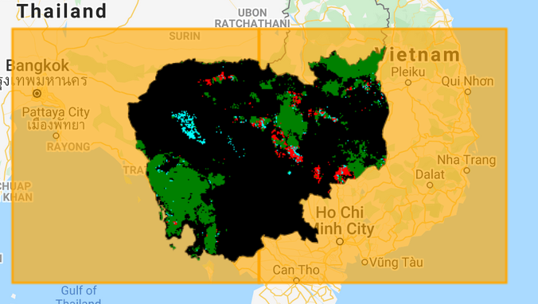

### 6.3 Mozambique (Sentinel-2)

Le CODED a été conçu pour utiliser les données Landsat. Cependant, les différences radiométriques entre Landsat et Sentinel-2 sont minimes, et l'extension de CODED à Sentinel-2 est donc assez simple. Sentinel-2 n'a pas de bande thermique, mais le modèle SMA utilisé ici n'en nécessite pas. Les principaux avantages de Sentinel-2 sont une fréquence de données plus élevée (après 2015), et une résolution spatiale plus élevée pour la plupart des bandes. Bien que l'application du CODED avec Sentinel-2 n'ait pas été largement testée, elle est actuellement soutenue par l'interface graphique de cartographie des perturbations forestières. 

La collecte actuelle (au 1/2021) de données de réflectance de surface Sentinel-2 dans l'EEG est relativement rare. À Madagascar, cela signifie que les données ne sont disponibles que pour 2019 et 2020, bien que des données plus anciennes puissent être disponibles à l'avenir. 

Vous trouverez ci-dessous un ensemble de paramètres de départ pour l'utilisation de Sentinel-2 :

- début : _1er janvier 2018_
- Fin : _1er janvier 2021_
- Masque de forêt : _GFW_
- Input : _Sentinel-2_ (paramètres d'entrée par défaut)
- Détection des changements : _CODED_
- Changer l'attribution : _Échantillon_. Le paramètre _Training Year_ doit être ajusté pour se situer dans la période de collecte (2018-2021).
- Post-traitement : Utiliser les valeurs par défaut
- Visualisation : _Ajouter une couche de masque forestier_ (autres non cochées)
- Exportation : Aucune (toutes non cochées)

Un paramètre qui devrait être ajusté pour le Mozambique est le seuil de couverture de la canopée en pourcentage utilisé pour définir le masque forêt/non-forêt. Bien que le masque puisse être créé à l'extérieur, il est plus rapide d'utiliser la couche de pourcentage de couverture forestière de Global Forest Watch. En Colombie, le seuil utilisé pour définir les forêts et les zones non forestières peut être fixé à un niveau relativement élevé, en raison de la densité de la canopée forestière dans tout le pays. Cependant, le Mozambique a une répartition plus élevée de forêts à canopée ouverte, et ce seuil devrait donc être ajusté en conséquence. Trois seuils différents peuvent être observés pour la région étudiée (actif "utilisateurs/openmrv/MRV/MozambiqueArea".) ci-dessous.

*   Pour réaliser ces cartes :
    *   Sélectionnez _GFW_ comme _Méthode de définition du masque forestier_ dans les paramètres du _Forest Mask_. 
    *   Préciser un seuil minimum de  de la canopée.
    *   Sélectionnez _Add Forest Mask Layer_ dans les paramètres de _Visualisation_. Assurez-vous qu'aucune autre case à cocher n'est sélectionnée. 
    *   Cliquez sur _Run_ et le masque de forêt sera ajouté à la carte. 

**Rappel** Le terme "forêt/non-forêt" est utilisé pour séparer le changement de forêt (c'est-à-dire la déforestation et la dégradation) du changement spectral. Il est également utilisé pour définir les données de training, à moins qu'un ensemble de données auxiliaires ne soit utilisé. Par conséquent, le masque Forêt/Non-Forêt est important à la fois pour déterminer où un "changement de forêt" peut se produire, et pour l'attribuer comme Déforestation ou Dégradation. 

<table>
  <tr>
   <td>
Sentinel-2 RGB Composite
<p>

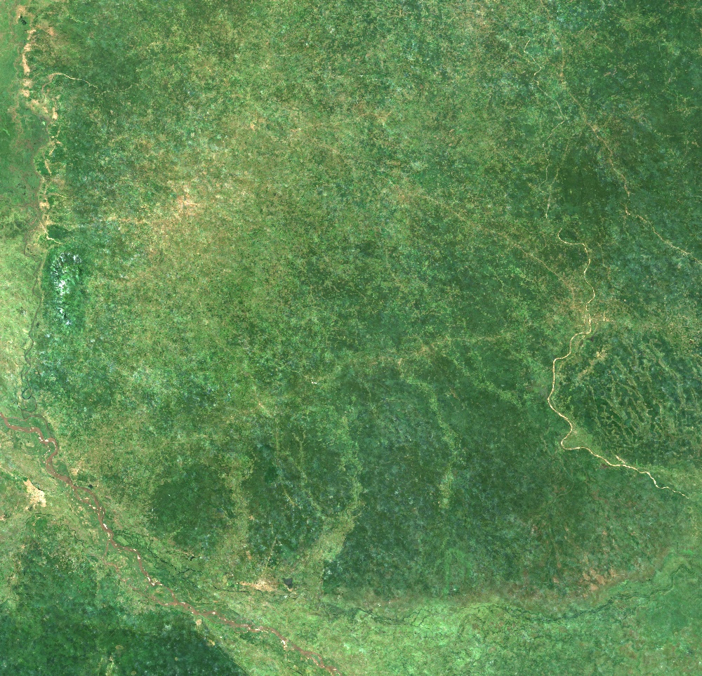

   </td>
   <td>Threshold: 20%
<p>

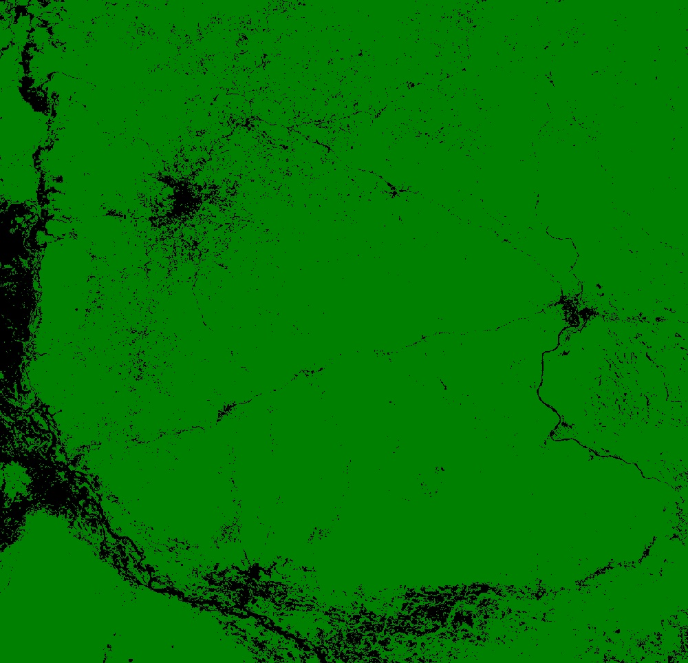

   </td>
  </tr>
  <tr>
   <td>Threshold: 40%
<p>

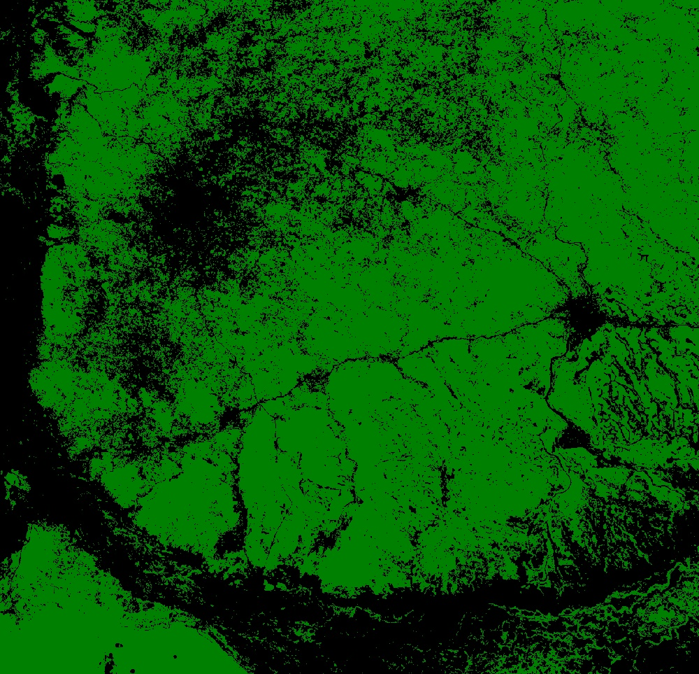
 
   </td>
   <td>Threshold: 80%
<p>

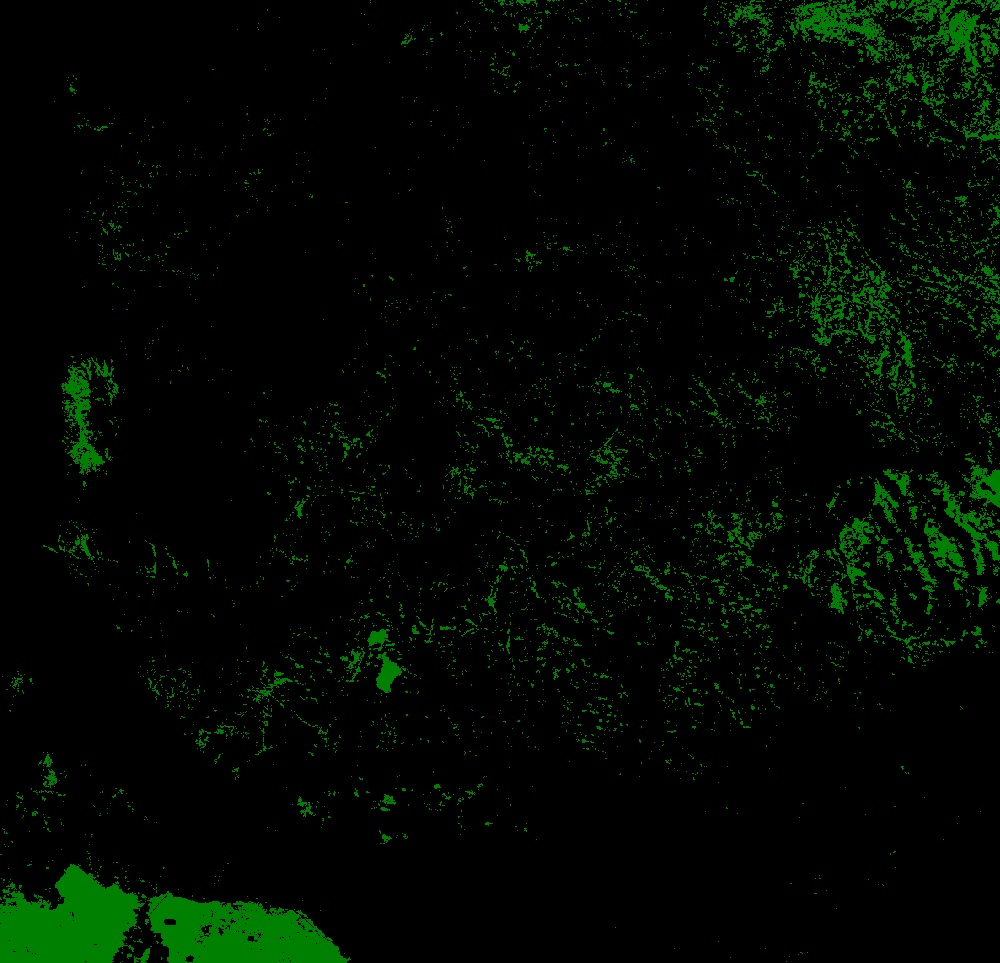

   </td>
  </tr>
</table>

*   Sur la base de ces tests, il est recommandé d'atteindre un seuil de recouvrement des arbres de 40. 
*   Ensuite, nous pouvons examiner un exemple de série chronologique Sentinel-2 de NDFI pour un pixel de forêt perturbé.  Un exemple d'un événement de changement de forêt peut être trouvé dans l'actif : users/openmrv/MRV/Mozambique_Exemple_Point
    * Ajouter le point à la carte en utilisant les outils _Asset path_ et _Load asset_. Naviguer jusqu'au point au Mozambique, et définir la région d'étude autour du point.

    

    * Ajouter le viewer de séries temporelles avec _Toggle time series viewer_. 
    * Cliquez sur le point ajouté pour voir la série chronologique et l'ajustement du modèle du NDFI.
  
    
  
    * Notez qu'il y a une variabilité substantielle dans les séries chronologiques des NDFI avant 2020, bien qu'il n'y ait pas de rupture de modèle. Cette variabilité pourrait être due à deux facteurs : 
        * Il y a un changement dans la forêt en raison d'une perturbation ou d'une croissance.
        * La variabilité naturelle et saisonnière de la forêt. 
    * Il est difficile à déterminer à partir de ce graphique car les données Sentinel-2 pour cet endroit ne sont disponibles qu'après 2019. Alternativement, nous pouvons regarder les observations Landsat pour ce pixel d'exemple, que les archives GEE commencent des années avant celles de Sentinel-2. Notez la variabilité du paysage en termes de verdure avant 2020 et le changement spectaculaire dû à la perturbation dans le pixel d'exemple (point noir au centre) :
     
    
    
    *   Sur ces images, on voit qu'il y a une saisonnalité due à la phénologie des plantes. La végétation apparaît brune en raison de la phénologie à la fin de la saison sèche, soit vers septembre à décembre. Nous pouvons supprimer ces dates de l'analyse dans les paramètres "Input" en changeant les paramètres _Start DOY_ et _End DOY_ en 1 à 244 (du 1er janvier au 1er septembre). Observez les séries chronologiques de Sentinel-2 en excluant les dates de la saison sèche :
    
    
    
    * Il est intéressant de noter qu'un changement a été trouvé sans effectuer de filtrage pour les images de la saison sèche mais pas après le filtrage ! Ceci est dû au fait que les modèles de régression saisonnière s'adaptent correctement à la variabilité saisonnière, de sorte que les faibles valeurs de l'indice NDFI à la fin de 2019 ont été déterminées comme étant la trajectoire annuelle "normale" des données. Les observations après la perturbation en avril 2020 ne correspondent pas à la "tendance saisonnière normale", et donc un changement est signalé. Sur la base de cet exemple, il apparaît que le filtrage par jour de l'année fait plus de mal que de bien. 
    * Après avoir exploré la série chronologique des différents lieux, exporter une stratification en sélectionnant l'option _Export_ option for _Stratification_, et en définissant la zone d'étude avec _Use Asset for Study Area_ et en saisissant la collection de caractéristiques ("users/openmrv/MRV/MozambiqueArea"). 
    * Après le traitement, la stratification peut être ajoutée à la carte en copiant et en collant le chemin vers l'actif dans la zone de texte _Asset path_ et en sélectionnant _Load asset_. La carte doit être affichée sur la carte. 

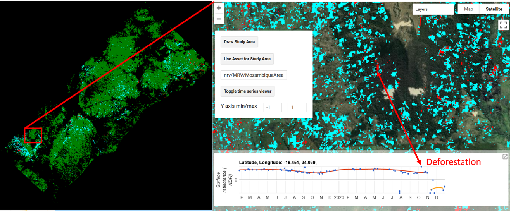

**Conseil** : si vous trouvez trop d'erreurs de commission (ou de faux changements détectés), essayez de diminuer le seuil _Obs_ consécutif. Notez la différence dans les deux cartes ci-dessous. Ces couches montrent des pixels marqués comme changement et. sont ajoutées à la carte en cochant les cases de visualisation _Add Break Date_ (pour l'ajouter à la carte) et _Mask Results_ (pour appliquer le masque Forest/Non-Forest Mask). La couche de la date de rupture peut généralement être calculée à la volée, de sorte que les paramètres de détection des changements peuvent être ajustés sans qu'il soit nécessaire d'exporter les résultats à chaque fois. Si vous décochez le paramètre _Reset Map_, les résultats précédents resteront chargés sur la carte. 

<table>
  <tr>
   <td>
<strong><i>Consecutive obs</i> = 3</strong>
<p>

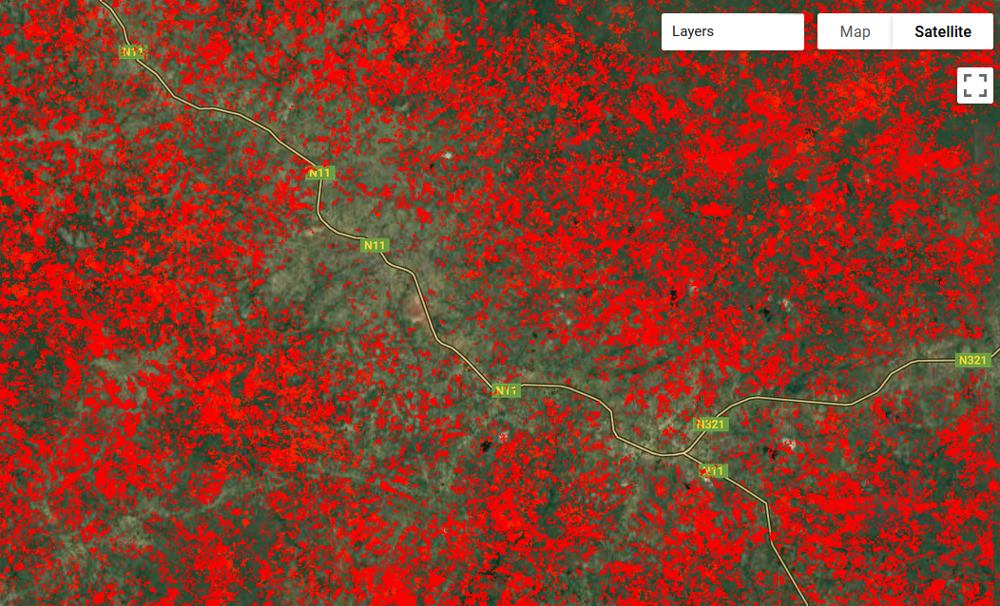


   </td>
   <td><strong><i>Consecutive obs = 5</i></strong>
<p>

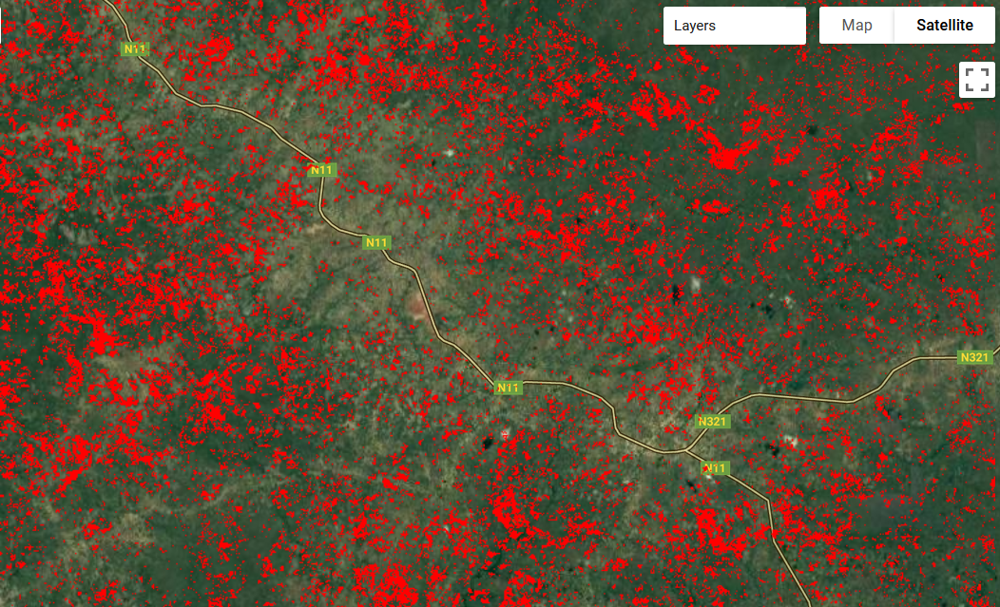

   </td>
  </tr>
</table>

- Ce processus est censé être itératif. Une fois qu'une stratification est exportée, elle peut être chargée sur la carte et analysée à l'aide du Time Series Viewer. Il est recommandé de commencer dans une petite zone afin de pouvoir ajuster les paramètres sans qu'un temps de traitement important soit nécessaire. 

## 7 Foire aux questions

**Comment le CODED tient-il compte de la saisonnalité ?**

Le CODED utilise la régression saisonnière pour modéliser les changements saisonniers dus à la phénologie. Puisque le test statistique pour la détection des changements est basée sur les résidus du modèle, la régression harmonique agit pour " désaisonnaliser " le NDFI. 

**Dans le contexte du CODED, quelle est la définition de la dégradation des forêts ?**

La dégradation des forêts est définie ici comme une perturbation des forêts qui réduit la biomasse, la productivité écologique et/ou le couvert végétal mais qui n'entraîne pas de conversion de la couverture des sols. Les exemples comprennent l'exploitation forestière sélective, la récolte de bois à petite échelle, le feu et la conversion d'une forêt naturelle en plantation. 

**Comment peut-on considérer les défrichements complets de la canopée comme une dégradation, plutôt que comme une déforestation ?**

Les surfaces de forêt qui sont défrichées mais qui commencent immédiatement à se régénérer, sans utilisation de sols non forestiers, sont considérées dans ce contexte comme une forêt en régénération. La définition de la déforestation utilisée ici nécessite une conversion de la classe de couverture du sol (par exemple, forêt en terres cultivées). Par conséquent, une perturbation dans une forêt qui reste une forêt est considérée comme une dégradation, indépendamment de la quantité de couvert de forêt affectée. 

**Peut-on appliquer le CODED à des données à haute résolution?**

Le CODED peut techniquement être appliqué à toute source de données optiques. Cependant, il nécessite une série d'observations cohérentes dans le temps. 

**Pourquoi le CODED utilise-t-il des images NDFI et des fractions plutôt que les bandes spectrales originales ?**

Des recherches antérieures en Amazonie brésilienne (c'est-à-dire Souza et al., 2003, 2005, 2013) ont montré que le NDFI est plus sensible à la dégradation des sous-pixels due aux incendies et à l'exploitation forestière que les bandes spectrales ou les indices. 

**Mes résultats ont détecté trop ou trop peu de changements, que puis-je faire ?**

La modification de l'"Obs consécutif" et du "chiSquareProbability" permettra de contrôler la sensibilité de l'algorithme au changement. 

**Comment les résultats peuvent-ils être utilisés pour créer des données liées à l'activité ?**

Les informations sur l'activité peuvent être dérivées des cartes basées sur le CODED directement ou dans un plan d'échantillonnage. 

**Que faire si la précision des résultats est faible ?**

Le processus est censé être itératif. Nous suggérons de commencer par une petite zone d'étude, puis d'exécuter les paramètres par défaut, puis d'examiner les résultats des cartes et les exemples de séries chronologiques, et d'essayer un nouvel ensemble de paramètres. De plus, si les résultats sont utilisés dans un cadre d'échantillonnage pour l'estimation statistique, la précision de la carte n'a pas beaucoup d'importance. Dans ce contexte, les erreurs cartographiques sont prises en compte en utilisant un estimateur statistique non biaisé. 

### 7.1 Guide de débogage

**“Erreur : Limite de mémoire utilisateur dépassée”.**

Cette erreur se produit généralement lorsqu'un calcul est trop complexe ou porte sur une zone trop étendue. Essayez de réduire la taille de la région étudiée, soit manuellement, soit en utilisant les options "Use Grid".  

**"Erreur : Image.classify : aucune donnée n'a été trouvée dans la saisie de formation du classificateur. "**

Cette erreur se produit lorsque les données sur la formation se situent en dehors de la région d'étude ou lorsque le paramètre "Training year" se situe en dehors des dates de début et de fin de la collecte d'images d'entrée. 

**“Computation Timed Out”**

Cette erreur est fréquente lors de l'affichage des résultats "à la volée". Essayez d'exporter les résultats dans une tâche, puis de les charger à nouveau sur la carte à l'aide de l'outil "Load asset". S'il s'agit d'une Stratification, l'outil appliquera automatiquement un style à l'actif chargé. 

**“Cannot find required repo”**

Cela indique qu'un lien vers une bibliothèque externe est rompu. Veuillez vous référer à [https://coded.readthedocs.io](https://coded.readthedocs.io) pour la version la plus récente de l'interface graphique. 

## 8 References

Bullock, E.L., Woodcock, C.E. and Olofsson, P., 2020. Monitoring tropical forest degradation using spectral unmixing and Landsat time series analysis. *Remote Sensing of Environment*, *238*, p.110968. https://doi.org/10.1016/j.rse.2018.11.011

Hansen, M.C., Potapov, P.V., Moore, R., Hancher, M., Turubanova, S.A., Tyukavina, A., Thau, D., Stehman, S.V., Goetz, S.J., Loveland, T.R. and Kommareddy, A., 2013. High-resolution global maps of 21st-century forest cover change. *Science*, *342*(6160), pp.850-853. https://doi.org/10.1126/science.1244693

Huang, C., Goward, S.N., Masek, J.G., Thomas, N., Zhu, Z. and Vogelmann, J.E., 2010. An automated approach for reconstructing recent forest disturbance history using dense Landsat time series stacks. *Remote Sensing of Environment*, *114*(1), pp.183-198. https://doi.org/10.1016/j.rse.2009.08.017

Kennedy, R.E., Yang, Z. and Cohen, W.B., 2010. Detecting trends in forest disturbance and recovery using yearly Landsat time series: 1. LandTrendr—Temporal segmentation algorithms. *Remote Sensing of Environment*, *114*(12), pp.2897-2910. https://doi.org/10.1016/j.rse.2010.07.008

Souza Jr, C., Firestone, L., Silva, L.M. and Roberts, D., 2003. Mapping forest degradation in the Eastern Amazon from SPOT 4 through spectral mixture models. *Remote Sensing of environment*, *87*(4), pp.494-506. https://doi.org/10.1016/j.rse.2002.08.002

Souza Jr, C.M., Roberts, D.A. and Cochrane, M.A., 2005. Combining spectral and spatial information to map canopy damage from selective logging and forest fires. *Remote Sensing of Environment*, *98*(2-3), pp.329-343. https://doi.org/10.1016/j.rse.2005.07.013

Souza Jr, C.M., Siqueira, J.V., Sales, M.H., Fonseca, A.V., Ribeiro, J.G., Numata, I., Cochrane, M.A., Barber, C.P., Roberts, D.A. and Barlow, J., 2013. Ten-year Landsat classification of deforestation and forest degradation in the Brazilian Amazon. *Remote Sensing*, *5*(11), pp.5493-5513. https://doi.org/10.3390/rs5115493

Zhu, Z. and Woodcock, C.E., 2014. Continuous change detection and classification of land cover using all available Landsat data. *Remote Sensing of Environment*, *144*, pp.152-171. https://doi.org/10.1016/j.rse.2014.01.011

-----

  
This work is licensed under a [Creative Commons Attribution 3.0 IGO](https://creativecommons.org/licenses/by/3.0/igo/)

Copyright 2021, World Bank 

Ce travail a été développé par Eric Bullock dans le cadre d'un contrat de la Banque mondiale avec GRH Consulting, LLC pour le développement de nouvelles ressources - et la collecte des ressources existantes - liées à la mesure, la notification et la vérification afin de soutenir la mise en œuvre du MRV par les pays. 

Matériel examiné par :   
Carole Andrianirina, Madagascar, National Coordination Bureau REDD+ (BNCCREDD)   
Jennifer Juliana Escamilla Valdez, El Salvador, Ministry of Environment and Natural Resources   
Konan Yao Eric Landry, Côte d'Ivoire, REDD+ Permanent Executive Secretariat   
Tatiana Nana, Cameroon, REDD+ Technical Secretariat  

Attribution   
Bullock, E. 2021. Continuous Degradation Detection (CODED). © World Bank. License:  [Creative Commons Attribution license (CC BY 3.0 IGO)](http://creativecommons.org/licenses/by/3.0/igo/)   


