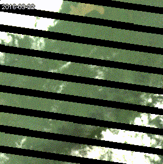
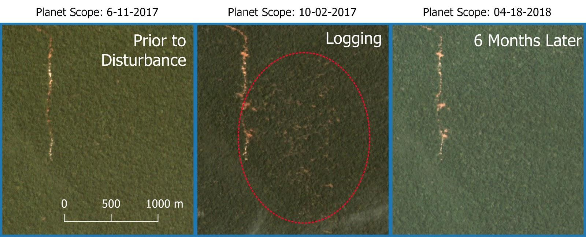
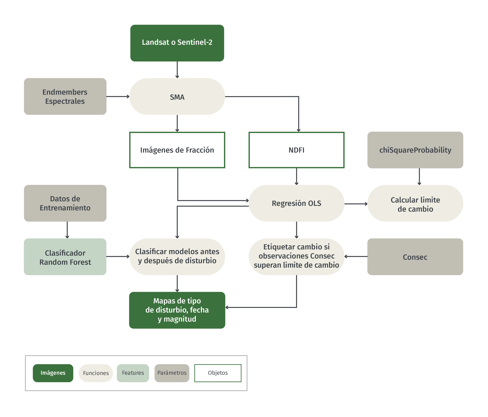
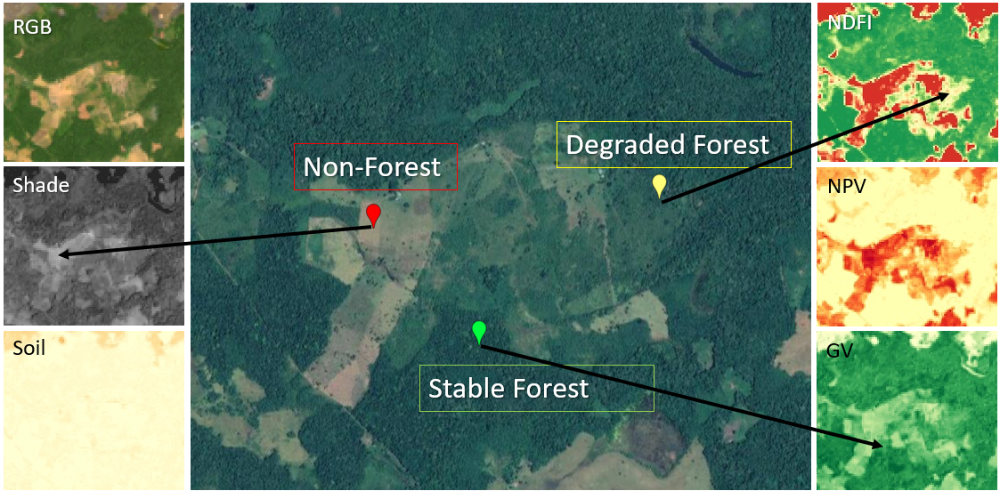
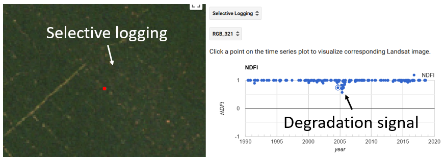
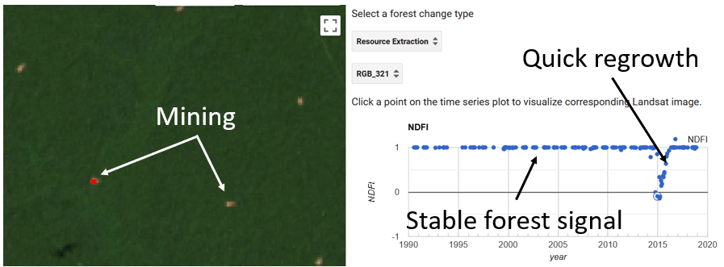
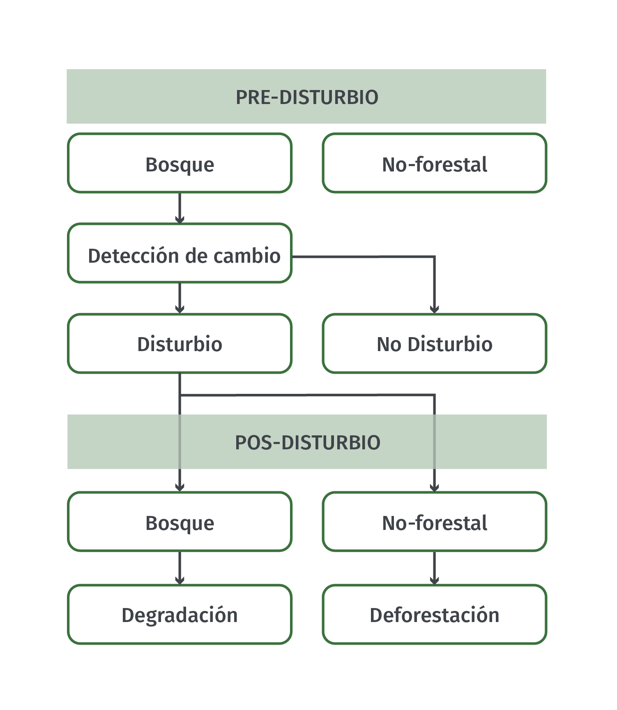
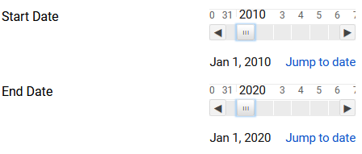
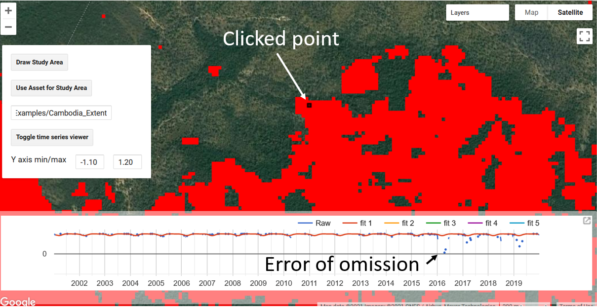
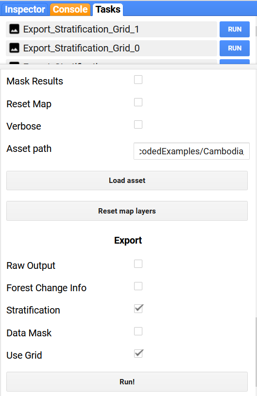

# Detección de Degradación Continua (CODED)

## 1 Contexto

#### 1.1 Degradación Forestal 

No existe una definición internacionalmente aceptada de degradación forestal, pero en general se puede definir como una perturbación en un bosque que reduce la biomasa, la productividad ecológica y / o la cubierta del dosel, pero que no da como resultado una conversión de la cubierta terrestre.

En el contexto de los inventarios nacionales de gases de efecto invernadero, la degradación forestal representa una fuente de pérdida de carbono de manera similar a la deforestación. Ejemplos de actividades que causan degradación forestal incluyen la tala selectiva, los incendios forestales no naturales y la recolección de leña para uso doméstico.

Si bien la deforestación ha sido objeto de un intenso debate a escala mundial, la degradación forestal también contribuye de manera significativa a las emisiones de gases de efecto invernadero y reduce la capacidad de los bosques para proporcionar productos y servicios esenciales y mitigar el cambio climático. Sin embargo, el monitoreo de la degradación forestal a escala nacional y regional ha demostrado ser un desafío. En consecuencia, con frecuencia se omite de los inventarios nacionales de gases de efecto invernadero y representa una fuente significativamente subestimada de emisiones de carbono y daño ecológico.

Este tutorial presentará una metodología para monitorear la degradación forestal llamada Detección Continua de Degradación (CODED). CODED fue creado con el objetivo específico de detectar la degradación forestal que, como se describirá en las siguientes secciones, ha demostrado ser un desafío al utilizar enfoques tradicionales para la detección de cambios. La aplicación de CODED se realiza en Google Earth Engine y se demuestra para estudios de casos en Colombia, Mozambique y Camboya.


## 2 Objetivos de Aprendizaje

Al final de este tutorial, el usuario podrá: 

*   Identificar los impulsores comunes de degradación forestal con imágenes satelitales de resolución moderada o alta  
*   Realizar análisis de mezcal espectral con imágenes ópticas y calcular índice de fracción de diferencia normalizada (NDFI por sus siglas en ingles)
*   Parametrizar CODED para apuntar a diferentes dinámicas de disturbio, tipos de bosques, y disponibilidad de fechas
*   Usar CODED para crear mapas de degradación y deforestación

Uso avanzado también incluirá:

*   Resultados posteriores al procesamiento de CODED para incrementar la precisión de detección de cambio 
*   Aplicación de versión modificada de CODED para usar imágenes de radar de Sentinel-1

### 2.1 Prerrequisitos

- Conceptos de Google Earth Engine (GEE) (por favor refiérase a Sección 1.1 de Modulo 1.1 Creación de mosaico/imagen compuesta para Landsat y Sentinel-2 en Google Earth Engine para encontrar recursos de GEE útiles)

  - Obtener una cuenta de usuario
   - Imágenes en GEE
   - Sintaxis básico de funciones
   - Procesamiento básico de imágenes, incluyendo elección de imágenes, filtración de nubes, creación de mosaicos y compuestas 

NOTA: Consulte el proceso "Preprocesamiento" y la herramienta "GEE" aquí en OpenMRV para obtener más información y recursos para trabajar en Google Earth Engine.

## 3 Detección de Degradación Continua (CODED)


### 3.1 Motivación

En ausencia de un inventario de campo sólido, la única forma viable de hacerlo es utilizar imágenes de observación de la tierra, pero la degradación de la forma que se produce en el paisaje trae consigo consideraciones técnicas que deben abordarse. Para empezar, cualquier enfoque automatizado para la clasificación de imágenes de satélite inevitablemente contendrá errores. Estos errores pueden provenir de muchos factores, incluyendo nubes desenmascaradas y sombras de nubes, datos faltantes (por ejemplo, debido al problema del corrector de línea de escaneo de Landsat 7) y errores de clasificación (por ejemplo, clasificación errónea de la cobertura terrestre o cambio de clases). También sabemos que los trópicos húmedos son especialmente susceptibles a datos perdidos o contaminados debido a las nubes.

Si bien este problema no es exclusivo al mapeo de la degradación forestal, es importante considerar este contexto cuando se intenta automatizar un enfoque para el monitoreo de áreas extensas. A continuación, podemos ver imágenes Landsat de unos años en un bosque talado en la República Centroafricana. El objetivo aquí es extraer información significativa sobre los cambios en el bosque, a pesar de que casi todas las imágenes están parcial o totalmente cubiertas por nubes, o el mapeo de las perturbaciones en este paisaje debe adaptarse a las observaciones ruidosas y al mismo tiempo ser sensible a los cambios sutiles en el dosel del bosque.




Existen numerosos enfoques para tratar las observaciones ruidosas, como el filtrado, la composición y la corrección atmosférica. Sin embargo, los enfoques basados en la filtración o suavización de los datos insumos no son adecuados para detectar la degradación, ya que la degradación suele ser visible durante un breve período de tiempo y en áreas pequeñas. Observe el siguiente ejemplo de un incendio en la Amazonía brasileña. El píxel resaltado en rojo está en un bosque que se quemó alrededor del 2008. Los signos de este incendio no son visibles mucho después del evento debido a la regeneración.


Mirando nuevamente el ejemplo de la República Centroafricana, podemos ver además cuán efímeros pueden ser los daños causados por la degradación. Aquí, podemos ver signos de registro en imágenes de alta resolución de Planet. Sin embargo, solo unos meses después, el bosque se ha regenerado. La naturaleza efímera de la degradación implica que es necesario un monitoreo continuo en lugar de un análisis o composición de una sola fecha.





Además, la degradación de los bosques a menudo ocurre a una escala espacial por debajo de la escala nominal de las imágenes de satélite, lo que significa que la suavización espacial de los datos para reducir ruido puede mezclar aún más las señales de bosques estables y perturbados. Por ejemplo, a continuación se muestra un ejemplo de tala selectiva en Fiji. Si bien hay caminos de tala obvios visibles en las imágenes de alta resolución, la mayor parte del paisaje sigue siendo bosque en las imágenes de resolución moderada.


Estos ejemplos demuestran como la misma naturaleza de degradación forestal representa un desafío significativo para el mapeo usando los métodos tradicionales de análisis de teledetección. 


### 3.2 Monitoreo de Cambio Terrestre

En los últimos años, la comunidad de monitoreo del cambio de la tierra ha adoptado cada vez más la noción de que el análisis de series de tiempo puede aliviar muchos de los problemas que surgen en el análisis de una sola fecha. Los enfoques de series de tiempo pueden monitorear las tendencias a lo largo del tiempo, lo que ayuda a distinguir los cambios terrestres sutiles de los ruidosos y caracterizar los cambios abruptos y graduales. Si bien el monitoreo de cambios tiene una larga historia en campos como la econometría, el procesamiento de señales, el reconocimiento de patrones y el modelado y pronóstico ambiental, la aplicación en el dominio de la teledetección es relativamente nueva.

Los enfoques de series de tiempo para el monitoreo del cambio se han beneficiado enormemente de algunos avances en las comunidades de teledetección, que incluyen:

*   Acceso gratuito y abierto a datos de agencias como USGS, NASA, ESA, y JAXA
*   Archivos de datos consistentes y repetidos que embarcan múltiples años o décadas
*   Entornos de computación de la nube de alto rendimiento como Google Earth Engine y Amazon Web Services
*   Metodologías de detección de cambio novedosas basadas en datos densos de series temporales
*   Pre-procesamiento estandarizado en apoyo a las colecciones de datos

Aplicaciones tempranas notables del análisis de serie temporal para el monitoreo de cobertura terrestre incluyen LandTrendr (Kennedy e tal., 2010), BFAST (Verbesselt et al., 2010), Vegetation Change Tracker<sup> </sup>(Huang et al., 2010), y Continuous Change Detection and Classification o CCDC <sup> </sup>(Zhu and Woodcock, 2014). Cada uno de estos métodos tienen sus ventajas únicas y han ayudado a establecer la base para el CODED.


### 3.3 Descripción General del Algoritmo


La metodología CODED tiene tres componentes primarios (ver Bullock et al., 2020 para mas información):


1. Pre-procesamiento de imágenes ópticas para crear máscara de nubes y transformar la reflectancia en imágenes de fracciones de miembros terminales ("endmembers") espectrales (en otras palabras, las extremidades de un segmento, las cuales típicamente contienen la mayoría de la variabilidad de una imagen)
2. Detección de cambio usando la detección de rotura basada en regresión
3. Atribución de cambio a deforestación o degradación usando datos de entrenamiento y un clasificador de aprendizaje automático




#### 3.4 Análisis de Mezcla Espectral 

Durante el preprocesamiento, los datos de entrada se transforman en imágenes fraccionarias de endmembers mediante el análisis de mezcla espectral (SMA). Se ha demostrado que la desmezcla espectral en una variedad de entornos es sensible a los cambios de tierra de subpíxeles, lo que la hace ideal para la detección de eventos de degradación a pequeña escala. La aplicación de SMA para mapear la degradación se demostró en la Amazonía brasileña en el trabajo del Dr. Carlos Souza Jr. (por ejemplo, Souza et al., 2005) que introdujo el modelo de mezcla utilizado por defecto en CODED.

El modelo SMA utilizado en CODED transforma la reflectancia en la proporción de escala de píxeles de vegetación verde (GV por sus siglas en ingles), suelo, vegetación no fotosintética (VPN por sus siglas en ingles), sombra y nube. Estas capas se pueden utilizar para calcular el índice de fracción de diferencia normalizada (NDFI por sus siglas en ingles), que es una transformación de imagen fraccional introducida por primera vez en Souza et al. (2005) y demostró ser sensible al daño subpíxel por tala o incendios.


**Inténtelo usted mismo**

Antes de sumergirse en el uso más complejo de CODED, vale la pena mirar los resultados de imágenes fraccionarias de SMA en imágenes individuales. El siguiente código Javascript se puede utilizar en Google Earth Engine. El código completo para SMA se puede encontrar en el repositorio Open-MRV en el archivo 'OpenMRV_español/Part 2/CODED_esp/Unmix_esp'.

Primero, cargue una imagen Landsat 8 para una región de estudio en Colombia y agréguela al mapa. El área de estudio se define como una colección de características (FeatureCollection) en la variable 'studyArea'.

```javascript
var studyArea = ee.FeatureCollection('users/openmrv/MRV/ColombiaRectangle')

Map.addLayer(studyArea)
Map.centerObject(studyArea)
```

Ahora, podemos cargar la colección de Landsat 8 y aplicar la mascara de nubes usando una función definida 'maskL8sr'. 

```javascript
var landsat8 = ee.ImageCollection("LANDSAT/LC08/C01/T1_SR").filterBounds(studyArea)


function maskL8sr(image) {
  var bandList = ['B2', 'B3', 'B4', 'B5', 'B6', 'B7']
  var nameList = ['BLUE', 'GREEN', 'RED', 'NIR', 'SWIR1', 'SWIR2']
 
  var cloudShadowBitMask = 1 << 3;
  var cloudsBitMask = 1 << 5;
  var qa = image.select('pixel_qa');
  var mask = qa.bitwiseAnd(cloudShadowBitMask).eq(0)
	.and(qa.bitwiseAnd(cloudsBitMask).eq(0));
 	 
  return image.updateMask(mask).divide(10000)
	.select(bandList).rename(nameList)
	.copyProperties(image, ["system:time_start",'CLOUD_COVER']);
}

var l8Masked = landsat8.map(maskL8sr)
```

Para encontrar una imagen relativamente libre de nubes para aplicar SMA, podemos organizar la colección por la propiedad de metadatos 'CLOUD_COVER' y usar la primera imagen en la colección (por ejemplo la imagen con el valor mas bajo de 'CLOUD_COVER'). 

var l8Image = l8Masked.sort('CLOUD_COVER',true).first()

```javascript
Map.addLayer(l8Image.select(['RED','GREEN','BLUE']), {min: 0, max: .14}, 'RGB Image')
```

Note que la imagen se superpone solo parcialmente sobre nuestra área de estudio. Para este ejercicio, eso es aceptable, porque el propósito es solo para mirar una imagen de fracción singular. Para hacerlo, podemos calcular imágenes de fracción usando los endmembers espectrales definidos por Souza et al., 2005 y agregar cada imagen de fracción al mapa. 

```javascript
// Definir endmembers espectrales en unidades de reflectancia
var endmembers = {
  gv: [.0500, .0900, .0400, .6100, .3000, .1000],
  shade: [0, 0, 0, 0, 0, 0],
  npv: [.1400, .1700, .2200, .3000, .5500, .3000],
  soil: [.2000, .3000, .3400, .5800, .6000, .5800],
  cloud: [.9000, .9600, .8000, .7800, .7200, .6500],
}

// Definir paletas de color para visualización

var palettes = {
  gv: ['##ffffcc','##c2e699','##78c679','##31a354','##006837'],
  shade: ['##f7f7f7','##cccccc','##969696','##636363','##252525'],
  npv: ['##ffffb2','##fecc5c','##fd8d3c','##f03b20','##bd0026'],
  soil: ['##ffffd4','##fed98e','##fe9929','##d95f0e','##993404'],
  cloud: ['##ffffcc','##a1dab4','##41b6c4','##2c7fb8','##253494'],
  ndfi: ['##d73027','##fc8d59','##fee08b','##ffffbf','##d9ef8b','##91cf60','##1a9850']
}

// Realizar la desmezcla en la imagen de Landsat 8 
var unmixedImage = ee.Image(l8Image).unmix({
  endmembers: [endmembers.gv, endmembers.shade, endmembers.npv, endmembers.soil, endmembers.cloud],
  sumToOne: true,
  nonNegative: true
}).rename(['GV', 'Shade', 'NPV','Soil','Cloud'])

// Agregar cada imagen fracional al mapa
Map.addLayer(unmixedImage.select('GV'), {min: 0, max: .6, palette: palettes.gv}, 'GV')
Map.addLayer(unmixedImage.select('Shade'), {min: 0, max: .6, palette: palettes.shade}, 'Shade')
Map.addLayer(unmixedImage.select('NPV'), {min: 0, max: .6, palette: palettes.npv}, 'NPV')
Map.addLayer(unmixedImage.select('Soil'), {min: 0, max: .6, palette: palettes.soil}, 'Soil')

//Finalmente, podemos calcular NDFI en las imagenes de fracción de endmembers y agregar los datos NDFI al mapa. 

var ndfi = unmixedImage.expression(
  '((GV / (1 - SHADE)) - (NPV + SOIL)) / ((GV / (1 - SHADE)) + NPV + SOIL)',
  {'GV': unmixedImage.select('GV'),
  'SHADE': unmixedImage.select('Shade'),
  'NPV': unmixedImage.select('NPV'),
  'SOIL': unmixedImage.select('Soil')}
)

Map.addLayer(ndfi, {min: 0, max: 1, palette: palettes.ndfi}, 'NDFI')

The example below is a zoom-in the results that can be navigated to by defining the image boundary as a geometry:


var geo = ee.Geometry.Polygon(
    	[[[-73.84809238658222, 2.093131559229626],
      	[-73.84809238658222, 2.047928319636153],
      	[-73.8027737830666, 2.047928319636153],
      	[-73.8027737830666, 2.093131559229626]]])

Map.centerObject(geo)
```

Note la franja de terreno perturbada en medio de la geometría. Los pixeles claramente no-forestales tienen un NDFI alto (rojo), Sombra baja (blanco), NPV alto (rojo), y GV moderado (verde claro), mientras que los pixeles de bosque dañados a mano derecha tienen un NDFI moderado (amarillo), y el bosque denso tiene un NDFI alto (verde), GV alto (verde), y Sombra alta (negro). 



### 3.5 Trayectorias temporales

CODED realiza SMA para cada imagen de Landsat disponible en la región de estudio. Luego realiza la detección de cambios utilizando las trayectorias NDFI de series de tiempo. Veamos algunos ejemplos de cómo se ve la serie temporal de NDFI para la degradación y la deforestación. Tenga en cuenta que en estas figuras el eje-y se escala en 10,000.

NDFI es alto (~1) para bosques densos, moderado (0-1) para bosques abiertos o degradados, y en lo mas bajo para paisajes no-forestales (-1 a 0). La figura siguiente demuestra una trayectoria NDFI para un evento de deforestación. En cada uno de los ejemplos siguientes, las líneas verticales rojas y verdes en la trama representan el año de deforestación o evento de degradación, respectivamente. Note que antes del evento de deforestación, NDFI tiene valor de aproximadamente 1 porque es bosque denso y estable. Después de que el bosque se convierte en pastizal, NDFI cae precipitadamente y fluye entre -1 y 1 dependiendo de la estación. 


Ahora, comparemos esto con un ejemplo de degradación debido a la tala selectiva. Tenga en cuenta que el cambio en NDFI debido a la perturbación es relativamente pequeño, y hay una clara señal de recuperación debido a la regeneración del bosque.


Finalmente, vemos en la siguiente figura un ejemplo de un bosque afectado por un incendio. Tenga en cuenta que aquí el daño al dosel fue bastante dramático, como se evidencia en la gran reducción en NDFI después de la perturbación. Sin embargo, una vez más hay una clara señal de regeneración, y se desprende de la serie de tiempo que no hubo conversión de la cobertura terrestre.


**Inténtelo usted mismo**

Es relativamente sencillo trazar las trayectorias temporales de NDFI en Google Earth Engine. Este puede hacer un ejercicio útil para comprender el historial de uso de la tierra de una ubicación además de la respuesta espectral a los cambios del paisaje. Para hacerlo, es necesario calcular primero el NDFI para una colección de imágenes completa y luego definir una función para trazar el NDFI en la ubicación seleccionada en el mapa.

**Nota **: Este código se puede encontrar en el repositorio de Open MRV en el script "OpenMRV_español/Part 2/CODED_esp/Unmix Time Series_esp". 

```javascript
// Definir una función para SMA y calcular NDFI
var unmixAndNDFI = function(image) {
  var unmixedImage = ee.Image(image).unmix({
	endmembers: [endmembers.gv, endmembers.shade, endmembers.npv, endmembers.soil, endmembers.cloud],
	sumToOne: true,
	nonNegative: true
  }).rename(['GV', 'Shade', 'NPV','Soil','Cloud'])
 
  var ndfi = unmixedImage.expression(
	'((GV / (1 - SHADE)) - (NPV + SOIL)) / ((GV / (1 - SHADE)) + NPV + SOIL)',
	{'GV': unmixedImage.select('GV'),
	'SHADE': unmixedImage.select('Shade'),
	'NPV': unmixedImage.select('NPV'),
	'SOIL': unmixedImage.select('Soil')}
  ).rename('NDFI')
  return image.addBands([unmixedImage, ndfi])
}

// Mapear sobre la colección de Landsat 8 y calcular NDFI
var ndfiCollection = l8Masked.map(unmixAndNDFI).select('NDFI')

El siguiente codigo demuestra como puede crear una geometria de la ubicacion que selecciono con un clic del maoa ("var point"), y trazar la serie de tiempo de NDFI ("var chart") para todos los datos que cruzan esa ubicacion. Las tramas tienen una funcion callback que cargara la imagen correspondiente al mapa cuando se selecciona una observacion en la trama.

// Función para hacer una trama NDFI en la ubicación seleccionada con clic
var makeImagePlot = function(col, region){
  var chart = ui.Chart.image.series(col, region, ee.Reducer.mean(), 30)
	.setOptions({
  	lineWidth: 0,
  	pointSize: 6,
 	});
	 
  // Función para agregar imagen seleccionada con clic al mapa
  chart.onClick(function(x, y, sName) {
	if(x) {
  	var im = l8Masked.filterMetadata('system:time_start','equals',x)
  	Map.addLayer(im.select(['RED','GREEN','BLUE']), {min: 0, max: .14}, 'Image ' + x)
	}
    
  });
  print(chart)
}

// Función cuando se le hace clic al mapa 
Map.onClick(function(coords) {
  var point = ee.Geometry.Point([coords.lon, coords.lat])
  makeImagePlot(ndfiCollection, point)
  Map.addLayer(point)
})

```

Para ayudar a comprender la respuesta de NDFI a diferentes eventos de degradación, hemos estado construyendo una biblioteca de puntos de ejemplo en todo el mundo. Estos ejemplos continuarán actualizándose y demostrarán cómo se ven las series de tiempo NDFI de diferentes eventos de degradación en diferentes entornos.

**Inténtelo usted mismo**

Se puede encontrar un visor de series de tiempo de los ejemplos de degradación en el repositorio 'OpenMRV' en el archivo 'OpenMRV_español/Part 2/CODED_esp/Time Series Examples_esp':

Una vez que haya cargado el script en GEE, haga clic en el botón "Run" para inicializar la interfaz gráfica de usuario.

Esta es una herramienta relativamente simple que solo permite la visualización de series de tiempo NDFI predefinidas. Hemos etiquetado manualmente el tipo de perturbación que se puede seleccionar usando el primer menú desplegable. El segundo menú desplegable define la extensión de la imagen que se utilizará al agregar una imagen Landsat a la interfaz del mapa.

La siguiente imagen describe la funcionalidad de la herramienta:

El tipo de perturbación se puede seleccionar usando el primer menú desplegable.

El usuario puede navegar por los ejemplos usando los botones 'Siguiente' y 'Anterior' en el widget 'Navegador'.
Para cada serie de tiempo, las series de tiempo correspondientes de NDFI y SMA se muestran a la derecha.
Al seleccionar una observación en la serie temporal, se cargará la imagen correspondiente en el mapa.
El estiramiento de la imagen se puede cambiar usando el segundo menú desplegable.


El ejemplo anterior es el mismo que se usó en la introducción. Ésta es una señal de degradación típica en un bosque templado con muchas observaciones Landsat. Antes de la perturbación, el NDFI es muy estable con valor de alrededor de 1. Hay una disminución obvia en el NDFI durante aproximadamente un año, pero el bosque se regenera rápidamente y el NDFI parece similar al bosque anterior a la perturbación alrededor de 2012.

Veamos algunos otros ejemplos de esta herramienta con un poco más de detalle. El siguiente ejemplo muestra un evento de registro selectivo. Tenga en cuenta el cambio breve y mínimo en NDFI debido a la perturbación. 



El siguiente ejemplo muestra una compensación inicial para exploración minera. Dado que los árboles en el bosque están completamente talados, la señal NDFI es dramática. Sin embargo, el píxel puede regenerarse rápidamente después del desmonte inicial y, en dos años, el NDFI vuelve a un nivel similar anterior a la perturbación.



Compare el ejemplo anterior de una mina que se regenera como bosque con el siguiente ejemplo de una mina permanente. Tenga en cuenta que en este ejemplo no hay signos de recuperación.


### 3.6 Detección de Cambio

Los modelos de regresión se utilizan para predecir observaciones dentro de una ventana móvil. Si los residuos de las observaciones en la ventana superan un valor crítico, se detecta un cambio. Observe que debajo de los triángulos son las observaciones en la ventana móvil. Los triángulos azules son las observaciones predichas, mientras que el amarillo y el rojo representan cambios de magnitud alta y baja, respectivamente. A continuación, el proceso se repite con un nuevo ajuste de regresión a las observaciones posteriores.


**Parámetros de Detección de Cambio**

El componente de detección de cambios tiene dos parámetros importantes, ambos equivalentes a los parámetros que comparten el mismo nombre en la implementación de GEE de detección y clasificación continuas de cambios (CCDC). CCDC es un algoritmo de monitoreo de cambios similar que es más general para todos los tipos de cambio de uso y cobertura del suelo. CODED se puede considerar como una versión modificada de CCDC que utiliza la desmezcla espectral para apuntar a los cambios debidos a perturbaciones forestales.

El primer parámetro de detección de cambios, Consec, define el número de observaciones consecutivas que superan un umbral de cambio necesario para desencadenar un cambio. Si Consec = 5, entonces es necesario que haya cinco observaciones consecutivas que excedan el umbral de cambio para desencadenar un cambio. Se recomienda un valor de Consec más bajo para áreas de estudio con baja disponibilidad de datos o para encontrar cambios que sean visibles desde arriba durante un período corto. Un ejemplo de esto último sería un evento de tala selectiva que, debido a la regeneración del dosel, solo se puede ver desde arriba durante algunas semanas o meses. Reducir el parámetro Consec puede ayudar a encontrar cambios, pero también hará que los resultados sean más susceptibles a errores de comisión debido a nubes desenmascaradas o sombras de nubes. 

El segundo parámetro de detección de cambio define la estadística de prueba de cambio y el umbral de cambio. La estadística de prueba cambio <i>f<sub>i,mn</sub></i> para el modelo m y la observación y se pueden definir como:  


Donde <i>y<sub>p</sub></i> es el valor predicho NDFI en el tiempo <i>i</i> y <i>RMSE<sub>m</sub></i>  es el error root mean squared del modelo de regresión *m*.  Una observación es identificada como cambio potencial si: 

&space;*&space;-1))

donde *chi2 ppf* es la función de probabilidad de densidad del  *chiSquareProbability* con 1 grado de libertad. Luego, un cambio es etiquetado si hay *Consec* observaciones potenciales de cambio consecutivas. Un cambio es detectado solo cuando f<sub>i,mn</sub> esta debajo del chi2 ppf negativo porque CODED solo etiqueta cambios que resultan en un declive de NDFI (por ejemplo, contener una estadística de prueba grande y negativa). 

Un *chiSquareProbability* mas bajo tiene el efecto de incrementar la sensibilidad de CODED al cambio, por lo tanto encuentra mas cambios que cuando se usa un *chiSquareProbability* mas alto. 


### 3.7 Atribución de Cambio

Disturbios son atribuidos como deforestación o degradación basado en la cobertura terrestre después del disturbio. Si hay una conversión de bosque a no-forestal (por ejemplo, pastizal, asentamientos, o agricultura), el disturbio es considerado deforestación. Si la regeneración comienza después del disturbio es etiquetado degradación. El proceso de atribución se puede describir generalmente de acuerdo al flujo de trabajo siguiente: 




## 4 Ejecutar CODED con una Interfaz de Usuario Grafica 

CODED se puede ejecutar con una interfaz de usuario grafica (GUI por sus siglas en ingles) llamada ‘OpenMRV_español/Part 2/CODED_esp/Forest Disturbance Mapping GUI_esp’ (GUI de Mapeo de Perturbaciones Forestales), la cual se puede encontrar en el repositorio Open MRV. Note que la versión en el repositorio es un momento en el tiempo y la versión mas reciente se puede encontrar aquí: [https://coded.readthedocs.io](https://coded.readthedocs.io). 

**Nota:** La herramienta también depende de las bibliotecas externas. Si recibe un error “Cannot find required repo” eso indica que un enlace en el repositorio esta roto. Si ese es el caso, por favor refiérase a la pagina CODED ReadTheDocs. 

Esta sección provee una visión general de la aplicación y su funcionalidad, y la sección siguiente demuestra ejemplos de usar la aplicación. Note que los usuarios deberían de usar esta sección como una referencia, y seguir los ejemplos en Colombia, Camboya, y Mozambique. 

Después de agregar el repositorio,debería de ver una carpeta “coded” en su panel de “Scripts” bajo “Reader”:


Figura 1 es una imagen de como debería de aparecer su pantalla. Si no ve esto, navegue a la pestana de scripts en la esquina superior a mano izquierda de la interfaz GEE. Expanda la pestana Reader, y haga clic en la script llamada **Forest Disturbance Mapping GUI**. 

A continuación, es posible que deba hacer clic en Ejecutar para iniciar la secuencia de comandos que se cargará en el navegador. Tenga en cuenta que la GUI puede tardar unos minutos en aparecer en el navegador.


Luego le pedirá que elija su idioma. Una vez configurado el idioma, su navegador debe tener un aspecto similar al de la siguiente figura; sin embargo, B, D y E no aparecerán hasta después de ejecutar CODED.


Como se puede ver en la Figura 1, la aplicación contiene varios componentes que están etiquetados de acuerdo a las letras de los paréntesis a continuación: 

**Panel de Parámetro (A)**


*   A mano derecha de la pantalla esta el panel de parámetros. Este panel contiene widgets que controlan todos los aspectos del proceso de mapeo incluyendo los datos de insumo, el pre-procesamiento, parámetros de cambio de detección, procesamiento posterior, visualización, y exportación. 

**Panel de Mapas (B)**

*   Este mapa visualiza los resultados de la detección de cambio y se puede usar de manera interactiva para definir el área de estudio usando los controles de mapa y para visualizar trayectorias históricas de ubicaciones seleccionadas por clic.

**Controles de Mapa (C)**

*   Los controles de mapa contienen dos botones: ‘Draw Study Area’ (Dibujar área de estudio) y ‘Toggle time series viewer’ (alternar el visor de series de tiempo). Después de hacerle clic al primer botón, se crea una importación con el nombre ‘StudyArea’. Use esta casilla para definir el área de estudio de su análisis. El área de estudio se puede restablecer haciendo clic en el botón. El segundo botón se utiliza para mostrar o eliminar el panel de series de tiempo del mapa.

**Panel de Serie de Tiempo (D)**

*   El panel de series de tiempo muestra la trayectoria temporal de la colección definida en el panel de parámetros. La banda que se visualiza se puede definir bajo los parámetros de visualización. Cada punto del diagrama de dispersión representa una observación desde la ubicación en la que se hizo clic en el mapa. Al hacer clic en un punto del diagrama de dispersión, la imagen correspondiente se cargará en el mapa. Las opciones de combinación de bandas y estiramiento para la imagen mostrada se pueden cambiar en la sección de visualización del panel de parámetros.

**Pestana de Tareas (E)**

*   La pestaña de tareas es una característica predeterminada de la interfaz web de GEE y se utiliza para enviar trabajos para su procesamiento. Las tareas se pueden utilizar para exportar imágenes y colecciones de características como activos o para almacenamiento externo como Google Drive.


## 5 Parametrización


### 5.1 Máscara de Bosque

Se puede usar una máscara de bosque que determina los píxeles válidos para mapear las perturbaciones del bosque. Las áreas definidas como no forestales no tendrán ninguna perturbación mapeada. Actualmente existen dos enfoques para definir una máscara de bosque / no-forestal (FNF por sus siglas en ingles), o puede optar por no usar una máscara y asumir que todos los píxeles en la región de estudio pueden contener potencialmente una perturbación.

**Asset**

*   La primera opción le permite usar un activo de imagen existente como una máscara de bosque / no-forestal. Especifique la ruta a la imagen en el cuadro de texto que aparece después de seleccionar "Activo" en el widget desplegable "Máscara de bosque".
*   El activo de máscara FNF debe tener valores de 1 que indique píxeles válidos (bosque) y cero o nulo que indique píxeles no válidos (no bosque).
*   De forma predeterminada, esta opción utiliza la geometría de la imagen como región de estudio. El área de estudio se puede anular manualmente mediante el widget de selección del área de estudio.

**Global Forest Watch (GFW)**

*   La segunda opción utiliza la capa de porcentaje de cobertura arbórea del 2000 del conjunto de datos de Hansen et al (2013) / Global Forest Watch. Esta opción requiere que el usuario defina manualmente el área de estudio (siguiente sección).
*   La capa GFW está en unidades de porcentaje de cobertura arbórea para el año 2000. Después de seleccionar "GFW" en el menú desplegable, especifique la cobertura arbórea mínima que se etiquetará como bosque. Todos los píxeles que no alcanzan este umbral se asignan a la clase no forestal.
*   Hay una opción para ‘Mask Prior to Start Date’ (Enmascarar antes de la fecha de inicio). Este enmascaramiento se realiza utilizando la pérdida de cobertura de árboles GFW y capas anuales. El propósito es convertir todos los píxeles mapeados como “Tree Cover Loss” (Pérdida de cobertura de árboles) antes del "StartDate" (Fecha de inicio) a no forestales. En otras palabras, si su fecha de inicio es 2005 y los mapas del conjunto de datos de GFW cambian entre 2000 y 2005, esos píxeles no se incluirán en la máscara del bosque. 


### 5.2 Definiendo un Área de Estudio y Periodo de Tiempo

*   El área de estudio se establece presionando el botón con el texto "Dibujar área de estudio" en el lado izquierdo del mapa (Figura 1). Una vez presionada, aparece una geometría titulada "StudyArea" en Importaciones de geometría. Utilice el mapa para dibujar un cuadro delimitador, que será la extensión del análisis.

**Consejo:** Un área de estudio grande puede causar que se expire el tiempo de computación. Si eso ocurre, intente exportar los resultados enviando una tarea (ver la sección 'Exporting' próximamente). 


<table>
  <tr>
   <td>


   </td>
   <td>


   </td>
  </tr>
  <tr>
   <td colspan="2" ><em>Un area de estudio de ejemplo definida por la capa de importacion de geometria ‘StudyArea’ (izq.) y la mascara FNF correspondiente usando la opcion GFW con un umbral de cobertura arborea de 80% (derecha). </em>
   </td>
  </tr>
</table>


*   En el panel de Parámetros (Figura 1, A), puede especificar fechas de inicio y final para el análisis. Estas fechas filtraran los datos usados para la detección de cambio. El enlace  ‘Jump to date’ (brincar a fecha) permite la selección de fechas en el calendario.



### 5.3 Insumos

*   Actualmente, la aplicación proporciona apoyo para usar datos Landsat, Sentinel 2 o Sentinel-1 como base para la detección y atribución de cambios. Las entradas apropiadas para su estudio dependen de los detalles de su estudio y los datos disponibles en su área de estudio. En términos generales, Landsat será más sensible a alteraciones sutiles en áreas con datos suficientes, pero está sujeto a datos enmascarados o defectuosos debido a las nubes.
*   Cada colección de entrada se puede filtrar por día del año (DOY). Por ejemplo, un "Start DOY" (Inicio DOY) de 152 y un "End DOY" (Final DOY) de 244 utilizarán todas las imágenes entre el 1 de junio y el 1 de septiembre y dentro de los años del período de estudio.
* Las colecciones también se pueden "suavizar" temporalmente usando un ee.Reducer seleccionando los parámetros "Temporal Filter" (Filtro temporal) y "Temporal Filter Size" (Tamaño del filtro temporal). Por ejemplo, un 'Filtro temporal' de 'Media' y 'Tamaño de filtro temporal' de 2 crearía imágenes compuestas de 14 días calculando la media de cada píxel para todos los datos dentro del período de 14 días.


### 5.4 Detección de Cambio

CODED puede ser modificado usando tres parámetros: Estos parámetros son visualizados después de seleccionar ‘CODED’ para el método de Detección de Cambio.

<table>
  <tr>
   <td><strong>Parámetro</strong>
   </td>
   <td><strong>Descripción</strong>
   </td>
  </tr>
  <tr>
   <td>chiSquareProbability
   </td>
   <td>La probabilidad chi-square de detectar un cambio [0-1]. 
   </td>
  </tr>
  <tr>
   <td>Obs Consecutivos
   </td>
   <td>## de observaciones consecutivas mas allá de la probabilidad de cambio para etiquetar un cambio
   </td>
  </tr>
  <tr>
   <td>Banda de Cambio
   </td>
   <td>Banda para usar en prueba de detección de cambio. Por el momento, solo apoya a NDFI.
   </td>
  </tr>
</table>


### 5.5 Atribución de Cambio

**Muestreo**

*   Con este método, la máscara FNF se muestrea y usa como datos de entrenamiento para clasificar el segmento de la serie de tiempo después del primer disturbio. Las etiquetas de clase se definen de la mascara FNF, mientras que los datos predictores son muestreados de los resultados de CODED. 
*   Si el segmento de tiempo después de la perturbación es bosque, la perturbación se etiqueta como degradación. Si no es bosque, entonces eso es evidencia de una conversión de la cobertura terrestre y la alteración se etiqueta como deforestación. Si el segmento no se puede clasificar debido a datos insuficientes, se etiqueta como una perturbación desconocida.
*   Solo hay dos parámetros que deben especificarse para el muestreo. El primero es el número de puntos de entrenamiento para asignar a cada clase (forestal y no forestal), y el segundo es el año en el que hay que entrenar al clasificador. El año debe estar dentro del período de estudios. Los píxeles que experimentan un cambio espectral no se utilizarán para el entrenamiento.
*   **Nota:** Esta opción debe de ser seleccionada en la ausencia de datos de entrenamiento definidos manualmente. Sin embargo, ya que están derivados de un conjunto de datos global, es probable que sea menos preciso que definir los datos de entrenamiento manualmente.  

**Datos de Entrenamiento**

*   Con este método, los usuarios pueden especificar los datos de entrenamiento manualmente para clasificar la cobertura terrestre después del disturbio. 
*   Esta opción requiere que el usuario especifique una ruta a los datos de entrenamiento como un ee.FeatureCollection de puntos con etiquetas de cobertura terrestre. Puede haber un número ilimitado de clases, pero exactamente una debe ser bosque.
* El año de formación representa el año en que los lugares de formación corresponden a la etiqueta de cobertura terrestre asociada.


### 5.6 Post-procesamiento 

*   Post-procesamiento de los resultados del mapa es una buena manera de eliminar cambios aleatorios debidos al ruido (como nubes desenmascaradas) o cambios reales que no son debidos a un disturbio.
*   Actualmente, el único paso de post-procesamiento implementado es el uso de un umbral en la magnitud del cambio. La magnitud del cambio se relaciona con el cambio en el espacio de datos. Por ejemplo, una perturbación que causa un gran cambio en el NDFI tendrá una magnitud de cambio mayor que un cambio sutil que da como resultado un cambio menor en el NDFI. Las unidades de magnitud del cambio son los residuos durante la ventana de cambio del modelo normalizados por la raíz del error cuadrático medio del modelo.
* Las unidades de magnitud de cambio pueden ser difíciles de entender, pero en general, un umbral más grande eliminará más cambios y un umbral de 0 no eliminará ningún cambio. Por ejemplo, un valor de 1 filtraría cambios de muy baja magnitud, mientras que un valor de 8 filtraría todo excepto los cambios de gran magnitud.


### 5.7 Visualización

**Agregar Capa de Máscara de Bosque**

*   Agregar la capa de máscara de Bosque/No-forestales al mapa. Pixeles de bosque aparecerán en verde, y pixeles no-forestales aparecerán en negro. 

**Agregar Fecha de Rotura**

*   Agregar la fecha del primer cambio detectado como una capa al mapa. 

**Agregar Estratificación**

*   Agregar estratificación al mapa. 

**Centrar el Zoom**

*   Centrar el zoom del mapa en el área de estudio. 

**Resultados de Máscara**

*   Aplicar la máscara de Bosque/No-forestales a los resultados. Todas las áreas etiquetadas como no-forestales serán enmascaradas en los resultados. 

**Restablecer el Mapa**

*   Restablecer las capas del mapa.  

**Verboso**

*   Imprimir mensajes a la consola. 

**Ruta de Asset**

*   Ruta a Tabla de Earth Engine o Imagen que se puede cargar al mapa como referencia. 

**Cargar asset**

*   Cargar el asset especificado a un widget de 'Asset path' al mapa. 

#### 

### 5.8 Exportar

**Resultado (de Cambio) sin Procesar**

*   Esto representa los resultados sin procesar exactamente como aparecen en el algoritmo de detección de cambios (por ejemplo, CCDC). No se realiza ningún post-procesamiento ni ningún tipo de clasificación de la cobertura terrestre o cambio de atribución.

**Información de Cambio de Bosque**

*   Esto representa múltiples bandas relacionadas con píxeles identificados como perturbación del bosque. Las bandas contienen la fecha de la perturbación (banda 1) y la magnitud de NDFI (CODED) y VH (Sentinel-1) (banda 2).

**Estratificación**

*   Esta capa representa una estratificación de banda única del área de estudio de acuerdo con la perturbación y el historial de cobertura del suelo durante el período de estudio. Los valores de píxeles corresponden a bosque estable (1), no forestal (2), deforestación (3), degradación (4) y perturbación desconocida (5).

**Usar Cuadricula (Grid)**

*   Para áreas de estudio grandes, es útil dividir las tareas en subconjuntos. Esta opción dividirá el área de estudio en cuadrículas de aproximadamente 5x5 grados para permitir un procesamiento más rápido. Cuando se trabaja a escala nacional, se recomienda utilizar esta opción para evitar la sobrecarga del sistema GEE.


### 5.9 Interpretando los Resultados

**Visor de Serie Temporal**

*   El segundo botón en el panel de controles de mapa ("Toggle time series viewer") agregará y eliminará el visor de serie temporal del mapa. 


*   La serie temporal con el ajuste del modelo se puede mostrar para cualquier ubicación haciendo clic en el mapa. En el ejemplo anterior, la capa de fecha de cambio de Landsat / CODED se muestra en el mapa para una ubicación en la República Democrática del Congo.
* Para ver la imagen de un valor de datos específico en el gráfico en el mapa, simplemente haga clic en él en el visor de series de tiempo.
*   **Notas**
    * Es posible que el gráfico tarde un poco en generarse. La ventana notará que se está procesando con el mensaje "Processing, please wait" (Procesando, espere). 
    * Si el gráfico no muestra ese mensaje ni se actualiza, es posible que el cursor aún esté en modo de edición de geometría; asegúrese de desactivar la edición de geometría e intente hacer clic en el mapa nuevamente.

**Interpretando el Mapa**

*    Las capas seleccionadas en los parámetros de Visualización serán agregadas al mapa después de hacerle clic al botón "Run". 

<table>
  <tr>
   <td>
<strong>Fecha de Rotura</strong>
<br>
Verde: Bosque 
<br>
Negro: No-forestal
<br>
Amarillo (Start Date) -> Rojo (End Date)
   </td>
   <td><strong>Strata</strong>
<br>
Verde: Bosque 
<br>
Negro: No-forestal
<br>
Rojo: Deforestacion
<br>
Azul: Degradacion
<br>
Amarillo: Disturbio No Clasificado
   </td>
  </tr>
  <tr>
   <td>


   </td>
   <td>


   </td>
  </tr>
</table>


## 6 Additional Examples: Colombia, Cambodia, Mozambique

#### 6.1 Colombia

**Ejecutando la aplicación**

1. Si aun no lo ha hecho, agregue el [repositorio Open MRV](https://code.earthengine.google.com/?accept_repo=users/openmrv/MR) en Google Earth Engine. 
2. Navegue al script titulado ‘OpenMRV_español/Part 2/CODED_esp/Forest Disturbance Mapping GUI_esp.’ 
3. Hacer clic en ‘Run’. 


4. El panel que aparece junto al mapa permite la selección de un idioma. Seleccione su idioma preferido. Hasta el momento, las únicas opciones son ingles, español, o frances. 


**Parametrización**

Las siguientes son unas recomendación acerca de los parámetros que se deben utilizar en función de la experiencia previa. Todo puede y debe ajustarse para el análisis local.


- **Start and End date:** Cambiar las fechas de inicio y final a ‘2000-01-01’ and ‘2020-01-01, respectivamente. 
- **Forest mask**: Global Forest Watch (GFW): Esto usa la capa de cobertura arbórea global de [Hansen et al. (2013)](https://doi.org/10.1126/science.1244693) del 2000. Todo en la capa GFW que supere la capa de umbral de cobertura arbórea será clasificado como Bosque.
- **Tree cover threshold:** _80_. Esto define que cada pixel con mas de 80% de cobertura arbórea sea tratado como Bosque.  
- **Inputs:** Usan _Landsat_ con todos los valores de defecto.
- **Change Detection Method:** Hasta el momento, la única metodología de detección de cambio apoyada con Landsat es _CODED_. Los parámetros automáticos son aceptables para las pruebas iniciales. 
- **Change Attribution:** _Sample_ Automáticamente muestreará el mapa Bosque / No-forestal para la atribución de cambios. Después de que se detecte un cambio, las coberturas terrestres subsecuentes clasificados como No-forestales será etiquetadas Deforestación, mientras que un disturbio o perturbación en el bosque que se mantiene como bosque será etiquetado Degradación. 
- **Post-Processing:** Usa los parámetros automáticos de post-procesamiento, los cuales no realizan un post-procesamiento. 
- **Visualization:** Habilite _Verbose_ para leer información en la Consola. 
- **Export:** _Stratification_. Ya que estamos operando en un área de estudio relativamente pequeña, puede dejar vacía la opción de exporte usando una cuadricula.

**Área de Estudio**

1. Puede especificar una ruta a una Tabla de Earth Engine, cuyos limites se usaran como el área de estudio. 
2. A mano izquierda del mapa, haga clic en el botón “Use Asset for Study Area” (ver figura siguiente).
3. Ingrese la ruta a la tabla en la casilla justo debajo de la caja de texto debajo del botón: users/openmrv/MRV/ColombiaRectangle
4. Después de ingresar la ruta a la Tabla, debe de cargarse al mapa después de hacerle clic al mapa o presionar 'Enter'. Si quiere confirmar que el asset se ha cargado, manualmente mueva el mapa a Colombia y haga zoom al área donde esta el rectángulo negro.


**Ejecutar el script**

1. Hacer clic en el botón "Run" en el panel de control a mano derecha para ejecutar el script para visualizar los resultados. Las opciones automáticas visualizaran la fecha de cambio de bosque y la estratificación. 
2. La capa de fecha de cambio esta visualizada desde el principio del periodo de estudio hasta el final, correspondiendo de amarillo a rojo en el mapa. 
3. La estratificación tiene la siguiente leyenda (paleta): 
    - Verde: Bosque estable 
    - Negro: No-forestal
    - Rojo: Deforestación
    - Azul: Degradación
    - Amarillo: Disturbio no clasificado
4. Exportaciones se pueden enviar como tareas de GEE usando la pestana 'Task': 


5. Después de hacerle clic a ‘Run’ en la pestana ‘Tasks’ para la tarea de ‘Export_Stratification’, dele un nombre al archivo de exportación y haga clic en 'Run'.


6. Después de unos minutos, debería de ver que las capas 'Change Date' y ‘Stratification’ se agreguen al mapa. La capa de Forest Mask también esta disponible en el mapa.


7. Si en algún punto tiene un problema con cargar los resultados al mapa, o que se estén cargando muy lento, puede exportar la capa de ‘Stratification’ usando una tarea y volver a agregarla al mapa. 
    - Envíe una tarea ("Export_estratificación") para crear la estratificación de una sola capa (como se describió anteriormente en el paso 5).
    - Cuando la tarea esté completa, se volverá azul en la pestaña ‘Task’.   
        
    - Hacer clic en el signo de interrogación a la derecha de la casilla de tareas azul y haga clic en ‘View Asset.  
      
    - Copiar la ruta al asset guardado.   
  
    - Debajo de “Visualization”, pegue la ruta en la casilla junto a “Asset path” y haga clic en “Load asset”. Tres capas se deberían de agregar al mapa: una para los pixeles mapeados como degradación, uno para los pixeles mapeados como deforestación, y la estratificación como se estilizo con la paleta para la leyenda en paso 3 anteriormente. 
      
    - Seleccionar ‘Toggle time series viewer’ para habilitar la acción de hacer clic en el mapa para visualizar la serie temporal NDFI. 
    - Para comenzar a evaluar los resultados, intente hacer clic en el mapa de un píxel mapeado como degradación (azul) o deforestación (rojo). La serie de tiempo para ese píxel debería cargarse en el gráfico en la parte inferior de la pantalla. Opcionalmente, use los cuadros de texto "Eje Y mín. / Máx." para cambiar el eje Y. Se agregan algunas capas adicionales al mapa, incluido un cuadro que indica dónde hizo clic, la colección de imágenes utilizada para crear el gráfico y los coeficientes del modelo de regresión.


### 6.2 Tutorial: Creando resultados nacionales en Camboya

El ejemplo anterior demostró cómo crear resultados en una pequeña área de estudio en Colombia. Si bien esto es útil para la parametrización, ya que los resultados se pueden crear rápidamente, a menudo es el caso que el análisis debe realizarse a escala nacional.


#### Región de Estudio

Para este tutorial, usaremos el límite de Camboya para la región de estudio. Esto se puede hacer de forma rudimentaria usando el widget "Draw Study Area" en la herramienta de mapeo dibujando un cuadro alrededor del país. Mejor aún, esto se puede hacer creando una colección de características del dominio de estudio.

1. Abrir una ventana nueva de editor de código Earth Engine. Una copia de este script se encuentra en el repositorio Open-MRV titulado ‘OpenMRV_español/Part 2/CODED_esp/Create Cambodia boundary feature collection_esp’ (Crear colección de objetos de limites de Camboya).
2. Cargar colección de objetos de los limites del país. country 

```javascript
var countries = ee.FeatureCollection("USDOS/LSIB/2017")
```


3. Filtrar tabla por los metadatos para obtener los limites de Camboya solamente. 

```javascript
var cambodia = countries.filterMetadata('COUNTRY_NA','equals','Cambodia')
```

4. Agregar la capa al mapa y guardar los assets.

```javascript
Map.addLayer(cambodia)

Export.table.toAsset({ 
      collection: cambodia,
      assetId: 'Cambodia_Extent',
      description: ‘cambodia’
})
```
Ahora que ya ha creado el asset, puedo usar el próximo paso para restringir el mapeo al área delimitada. 

En la GUI ‘Forest Disturbance Mapping GUI’, defina el área de estudio usando el asset guardado en el paso anterior. 

1. Seleccione ‘Use Asset for Study Region’ a mano izquierda de la aplicación. 
2. Copiar y pegar la ruta al asset ‘Cambodia_Extent’ en la caja de texto justo debajo del widget ‘Use Asset for Study Region’. Después de navegar a Camboya, su pantalla debería de ensenar el área de estudio cargada al mapa: 


3. Para comenzar, defina los siguientes parámetros.  Definir estos parámetros nos permitirá visualizar la serie temporal y ajustar los parámetros. 
    - Inicio: _enero 1, 2001_
    - Final: _enero 1, 2020_
    - Máscara de Bosque: _GFW_
    - Insumos: _Landsat_ (parámetros de insumo automáticos)
    - Detección de Cambio: _CODED_
    - Atribución de Cambio: _Sample_ (parámetros automáticos)
    - post-procesamiento: _Usar valores predeterminados_
    - Visualización: _Agregar Capa de Máscara de Bosque_ (otros sin seleccionar)
    - Exportar: Ninguna (todos sin seleccionar)
4. Para identificar todas las áreas de posible cambio de bosque, podemos agregar el conjunto de datos de perdida de cobertura arbórea de Hansen (Hansen et al., 2013). 
    - Debajo de _Visualization_, agregar la ruta ‘UMD/hansen/global_forest_change_2019_v1_7’ a la caja junto a _Asset path_ y hacer clic en _Load asset_. El asset debería de ser agregado al mapa. 
    - El conjunto de datos se debería de cargar al mapa con el nombre _Added Image_ debajo de _Layers_. 
    - Abrir la caja de herramientas _Visualization parameter_ seleccionando la caja de engranaje junto al nombre de la capa.  
    - Cambiar la visualización a 1 banda (Greyscale), con la banda ‘lossyear’, un rango de 0-20, y una paleta de un color que resaltará bien en el mapa (en el siguiente ejemplo escogimos rojo). Hacer clic en _Apply_. 

  

    - **Nota:** Este conjunto de datos no es perfecto, y puede omitir eventos de pérdida de cobertura de árboles que no reemplazan a rodales. Sin embargo, sirve bien para propósitos exploratorios.

5. Agregar el visor de serie de tiempo al mapa con _Toggle time series viewer_. Cambiar el min/max del eje-y a -1 a 1.5. 
6. Tómese algo de tiempo haciéndole clic a las áreas clasificadas como perdida de cobertura arbórea y visualizando la serie de tiempo. Esta es una buena oportunidad para cambiar los parámetros de _Consecutive Obs_ y _chiSquareProbability_ . 
7. El ejemplo se puede encontrar en Latitud, Longitud 13.307, 104.587. Puede agregar este punto al mapa de la misma manera que la capa de Global Forest Watch usando la ruta de asset ‘users/openmrv/MRV/Cambodia_Example_Point’. Note el declive dramático en NDFI que no se detecta como cambio. 

  
Este disturbio se puede ver haciéndole clic a la observación en el tramo junto al error indicando el error de omisión. Note que los datos faltantes son debidos al problema del corrector de línea de escaneo de Landsat 7. 
  
Experimente con diferentes valores para _Consecutive Obs_ y _chiSquareProbability_ para intentar detectar este cambio correctamente.  Rangos típicos para _Consecutive Obs_ son de 3 (mas cambio) a 8 (menos cambio), mientras que _chiSquareProbability_ típicamente tiene un rango de .9 (mas cambio) a .999 (menos cambio). Después de cambiar el parámetro, haga clic en _Run_ para que entren en efecto. Asegúrese de que _Reset Map_ y _Center Zoom_ no estén seleccionados bajo _Visualization_. De esta manera pueden cambiar los parámetros sin restablecer ninguna de las capas del mapa o sin cambiar el visor del mapa.

    - Note que cambiar el umbral _Consecutive Obs_ de 4 a 3 llevo a la detección correcta del cambio:   
  
No es realístico determinar el conjunto perfecto de parámetros para un país entero. Sin embargo, este ejercicio se puede usar para determinar un conjunto de parámetros que funcione bien con los datos disponibles para su área de estudio. 

7. Después de determinar un conjunto de parámetros, exporte los resultados seleccionando 'Stratification' por debajo de opciones 'Export'. Ya que vamos a exportar un país entero, la exportación puede fallar si intentamos hacer el análisis en una sola tarea. Por lo tanto, seleccione la opción de Export 'Use Grid'. Esta opción dividirá los datos resultantes en cuadriculas de 5x5, lo cual drásticamente reducirá el tiempo de procesamiento y creara mapas que se pueden combinar en el próximo paso. Después de hacerle clic a ‘Run’ debería de ver dos tareas de exportación para diferentes cuadriculas de grados 5x5 que forman la región de estudio.




8. Una vez que se han procesado las dos tareas, las dos áreas de cuadricula se pueden combinar para crear una sola Estratificación para el país de Camboya. El código siguiente se puede encontrar en el script ‘Combine Grids’ en la carpeta  CODED. 
    - Abrir una nueva ventana de editor de código de GEE. 
    - Definir dos assets de cuadricula de estratificación como las variables ‘im1’ y ‘im2’ y los límites del país como ‘geo’. Note que las rutas deberían de ser reemplazadas para coincidir con sus archivos de asset guardados. 
```javascript
var im1 = ee.Image('users/openmrv/MRV/Cambodia_WB_Stratification_Grid_1')
var im2 = ee.Image('users/openmrv/MRV/Cambodia_WB_Stratification_Grid_2')
var geo = ee.FeatureCollection('users/openmrv/MRV/Cambodia_Extent')
```
    - Combinar las dos imágenes en una, agregarla al mapa, y guardarla como nuevo asset. En el ejemplo que sigue, los límites de la cuadricula tambien son agregadas al mapa en naranja.

```javascript
var combined = ee.ImageCollection([im1, im2]).mosaic().clip(geo)
Map.addLayer(im1.geometry(), {color: 'orange'}, 'Grid 1')
Map.addLayer(im2.geometry(), {color: 'orange'}, 'Grid 2')
Map.addLayer(combined, {min: 1, max: 4, palette: ['green','black','red','cyan']}, 'Results')

Export.image.toAsset({
  image: combined.toByte(),
  scale: 30,
  region: geo,
  maxPixels: 1e13,
  description: 'combined',
  assetId: 'Cambodia_WB_Stratification_Grid_Combined'
})
```


### 6.3 Tutorial: CODED Usando Sentinel-2 en Mozambique

CODED se diseño para ser usado con datos Landsat. Sin embargo, las diferencias radiométricas entre Landsat y Sentinel-2 son mínimas, y por lo tanto una extensión de CODED para Sentinel-2 no es complicada. Sentinel-2 no tiene banda térmica, pero el modelo SMA usado aquí no requiere una. Las ventajas principales de Sentinel-2 son frecuencia de datos mas alta (después del 2015), y resolución espacial mas alta para la mayoría de bandas. A pesar de que no se probado la aplicación de CODED con Sentinel-2 ampliamente, por el momento es apoyado en la GUI de Forest Disturbance Mapping.  

La colección actual (en 01/2021) de datos de reflectancia superficial de Sentinel-2 en GEE es relativamente escasa. En Madagascar esto significa que solo hay datos disponibles para el 2019 y 2020, aunque datos anteriores se pueden hacer disponibles en el futuro. 

Abajo hay un conjunto de parámetros para usar Sentinel-2:

- Inicio: _Jan 1, 2018_
- Final: _Jan 1, 2021_
- Máscara de Bosque: _GFW_
- Insumos: _Sentinel-2_ (parámetros de insumo predeterminados)
- Detección de Cambio: _CODED_
- Atribución de Cambio: _Sample_. El parámetro de _Training Year_ debe de ser ajustado dentro del periodo de tiempo de la colección (2018-2021).
- Post-procesamiento: Usar ajustes predeterminados
- Visualización: _Add Forest Mask Layer_ (dejar otros desmarcados)
- Exportar: None (ninguno seleccionado)

Un parámetro que debe ajustarse para Mozambique es el umbral de porcentaje de cobertura de dosel utilizado para definir la máscara de bosque / no-forestal. Si bien la máscara se puede crear externamente, es más rápido usar la capa de porcentaje de cobertura de árboles de Global Forest Watch. En Colombia, el umbral utilizado para definir bosque y no bosque puede establecerse relativamente alto, debido a los densos bosques en todo el país. Sin embargo, Mozambique tiene una distribución más alta de bosques de dosel abierto y, por lo tanto, este umbral debe ajustarse. Se pueden ver tres umbrales diferentes para la región de estudio (asset "users / openmrv / MRV / MozambiqueArea") a continuación.

*   Para crear estos mapas: 
    *   Seleccionar _GFW_ como el _Method for Defining Forest Mask_ (Método para definir mascara de bosque) en los parámetros de _Forest Mask_. 
    *   Especificar un umbral mínimo de cobertura de dosel. 
    *   Seleccionar _Add Forest Mask Layer_ en los parámetros de _Visualization_. Asegúrese de que ningún otra casilla este seleccionada.  
    *   Hacer clic en _Run_ y la máscara de bosque será agregada al mapa. 

**Recordatorio** El Bosque/No-forestal se utiliza para separar cambio de bosque (por ejemplo, Deforestación y Degradación) del cambio espectral. También se usa para definir los datos de entrenamiento, al menos que un conjunto de datos auxiliar se utilice. Por lo tanto, la mascara de Bosque/No-forestal es importante para determinar donde puede ocurrir el "cambio forestal", y si hay que atribuirlo como Deforestación o Degradación. 

<table>
  <tr>
   <td>
Sentinel-2 RGB Composite
<p>


   </td>
   <td>Threshold: 20%
<p>


   </td>
  </tr>
  <tr>
   <td>Threshold: 40%
<p>


   </td>
   <td>Threshold: 80%
<p>


   </td>
  </tr>
</table>


*   Basado en estas pruebas, se recomienda un umbral de cobertura de dosel de 40
*   Ahora, podemos ver un eje de una serie de tiempo de NDFI de Sentinel-2 para un pixel de bosque perturbado. Un ejemplo de un evento de cambio forestal se puede encontrar en el asset: users/openmrv/MRV/Mozambique_Example_Point
    *   Agregar el punto al mapa usando las herramientas _Asset path_ y _Load asset_. Navegue al punto en Mozambique, y defina su región de estudio alrededor del punto.
  
    *   Agregue el viso de serie de tiempo con el _Toggle time series viewer_. 
    *   Haga clic en el punto agregado para ver la serie de tiempo de NDFI y el ajuste del modelo.
  
    *   Note que hay variabilidad sustantiva en la serie de tiempo de NDFI antes del 2020, a pesar de que no hay rotura de modelo. Esta variabilidad podría ser causada por dos factores: 
        *   Hay un cambio en el bosque debido a perturbación o crecimiento. 
        *   Variabilidad natural y estacional en el bosque. 
    *   Es difícil de determinar a partir de este gráfico ya que los datos de Sentinel-2 para esta ubicación solo están disponibles después de 2019. Alternativamente, podemos mirar las observaciones de Landsat para este píxel de ejemplo, que el archivo GEE comienza años antes que el de Sentinel-2. Tenga en cuenta la variabilidad del paisaje en el verdor antes de 2020 y el cambio dramático debido a la alteración en el píxel de ejemplo (punto negro en el centro):
  
    *   A partir de estas imágenes, vemos que existe estacionalidad debido a la fenología de la planta. La vegetación aparece marrón debido a la fenología al final de la estación seca, o alrededor de septiembre a diciembre. Podemos eliminar estas fechas del análisis en los parámetros de "Entrada" cambiando _Start DOY_ y _End DOY_ de 1 a 244 (del 1 de enero al 1 de septiembre). Observe la serie de tiempo Sentinel-2 al excluir las fechas de la estación seca:
  
    *   Curiosamente, se encontró un cambio sin realizar el filtrado para las imágenes de la estación seca, ¡pero no después del filtrado! Esto se debe a que los modelos de regresión estacional se ajustan correctamente a la variabilidad estacional, por lo que se determinó que los valores bajos de NDFI a fines de 2019 eran la trayectoria anual "normal" de los datos. Las observaciones posteriores a la perturbación de abril del 2020 no coinciden con la “tendencia estacional normal” y, por lo tanto, se marca un cambio. Según este ejemplo, parece que filtrar por día del año hace más daño que bien.
    *   Después de explorar la serie de tiempo de diferentes ubicaciones, exporte una estratificación seleccionando la opción _Export_ para _Stratification_ y definiendo el área de estudio con _Use Asset for Study Area_ e ingresando la colección de características ('users / openmrv / MRV / MozambiqueArea').
    * Después del procesamiento, la estratificación se puede agregar al mapa copiando y pegando la ruta al activo en el cuadro de texto _Asset Path_ y seleccionando _Load asset_. El mapa debe mostrarse en el mapa.


**Consejo**: Si encuentra demasiados errores de comisión (o cambios falsos detectados), intente disminuir el umbral de *Consecutive Obs*. Tenga en cuenta la diferencia en los dos mapas siguientes. Estas capas muestran píxeles marcados como cambio y se agregan al mapa marcando las casillas de verificación de visualización _Add Break Date_ (para agregarlo al mapa) y _Mask Results_ (para aplicar la máscara de bosque / no forestal). La capa Break Date generalmente se puede calcular sobre la marcha, por lo que los parámetros de detección de cambios se pueden ajustar sin necesidad de exportar los resultados cada vez. Si desmarca el parámetro _Reset Map_, los resultados anteriores permanecerán cargados en el mapa. 

<table>
  <tr>
   <td>
<strong><i>Consecutive obs</i> = 3</strong>
<p>


   </td>
   <td><strong><i>Consecutive obs = 5</i></strong>
<p>


   </td>
  </tr>
</table>

- Este proceso está destinado a ser iterativo. Después de exportar una estratificación, se puede cargar en el mapa y analizar con el visor de series temporales. Se recomienda comenzar en un área pequeña para que los parámetros se puedan ajustar sin que se requiera un tiempo de procesamiento sustancial.


## 7 Preguntas Frecuentes

**¿Cómo CODED se adapta a la estacionalidad? **

CODED utiliza la regresión estacional para modelar los cambios estacionales debidos a la fenología. Dado que la estadística de prueba para la detección de cambios se basa en los residuos del modelo, la regresión armónica actúa para "destrendir estacionalmente" el NDFI.

**En el contexto de CODED, ¿cuál es la definición de degradación forestal? **

La degradación forestal se define aquí como una perturbación en un bosque que reduce la biomasa, la productividad ecológica y / o la cubierta del dosel, pero no da como resultado una conversión de la cubierta terrestre. Los ejemplos incluyen la tala selectiva, la extracción de madera a pequeña escala, los incendios y la conversión de un bosque natural a una plantación.

**¿Cómo se pueden considerar los claros completos del dosel como degradación, en lugar de deforestación? **

La tierra forestal que se despeja pero comienza a regenerarse inmediatamente, sin un uso de la tierra no forestal, se considera en este contexto como un bosque en regeneración. La definición de deforestación utilizada aquí requiere una conversión de la clase de cobertura terrestre (por ejemplo, bosque en tierra de cultivo). Por lo tanto, una perturbación en un bosque que sigue siendo bosque se considera degradación independientemente de la cantidad de cobertura arbórea afectada.

** ¿Se puede aplicar CODED a datos de alta resolución? **

CODED puede aplicarse técnicamente a cualquier fuente de datos ópticos. Sin embargo, requiere una serie de tiempo de observaciones temporalmente consistentes.

**¿Por qué CODED usa NDFI e imágenes de fracciones en lugar de bandas espectrales originales? **

Investigaciones anteriores en la Amazonía brasileña (es decir, Souza et al., 2003, 2005, 2013) encontraron que el NDFI es más sensible a la degradación de subpíxeles por fuego y tala que las bandas o índices espectrales.

**Mis resultados tienen demasiados o pocos cambios detectados, ¿qué puedo hacer? **

El cambio de "Obs consecutivos" y "chiSquareProbability" controlará la sensibilidad del algoritmo al cambio.

**¿Cómo se pueden utilizar los resultados para crear datos de actividad? **

Los datos de actividad pueden derivarse de los mapas basados en CODED directamente o en un diseño de muestreo.

**¿Qué hacer si la precisión de los resultados es baja? **

El proceso está destinado a ser iterativo. Sugerimos comenzar con un área de estudio pequeña, luego ejecutar los parámetros predeterminados, luego mirar los resultados del mapa y los ejemplos de series de tiempo, y probar un nuevo conjunto de parámetros. Además, si los resultados se utilizan en un marco de muestreo para la estimación estadística, no importa demasiado la precisión del mapa. En este contexto, los errores del mapa se acomodan utilizando un estimador estadístico insesgado.

#### 7.1 Guía de Depuración

**“Error: User memory limit exceeded”.**

Este error usualmente ocurre cuando una computación es demasiado compleja o sobre un área demasiado grande. Intente reducir su área de estudio, manualmente o usando las opciones de  ‘Use Grid’. 

**“Error: Image.classify: No data was found in classifier training input.”**

Este error ocurre cuando los datos de entrenamiento están afuera de la región de estudio o el parámetro de  ‘Training year’ esta fuera de las fechas iniciales y finales de la colección de imágenes de insumo. 

**“Computation Timed Out”**

Este error es común cuando se están visualizando los resultados sobre la marcha. Intente exportar los resultados en una Tarea  y luego cargarlos de nuevo al mapa usando la herramienta ‘Load asset’. Si es una Estratificación, la herramienta automáticamente aplicara un estilo al asset cargado. 

**“Cannot find required repo”**

Esto indica que un enlace a una biblioteca externa esta rota. Por favor refiérase a [https://coded.readthedocs.io](https://coded.readthedocs.io) para la versión mas reciente de la GUI. 

## 8 Referencias

Bullock, E.L., Woodcock, C.E. and Olofsson, P., 2020. Monitoring tropical forest degradation using spectral unmixing and Landsat time series analysis. *Remote Sensing of Environment*, *238*, p.110968. https://doi.org/10.1016/j.rse.2018.11.011

Hansen, M.C., Potapov, P.V., Moore, R., Hancher, M., Turubanova, S.A., Tyukavina, A., Thau, D., Stehman, S.V., Goetz, S.J., Loveland, T.R. and Kommareddy, A., 2013. High-resolution global maps of 21st-century forest cover change. *Science*, *342*(6160), pp.850-853. https://doi.org/10.1126/science.1244693

Huang, C., Goward, S.N., Masek, J.G., Thomas, N., Zhu, Z. and Vogelmann, J.E., 2010. An automated approach for reconstructing recent forest disturbance history using dense Landsat time series stacks. *Remote Sensing of Environment*, *114*(1), pp.183-198. https://doi.org/10.1016/j.rse.2009.08.017

Kennedy, R.E., Yang, Z. and Cohen, W.B., 2010. Detecting trends in forest disturbance and recovery using yearly Landsat time series: 1. LandTrendr—Temporal segmentation algorithms. *Remote Sensing of Environment*, *114*(12), pp.2897-2910. https://doi.org/10.1016/j.rse.2010.07.008

Souza Jr, C., Firestone, L., Silva, L.M. and Roberts, D., 2003. Mapping forest degradation in the Eastern Amazon from SPOT 4 through spectral mixture models. *Remote Sensing of environment*, *87*(4), pp.494-506. https://doi.org/10.1016/j.rse.2002.08.002

Souza Jr, C.M., Roberts, D.A. and Cochrane, M.A., 2005. Combining spectral and spatial information to map canopy damage from selective logging and forest fires. *Remote Sensing of Environment*, *98*(2-3), pp.329-343. https://doi.org/10.1016/j.rse.2005.07.013

Souza Jr, C.M., Siqueira, J.V., Sales, M.H., Fonseca, A.V., Ribeiro, J.G., Numata, I., Cochrane, M.A., Barber, C.P., Roberts, D.A. and Barlow, J., 2013. Ten-year Landsat classification of deforestation and forest degradation in the Brazilian Amazon. *Remote Sensing*, *5*(11), pp.5493-5513. https://doi.org/10.3390/rs5115493

Zhu, Z. and Woodcock, C.E., 2014. Continuous change detection and classification of land cover using all available Landsat data. *Remote Sensing of Environment*, *144*, pp.152-171. https://doi.org/10.1016/j.rse.2014.01.011

-----

  
  
Este trabajo tiene licencia bajo [Creative Commons Attribution 3.0 IGO](https://creativecommons.org/licenses/by/3.0/igo/)

Copyright 2021, World Bank 

Este trabajo fue desarrollado por Eric Bullock bajo contrato del World Bank con GRH Consulting, LLC para el desarrollo de recursos nuevos o existentes relacionadas a la Medida, Reportaje, y Verificación para el apoyo de implementación MRV en varios países. 

Material revisado por:  
Carole Andrianirina, Madagascar, National Coordination Bureau REDD+ (BNCCREDD)   
Jennifer Juliana Escamilla Valdez, El Salvador, Ministry of Environment and Natural Resources   
Konan Yao Eric Landry, Côte d'Ivoire, REDD+ Permanent Executive Secretariat   
Tatiana Nana, Cameroon, REDD+ Technical Secretariat  

Atribución
Bullock, E. 2021. Continuous Degradation Detection (CODED). © World Bank. License:  [Creative Commons Attribution license (CC BY 3.0 IGO)](http://creativecommons.org/licenses/by/3.0/igo/)  


