# 3.4.2 Response Design in Collect Earth Desktop 

## 1 Background

### 1.1 Collect

“Collect” is the tool used for managing data and creating surveys. It provides a fast, easy, flexible way to set up a survey with a user-friendly interface. Collect handles multiple data types and complex validation rules, all in a multilingual environment. This application is completely free. 

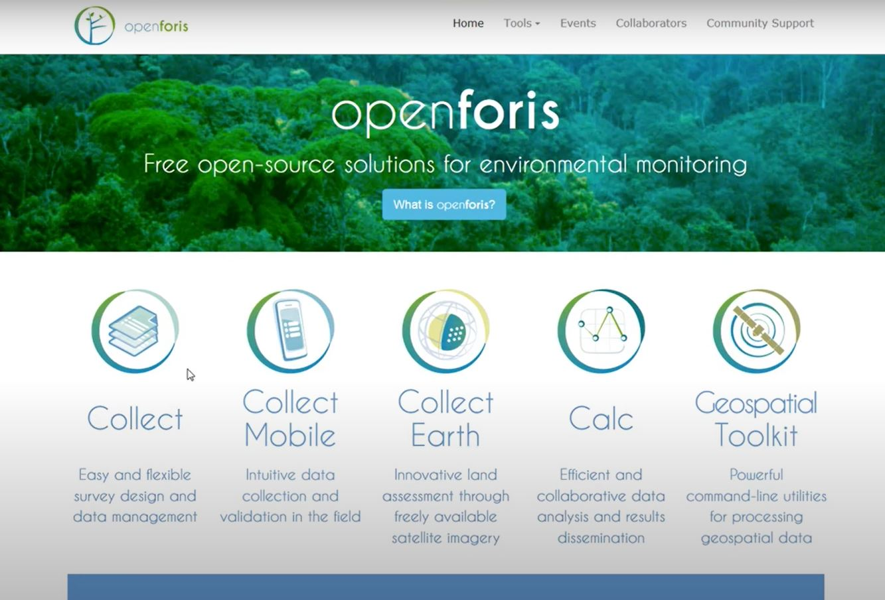

### 1.2 Collect Earth

Collect Earth is a tool that enables data collection through Google Earth. Users can analyze high and very high resolution satellite imagery for a wide variety of purposes. The data gathered through Collect Earth is exportable to commonly used formats and can also be exported to Saiku, a tool that facilitates data analysis.

Several country-specific versions of Collect Earth software have been configured, as well as versions consistent with leading international guidelines (e.g. IPCC, Food and Agriculture Organization Forest Resources Assessment, etc.). 

### 1.3 Collect Earth vs. Collect Earth Online

Collect Earth Desktop (CE) and Collect Earth Online (CEO) are two tools for data collection using high and very high resolution satellite imagery. They share many common features, with a few important differences. Which application to use depends on preference and your specific situation. Some considerations (and recommended programs) include whether you will have multiple data collectors (CEO), whether you want to work offline (CE), if you want an easier setup for your survey questions (CEO), and if you need more options for data export than .csv (CE). 

**CE**

*Data Collection*
- data collection completed in Google Earth, with browser data options from GEE, Bing, Planet, etc.

*Project Set Up* 
- use Collect application; steeper learning curve to use Collect

*Data Management*
- use Collect application. Data is stored on desktop or a server set up, data manager required to collate individual files from multiple users . Data saved for plot, not available at sample locations. There are multiple options for data formatting, especially for export.

**CEO**

*Data Collection*
- labeled online, in browser. Can view data in Google Earth if that is installed. Same data viewing options, and user can compile additional ones (e.g., wms feeds, etc)

*Project Set Up* 
- similar sample design options, although CEO will auto-generate plots for some sampling designs
- survey design functions are similar (hierarchy, conditional rules, etc.)
- in the browser, with a new easy to use interactive wizard

*Data Management*
- All data stored in the cloud in one database. Multiple users can collect information in the same project simultaneously. Users can export data compiled for either plot or sample. Currently, sparse options for data formatting, but compatible with a simple analysis tool in SEPAL. 

### 1.4 Overview

The process for creating a survey in Collect and collecting data using Collect Earth Desktop are detailed in the steps below. The process can be generally described as:
1. Insert parameters and create structure of survey in Collect Survey Designer
2. Generate a grid for where you want to collect the data and insert into Collect Survey Designer
3. Export the survey (.cep file) from Collect Survey Designer and open in Collect Earth Desktop
4. Collect the data in Collect Earth Desktop 

## 2 Learning Objectives

In this tutorial you will learn how to:

*   Download and install Collect and Collect Earth Desktop
*   Build a survey in Collect
*   [optional] Generate a sampling grid through Google Earth Engine
*   Import a sampling grid to Collect
*   Export a finalized survey from Collect 
*   Import the survey created in Collect into Collect Earth Desktop
*   Collect data using Collect Earth
*   Export your collected data 

Designing a project is an iterative process, and you will probably need to make multiple edits to projects in Collect and Collect Earth as you refine your goals, land use or land cover classification schemes, imagery sources, etc. These changes can be made to a project before your project is published. This means that you can create a project and collect test data in it, and edit any errors you find before publishing the project.

### 2.1 Pre-requisites for this module

* Have an understanding of the terminology in Module 3.1, and have an established sample design, which is outlined in Modules 3.2 and 3.3
* A general understanding of image interpretation. Image interpretation is the process of looking at moderate, high, or very high spatial resolution imagery (from satellites or aerial photography) and labeling the objects of interest in your sample locations. Photo interpretation is the core skill needed to effectively execute any Collect Earth desktop project
* It is highly recommended that you have an understanding of the previous tutorials in Modules 1 and 2

## 3 Tutorial: Collect Earth Desktop

### 3.1 Download and install Collect 

The first step is to download “Collect” from the OpenForis website, found at [http://openforis.org/](http://openforis.org/). 

Navigate to [http://www.openforis.org/tools/collect.html](http://www.openforis.org/tools/collect.html). Here you can download the “Collect” application by clicking on “Download last version” and selecting the correct version. Download and install Collect to your computer. If needed, please see the installation help available at [http://www.openforis.org/tools/collect/tutorials/installation.html](http://www.openforis.org/tools/collect/tutorials/installation.html).

Once the “Collect” application is installed, find the application in your file explorer and click “Open Foris Collect” to start the application. 

The OpenForis Collect Control Panel window will open and will need to stay open the entire time you are using Collect. 

The OpenForis Collect Control Panel window will open before the actual browser with the Collect interface opens. This Control Panel window will tell you that Collect is “Running.”

After a few minutes, a new browser window will automatically open with the Collect interface. 

### 3.2 Create a survey 

In this section we will demonstrate how to create a survey and modify it for your needs and suit the type of data you’re trying to collect.

*NOTE: There are also YouTube videos available that demonstrate how to create surveys for Collect Earth desktop which can be found here: [https://www.youtube.com/channel/UCxu8NZPvPxGBjBp0g6LCV4w](https://www.youtube.com/channel/UCxu8NZPvPxGBjBp0g6LCV4w).*

Navigate to the “Survey Designer” on the left hand side of the screen and click “New Survey”. 

There are four fields you will need to fill out to create a new survey. First. provide a title for your survey e.g.: “training_survey.” Your title must be all lowercase with no spaces, the tool will automatically convert caps to lowercase and spaces to underscores (_). 

The Template field has four options: Blank, Biophysical, Collect Earth, and Collect Earth + IPCC. Blank will create a new survey with no information filled in for you. The other three options will create a new survey with some information already filled in based on the template option you choose. Choose the “Collect Earth” option.

Finally, choose your preferred language (we will use English (en)) and for User Group, choose Default Public Group. Click “New” 

You are then taken into the survey editor (Edit survey). There are three tabs at the top of the page, Info, Code lists, and Schema. There is also a dropdown to change the Survey language and the Settings icon drop down menu with import and export functionality.

At the bottom of every screen is a Save button. Save your changes frequently to avoid losing progress.

If your session times out or you accidentally close the window, you can return to the Edit survey window by clicking Survey Designer -> List of surveys -> click on the name of your survey -> Edit survey.

#### 3.2.1 Add survey info

In the Info tab you can edit the Survey details. Add a Project name and Description if you would like (e.g. “Training survey located in Columbia”).

We will not change the Form versions, Spatial Reference Systems, or add Units for this exercise.

Collect Earth - Plot Layout controls plot size and the number of sample points for each plot. We will leave the Plot area as 1 ha (default) and change the Sample points within each plot to 3 x 3. 

Collect Earth - Other settings allow you to open additional sources of imagery automatically from Collect Earth. We will leave this at the default settings.

Be sure to save your survey using the “Save” button at the bottom of the screen. If you are interested in learning more about designing a survey, more information is available at [http://www.openforis.org/tools/collect/tutorials/survey-designer.html](http://www.openforis.org/tools/collect/tutorials/survey-designer.html).

#### 3.2.2 Add code lists

Now navigate to the “Code lists” tab. On the left you can see the pre-set  code lists including elevation, orientation, and slope.           

       

For this survey there are additional code lists we want to include, including land cover and land cover change by year. To add a code list, click “Add list” at the bottom left of the page.

*NOTE: As you are creating your code lists, a yellow triangle with an exclamation point in it may pop up next to the new lists you create. Do not be alarmed by this warning sign. This tells you whether or not it is used within your survey yet and will not affect the usability of your code list moving forward.* 

Now we will add the land cover code list. Name the list ‘land_cover’. **Any name for any code list you create MUST be all lowercase and have no spaces.**

Click “Add code.” A new window will pop up where you will populate the list item information. The first code we will add is ‘water’. Type ‘water’ into the Code, Label, and Tooltip text fields. Click apply. Now repeat this for all other land cover codes: snow_ice, developed, bare, trees, shrub, grassland, crops, and other.

Once you have finished, click “Add list” and create the land use change by year code list. Name the list ‘land_cover_change_yr.’ As before add your codes, which will be all years between 2009 and 2020: 2009, 2010, 2011, 2012… to 2020. We will also add a ‘no_change’ option.

Finally we will add a confidence code list. Name the list ‘confidence’. The first code we will add is ‘high’; add ‘high’ to the Code and Label field and use ‘high confidence’ for the Tooltip. Click apply. Repeat this for medium and low.

If you make a mistake, you can edit existing list items. You can also click and drag the list items into a different order. Go back to the code list ‘land_cover_change_yr’ and try dragging your ‘no_change’ option to the top of the list.

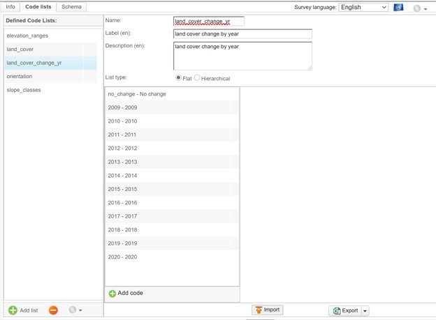 

*NOTE: If you have a list already created in an Excel sheet, click “Import” at the bottom of the page. You can also Export your code list when you are finished with it as an Excel sheet or CSV file.* 

Once you have created your additional code lists, be sure to Save your work at the bottom of the page. 

#### 3.2.3 Add survey questions

Now click on the “Schema” tab. The “Schema” tab is where you will define the structure of the survey and what data will be collected. Because we used the Collect Earth template, the survey will already have “plot” defined as the Sampling Unit. In the future if you would like to design a different survey, there is more information available at [http://www.openforis.org/tools/collect/tutorials/survey-designer.html](http://www.openforis.org/tools/collect/tutorials/survey-designer.html) under Schema. 

We will use this tab to add questions asking about land cover and the year of change.

To create a new survey question, right click your sampling unit “Plot” and select “Add attribute”. From the list that pops up, choose “Code.” Adding a Code attribute will allow you to use any of your previously made Code lists and input them as options for your survey questions. 

         

The Code attribute form will pop up in the right hand column. In the Name field, type “current_land_cover”, note that you cannot put numbers at the start of this field. Add a label in the “Label” section such as “Current Land Cover” and then add a description in the “Tooltip text” section such as “2020 land cover classes.” Next, for the Code list select your “land_cover” code list. By default the survey question will be required. Leave this setting as the default. You can add tooltip text, such as “What is the 2020 land cover?”

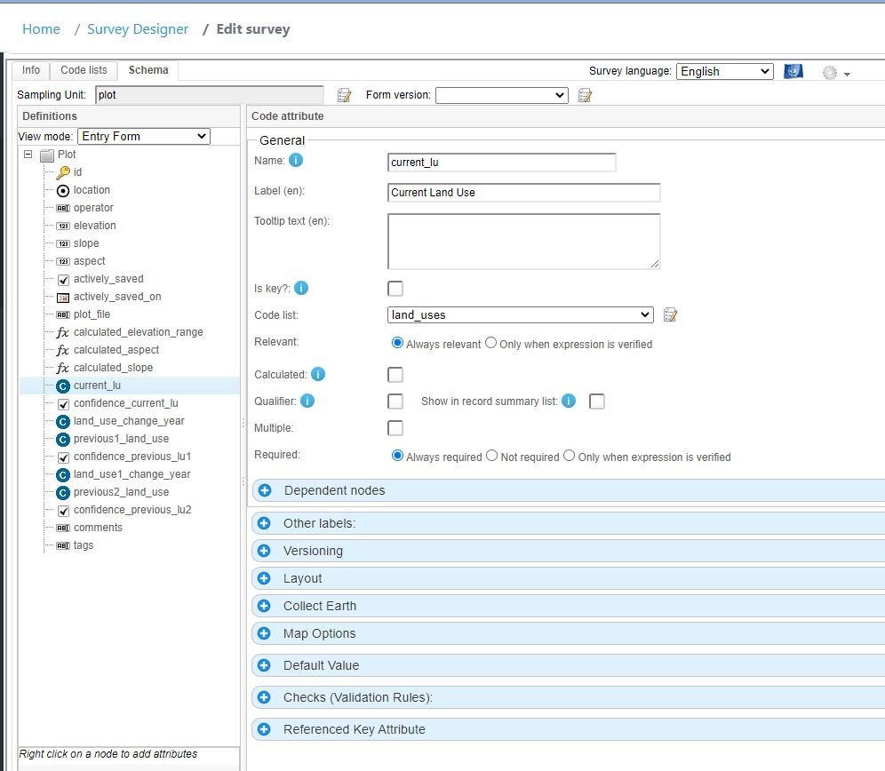          

Now we will repeat this for the land cover change code list. Create another Code attribute. In the Name field, type “land_cover_change”, add a description, and select the “land_cover_change_yr” code list. Add tooltip text, e.g. “No change or indicate year of change.”

Now we’ll add a confidence survey question. Add another Code attribute. In the Name field, type “current_confidence”, add a description, and select the “confidence” code list. Add tooltip text e.g. “How confident about current land cover/land cover change?”

Don’t forget to save your work.

For plots where there is land cover change, we need to add a question asking what the previous land cover change was. Create another Code attribute. In the Name field, type “previous_land_cover” and add a description to indicate this is for the previous time step. Select the “land_cover” code list. 

We only want this question to appear when land cover change has occurred. Next to “Relevant”, click “Only when expression is verified”. In the function box, type `land_cover_change != 'no_change'`. If you want to learn more about these functions, click on the function icon to the right of the textbox. We want to hide this question when it is not relevant, so also click “Hide when not relevant”. This means that the question will NOT pop up if the land cover year of change question is indicated as “No Change” because if there has been no change, then there is no need to identify the previous land cover. 

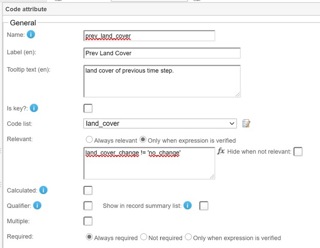 

We also want to add a validation rule to this question. We want to create an error if the current and previous land covers are the same, as that means there is no change. Scroll down and expand the “Checks (Validation Rules)”. Click the green plus button and select “Custom”. 

 

For this survey, add up to three time steps. This means adding additional code lists (“land_cover_change2” and “land_cover_change3”) with land cover change years and creating additional validations rules for each of these code lists. 

A preview of the survey questions can be seen by clicking “Preview” at the bottom right of the page. Be sure to continue to Save your work at the bottom of the page. 

### 3.3 Add a sampling grid to Collect

Collect needs a sampling grid that defines where we will collect data from the survey we just created. 
We present two options  here:
1. importing an existing sampling design, such as the one created in Module 3.3
2. creating and importing a sampling grid using the Grid Generator in Google Earth Engine

#### 3.3.1 Import an existing sampling design

Before importing an existing sampling design, you need to check that the csv is formatted correctly. 

The csv file should contain the following categories in the following order:

*  levelX_code columns: 1 column for each level X (maximum 3 levels, e.g. if you have 2 levels, cluster and plot, you will have a column "level1_code" with cluster id value and a column "level2_code" for plot id value);
*  x: easting, in the same CoordinateReference Systems settings of the survey;
*  y: northing, in the same CoordinateReference Systems settings of the survey; 
*  srs_id: id of the coordinate reference system, the same used as in the Coordinate Reference Systems settings of the survey; and
*  Any additional columns (to a maximum of 10) can be added to the csv file in order to record additional information related to the sampling points (eg. slope , administrative units, etc.).

To check that your csv file structure matches that required for the Collect survey, you can download a demonstration file. This file of the csv format of Collect can be found in the Open Foris Collect Survey Designer. To find this demonstration file:

1. Go to your “Edit survey” page
2. Be sure to be on the “Info” tab
3. Navigate to the “Attached Files” section
4. Click the green “Add” button in the symbol of a plus sign, and a “Survey file” window will pop up
5. Select “Grid” in the “Type” dropdown menu and a button to the left of that saying “Download template” will appear
6. Click “Download template” to download the demonstration csv file to know how to adapt your generated grid csv file to match the structure for the Collect survey

Once you are sure the structure matches, your generated grid csv file will be ready to use in the Collect Survey Designer.

To import an existing sampling design, navigate to the “Info” tab. On the “Info” tab of your survey editor, go to the “Attached Files” section and click the green add button to attach your csv grid file. If your file is too large you may need to split it up into multiple files.  

#### 3.3.2 [Optional] Creating a sampling grid for Collect Earth using the Grid Generator in Google Earth Engine

The Grid Generator is a Google Earth Engine App created with the Google Earth Engine Code Editor. This tool allows you to design and generate a grid for your Collect Earth project. 

*NOTE: There are also YouTube videos available that demonstrate how to generate a grid for Collect Earth desktop which can be found here: [https://www.youtube.com/channel/UCxu8NZPvPxGBjBp0g6LCV4w](https://www.youtube.com/channel/UCxu8NZPvPxGBjBp0g6LCV4w)*

To access the Google Earth Engine Grid Generator, visit this website ([http://www.openforis.org/tools/collect-earth/tutorials/grid-generation-through-google-earth-engine.html](http://www.openforis.org/tools/collect-earth/tutorials/grid-generation-through-google-earth-engine.html)) and click “Generated Grid through GEE”. This website also has further tutorials that may be useful for using this application. 

The Google Earth Engine Grid Generator offers different ways to generate a grid: you can use a feature collection by uploading a shapefile to GEE assets and using its GEE Asset ID, manually select the area using the polygon/rectangle drawing tool, or select a country from the list. In this case we’ll be selecting the country of Colombia. 

To select the country of Colombia, navigate to the dropdown menu that says “Choose a country or the option to use your own shapefile/asset” on the left side of the screen at the top of the grid generator window. Once you open the dropdown menu, scroll down to the country of Colombia and select. Once selected, the background Google map will change to the location of the country. Colombia portrays a diverse representation of forest type, topography, and cloud cover, and a very low deforestation rate relative to country area. 

Next you need to set the EPSG code for the coordinate system that best fits your study area. EPSG codes are a public registry of geodetic datums that most geographic information systems use to identify coordinate reference systems. For countries close to the equator you can use the EPSG code that is prefilled (EPSG:4326). EPSG:4326 is a common EPSG code that refers to the latitude/longitude coordinate system based on the Earth’s center of mass. Using an EPSG code in this case for Collect allows for an accurate projection of your chosen location across the different platforms utilized in this process. The Grid Generator recommends using the prefilled EPSG:4326 code for large countries, so we can keep it as since Colombia is a fairly large country. With this coordinate system, the longitudinal distance between plots changes between plots the more you move from the equator. You can visit epsg.io to find EPSG codes. 

You can also add different data to the plots of the grid that you will be generating. For example, you can add the GAUL Administrative Units data that includes the country, province, and district, you can add the digital elevation model (DEM) data that includes elevation, slope, and aspect, or you can add IPCC data specific for greenhouse gas inventories that includes soil, climate, and other data. With this data you can improve the information contained in the grid that will be used during the analysis phase of collecting data with Collect Earth. For this project, we will add the IPCC data to the grid we are generating. To do so, be sure to check the checkbox next to “Add IPCC (soil,climate,gez) data”. 

Next you will need to define what kind of grid you want to generate. You can generate a systematic grid or you can generate a random grid. If you generate a systematic grid, you set the distance between the plots in meters; this will depend on how large your grid ends up being. The Grid Generator generally recommends the distance for a systematic grid to be more than 500 meters. In a random grid you set the number of plots that need to be generated in the grid. 

In this case we’ll be generating a systematic grid with a distance of 6000 m between plots. To do so, be sure to check the checkbox next to “Generate systematic grid” and type in “6000” in the textbox under “Set the distance in meters of the systematic grid.” 

Lastly, you can add columns on the generated grid .csv file from other shapefiles. This is useful if you want ancillary information on the grid from later use in the analysis. The shapefiles must be uploaded to Google Earth Engine as assets and this option will add all of the properties from the polygons to the intersecting plot. In this exercise we will not be utilizing this feature. 

After defining everything, click “Generate grid” at the bottom and the grid will be generated. Once you’ve clicked this, a new window will pop up on the upper right side of the page. Then click “CLICK TO DOWNLOAD GRID” to download the generated csv file. You can also download data for the country or provinces only, and if the data ends up being too large you can generate the grid through the Google Earth Engine Code Editor instead. 

Next, the csv file structure will need to be adapted to the structure of the Collect survey. A demonstration file of the csv format of Collect can be found in the Open Foris Collect Survey Designer. To find this demonstration file:

1. Go to your “Edit survey” page
2. Be sure to be on the “Info” tab
3. Navigate to the “Attached Files” section
4. Click the green “Add” button in the symbol of a plus sign, and a “Survey file” window will pop up
5. Select “Grid” in the “Type” dropdown menu and a button to the left of that saying “Download template” will appear
6. Click “Download template” to download the demonstration csv file to know how to adapt your generated grid csv file to match the structure for the Collect survey

In the demonstration csv file, the columns are labeled as “id”, “YCoordinate”, “XCoordinate”, “elevation”, “slope”, and “aspect”. 

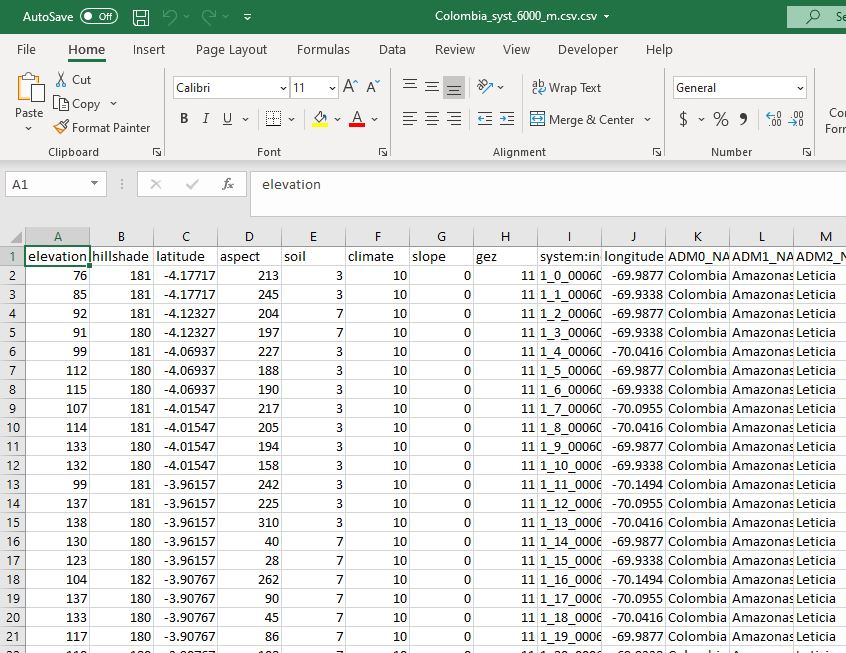

In the generated grid for Colombia, you can see that the columns are labeled differently. You will now need to edit your generated grid to match the structure for the Collect survey. To do this you must: 

1. Move the “system:index” column to be column A and rename the label to be “id”. This will be your identification for each point. 
2. Next, move the “latitude” column to become column B and rename it “YCoordinate”. 
3. Move the “longitude” column to become column C and rename it “XCoordinate”. 
4. Move the “elevation” column to be column D. 
5. Move the “slope” column to be column E. 
6. Lastly, move the “aspect” column to be column F. 

You can reorganize or delete the rest of the columns to your preference as long as columns A through F are in the same format as the demonstration csv file. Once you are sure the structure matches, your generated grid csv file will be ready to use in the Collect Survey Designer.

On the “Info” tab of your survey editor, go to the “Attached Files” section and click the green add button to attach your csv grid file. 
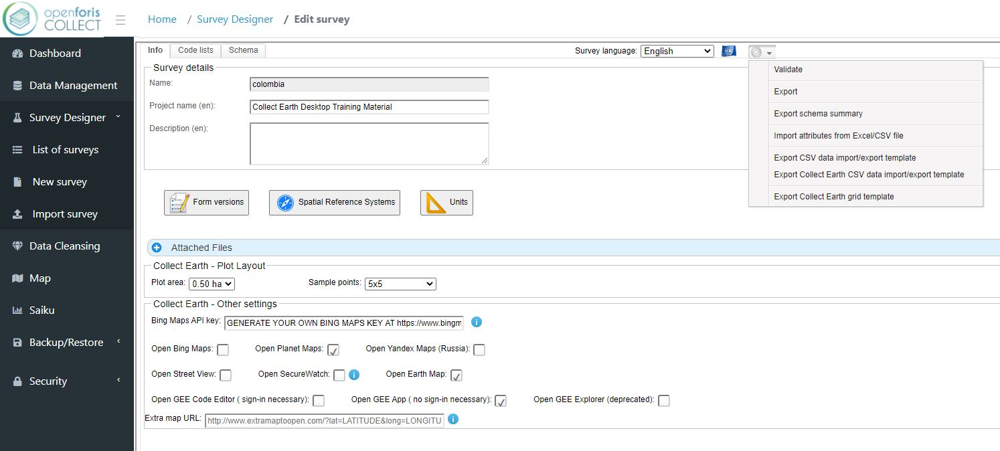

If your file has more than 4000 plot points it will be too large to upload, so you may need to split it up into multiple csv files. To do so, open Collect Earth, go to the “Tools” dropdown menu on the Control Panel, click “Utilities” and then “Divide large CSV plot files”. From here you can divide your large CSV file and prepare it to import into Collect Survey Designer. 

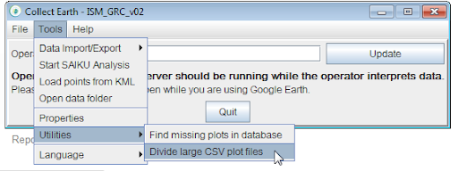

Now that you’ve completed your survey questions and attached the grid files to indicate the location of your data collection, you can now export and share your Collect Earth survey, which is described in the next section. 

### 3.4 Export and share your Collect Earth Survey 

To share your Collect Earth survey, go to the “List of surveys” and click “Export”. There are multiple ways to export the survey. For example, if you want to use the survey in Collect Earth, then you will need to change the export mode to “Collect Earth”. If you would like to create a backup of the information, selected “Collect Desktop (backup)” as the export mode. 

For this exercise, click “Export”, choose the type “Unpublished changes” if you have not yet published your survey. Use the export mode “Collect Earth,” and choose the language for your survey. Language options include English, Spanish, and French. 

The exported file will then download as a .cep file to the location you have specified. It can then be shared and will open directly into Collect Earth if you already have it downloaded. 

Please refer to the next tutorial on Collect Earth Desktop Data Collection for how to collect data using a survey. 

### 3.5 Download and launch Collect Earth

You can download Collect Earth from the Open Foris website. Visit [http://www.openforis.org/tools/collect-earth.html](http://www.openforis.org/tools/collect-earth.html). Click on Download latest version, then select the appropriate version for your operating system. Install based on your operating system. Installation instructions can be found at [http://www.openforis.org/tools/collect-earth/tutorials/installation.html](http://www.openforis.org/tools/collect-earth/tutorials/installation.html).

Launch Collect Earth by clicking on the shortcut or by navigating to the Collect Earth folder and double-clicking on the batch file entitled CollectEarth-launcher.exe. 

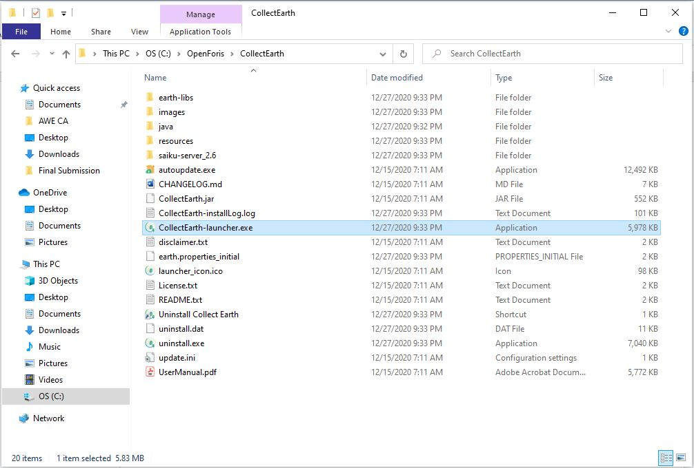

In the main Collect Earth window, set your operator name. When you run Collect Earth you need to set your operator name, which is a way for you to later filter out the data collected by the person (operator) that collected the data. Just put your name or whatever you like to identify yourself in the text field. Then click update. Remember to use a consistent operator name that is between 6 and 50 characters long.

Collect Earth will automatically launch Google Earth. Collect Earth together with Google Earth provide an easy way to systematically review satellite imagery and assess land use. 

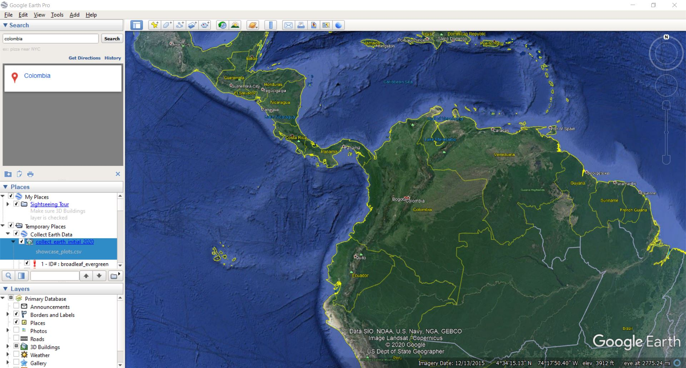

### 3.6 Collect Data

*NOTE: In addition to these materials, there are also YouTube videos available that demonstrate how to collect data in Collect Earth desktop which can be found here: [https://www.youtube.com/channel/UCxu8NZPvPxGBjBp0g6LCV4w](https://www.youtube.com/channel/UCxu8NZPvPxGBjBp0g6LCV4w)*

In the main Collect Earth window, navigate to “File” and click “Import CEP file” to import a previously made data collection survey. Locate the survey you just exported from the Collect application.

Once your .cep file opens in Google Earth Pro, click on a plot point in the right hand window and the map will navigate to the plot point. Then click on the actual plot point on the map. The survey questions will pop up in addition to maps in your browser that were previously chosen during the survey design. 

In this case, Collect Earth Plot Imagery and Statistics, NICFI Planet basemaps, and Earth Map all automatically open in your browser. Sign in to these maps accordingly and utilize these maps to answer your survey questions. Collect Earth Plot Imagery and Statistics and the NICFI Planet base maps will automatically open. Earth Map will allow you to sign in or continue as a guest. Accounts for these sites are not required. These maps will help you better understand the changes that occurred in land use for that particular plot point. 

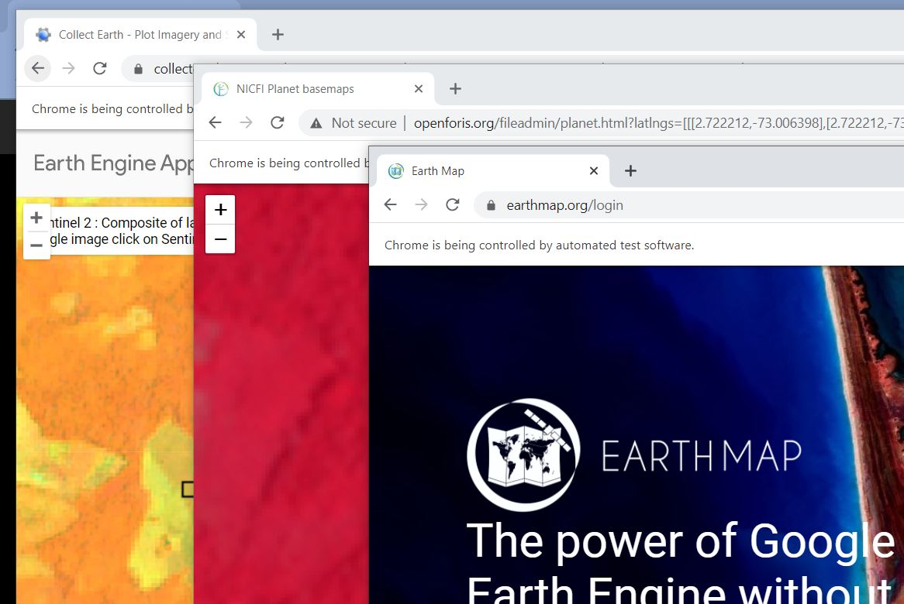

To analyze a plot point, utilize the maps that pop up and its corresponding data to determine what the current land use is and what changes may have occurred there. 

For example, we are analyzing plot number COLOMBIA_1778 here. 

After investigating the imagery further, utilizing the additional maps, you can conclude that this area has a mix of species of trees. In the dropdown for “Current Land Use” you can then choose “TREES: Mixed”. The “Confidence Current LU” yes or no question wants to know if you are confident in your land use choice. In this case, we can choose “Yes” because we are fairly confident that this imagery shows a mixed species of trees. 

If you look at the Earth Map window and investigate the data, you can see that there have been no changes in land use over the years, so within the “Land Use Change Year” dropdown you can choose “There has been no change in Land Use in the previous years”

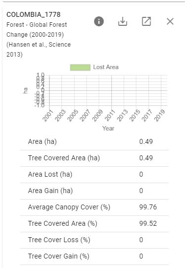

As you can see, once the required questions have been answered, the title turns from red to black. You can also include comments or tags if there is additional information you would like to include during your data collection. Once you are done with the survey, click “Send” in the bottom right corner of the pop up window. You will then see that your data was saved and the plot in the right hand plot list now has a green check mark next to it. When you press “Ok” the application will take you to the next plot. 

Continue with the rest of the plot points this way. You will have completed your survey once the entire right hand plot list has a green check mark next to each plot. 

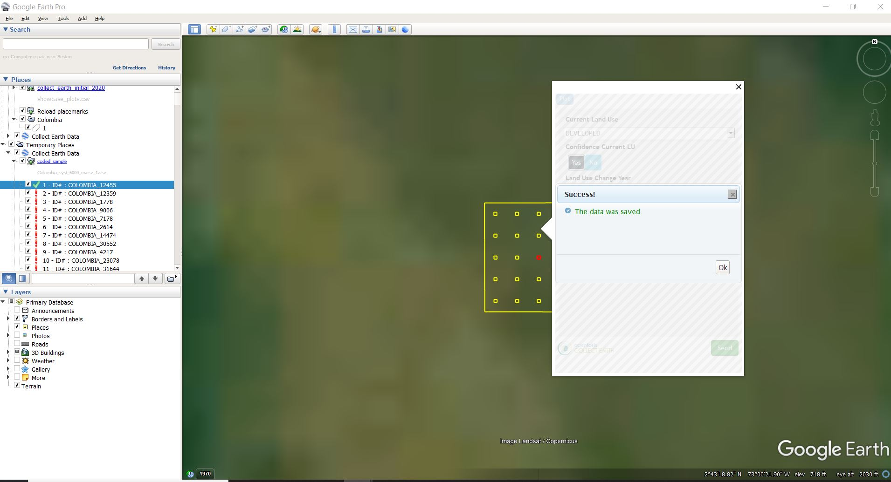

#### Image Interpretation Tips

* Seasonality issues can occur when different land uses appear different between seasons. For example, a grassland might be bright green in spring but look brown in the summer. If you saw just the brown imagery, you might think the brown is dirt and incorrectly classify the grassland as barren dirt.
* Zooming in and out to gather contextual clues from the landscape is important for multiple land use and land cover types. For example:
- Water in larger water bodies often appears black or dark until you zoom out.
- Tree plantations may look like forests until you zoom out and see the regular pattern of planted trees.

### 3.7 Export your data 

When you have completed your data collection and want to export your Collect Earth data, go to your main Collect Earth window and click on “Data Import/Export” under the Tools menu. Here you can save your file as a CSV, XML, Collect Backup, or Fusion Table. Name and save your file. 

The CSV file, which can be opened in Excel, tabulates all of the data that has been entered in Collect Earth, including data that has not been actively saved and validated. Some metadata are also provided, such as the plot coordinates and the operator name. Data Export to Fusion Table also generates a CSV file, but it differs from the normal CSV export in that it contains an additional column with the complete coordinates of each plot. XML is the only format that is configured to save Collect Earth metadata in addition to the data manually entered by users. 

## Frequently Asked Questions (FAQs)

For further support using Collect Earth, go to openforis.org and click “Community Support” in the upper navigation bar. 
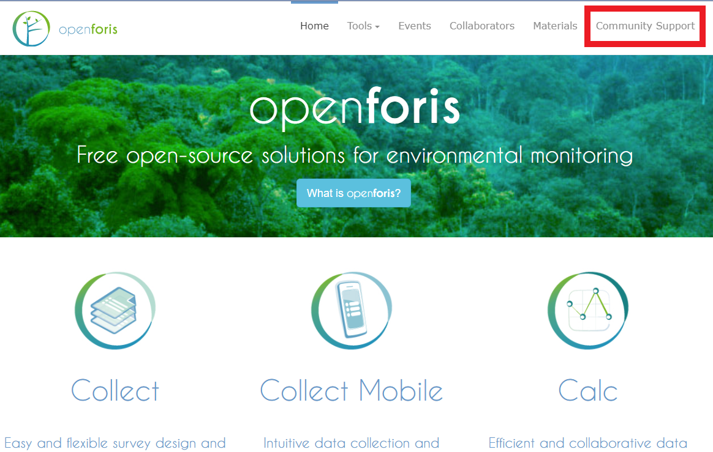

Here you can create an account and ask a question and it will reach OpenForis directly or others in the OpenForis community can help.

-----

  

This work is licensed under a [Creative Commons Attribution 3.0 IGO](https://creativecommons.org/licenses/by/3.0/igo/)

Copyright 2021, World Bank 

This work was developed by Justine Bui and Karen Dyson under World Bank contract with GRH Consulting, LLC for the development of new -and collection of existing- Measurement, Reporting, and Verification related resources to support countries’ MRV implementation. 

Material reviewed by:   
Ana Mirian Villalobos, El Salvador, Ministry of Environment and Natural Resources  
Carole Andrianirina, Madagascar, National Coordination Bureau REDD+ (BNCCREDD)  
Jennifer Juliana Escamilla Valdez, El Salvador, Ministry of Environment and Natural Resources 
Phoebe Oduor, Kenya, Regional Centre For Mapping Of Resources For Development (RCMRD) 
Tatiana Nana, Cameroon, REDD+ Technical Secretariat  

Attribution
Bui, J., Dyson, K. 2021. Response Design in Collect Earth Desktop. © World Bank. License:  [Creative Commons Attribution license (CC BY 3.0 IGO)](http://creativecommons.org/licenses/by/3.0/igo/)  
