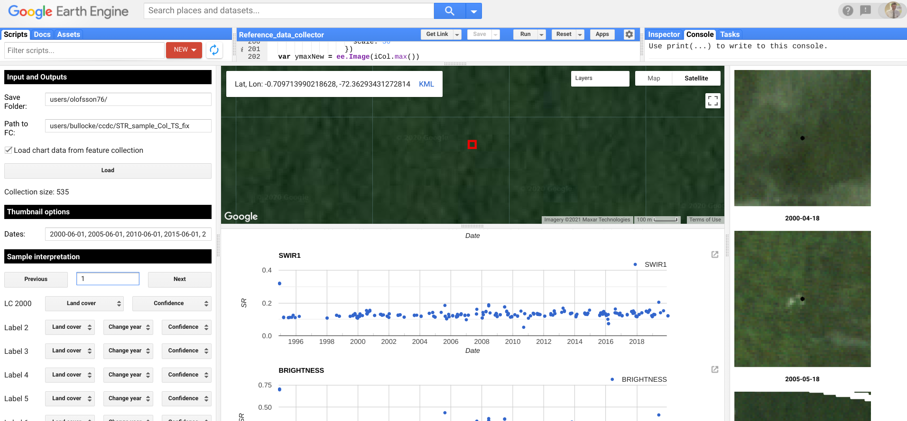

# Response design in AREA2 

## 1.Contexte
Le plan de réponse définit la " réponse " des unités d'un échantillon. Dans le contexte de l'inférence basée sur le design dans un contexte géographique, " le design de réponse englobe toutes les étapes du protocole qui mènent à une décision concernant la concordance des classifications de référence et de la carte [et] la meilleure classification disponible des [conditions de surface du sol] pour chaque unité spatiale échantillonnée "  (Olofsson et al. 2014) [^fn1].  Les termes suivants sont importants :

**Données de référence**
Données caractérisant l'évaluation disponible la plus précise de la condition réelle à la localisation de l'échantillon (exemple : imagerie satellitaire à résolution fine).

**Observations de référence**
L'évaluation disponible la plus précise de l'état réel d'une unité de population.

**Classification de référence**
La classification de référence appliquée à la collection de toutes les unités d'échantillonnage.

Dans ce tutoriel, nous allons déterminer les conditions de référence en examinant un ensemble de données de référence aux endroits où se trouvent les unités de l'échantillon que nous avons tiré de la Colombie dans le tutoriel précédent. Nous avons défini quatre strates : forêt, non-forêt, perturbation de la forêt et une zone tampon autour de la perturbation de la forêt. L'objectif est d'estimer la zone de perturbation forestière ; par conséquent, nous allons collecter des observations de référence de *forêt, non-forêt* et *perturbation de forêt*.

## 2. Préparer les données de référence
 La première étape consiste à extraire les séries temporelles des données Landsat aux localisations de l'échantillon. Pour ce faire, nous utilisons le script Save Feature Timeseries : https://code.earthengine.google.com/?scriptPath=projects%2FGLANCE%3Aglance%2Fsubmit%2FprepareTS%2FextractTS_getRegion Ce script n'a pas d'interface graphique mais tout ce que nous avons à faire est de pointer le script vers l'actif GEE contenant l'échantillon. En haut du script, ajoutez simplement la ligne suivante en spécifiant l'emplacement de l'échantillon sélectionné à l'étape précédente :
 ```
 var sample = ee.FeatureCollection('users/olofsson76/Open_MRV/STR_sample_Col')
 ```
 Changez également les dates de 'début' et de 'fin' dans le script en fonction de votre période d'étude. Cliquez sur Exécuter dans Tâches et enregistrez le résultat sous forme de ressource GEE en le nommant "[filename]_TS".


## 3. Examiner les données de référence sur les sites d'échantillonnage

Le collecteur de référence se trouve ici: https://code.earthengine.google.com/09964c3fbb9a7d9f8530ee687be8bb90
Une fois chargé, spécifiez un chemin pour sauvegarder votre travail sous "Inputs and Outputs" et par "Link to FC", spécifiez l'emplacement de l'actif contenant l'échantillon après avoir été traité en utilisant le script Save Feature Timeseries comme décrit ci-dessus. Cochez "Load chart data from feature collection" et cliquez sur "Load". Cela devrait afficher la taille de l'échantillon -- dans mon cas, j'utilise l'échantillon de 535 unités que nous avons conçu dans le tutoriel sur le plan d'échantillonnage.

Pour commencer, sous "Interprétation de l'échantillon", spécifiez "1" et appuyez sur la touche Entrée -- cela affichera les données de référence pour la première unité de l'échantillon. Les graphiques de séries temporelles situés au centre de l'interface sont importants : les séries temporelles sont affichées pour les bandes rouge, NIR et SWIR1 de Landsat, et pour les transformations de Tasseled Cap (Kauth-Thomas) : luminosité, verdure et humidité. Les six premiers graphiques montrent les données des séries temporelles pour la période d'étude spécifiée dans le script Save Features Timeseries ci-dessus ; vous pouvez zoomer sur un certain intervalle de temps et les graphiques peuvent être affichés dans une fenêtre séparée en cliquant sur la flèche à côté de chaque graphique. Les six derniers graphiques sont des graphiques de séries chronologiques annuelles cumulées, de sorte que les données de chaque année sont tracées "au-dessus" les unes des autres.   

Above the time series data is the outline of the sample unit draped on top of the default GEE satellite imagery -- click "KML" to display high resolution data in Google Earth at sample locations.

 

Pour l'instant, nous recommandons à l'utilisateur de noter les étiquettes de référence dans une feuille de calcul séparée, car la mise en œuvre de la sauvegarde des étiquettes de référence dans une collection unique de caractéristiques est en cours. Des vidéos illustrant la manière d'observer les conditions de référence en examinant les données de référence sont fournies ici (les vidéos font partie du projet NASA MEaSUREs GLanCE à l'Université de Boston

*  http://sites.bu.edu/measures/):  
* https://drive.google.com/file/d/1Y_D49kE_oiXxGEJEcPGT8FavrzdMj2qh/view?usp=sharing
* https://drive.google.com/file/d/1Md5NajZAngJsVWWiTCbgSdLiEyw7u6BE/view?usp=sharing

## licence
Cette œuvre est soumise à une licence  [Creative Commons Attribution 3.0 IGO](https://creativecommons.org/licenses/by/3.0/igo/) 

Copyright 2020, Banque Mondiale. Ce travail a été développé par Pontus Olofsson dans le cadre d'un contrat de la Banque mondiale avec GRH Consulting, LLC pour le développement de nouvelles ressources - et la collecte de ressources existantes - liées à la mesure, la notification et la vérification pour soutenir la mise en œuvre du MRV par les pays. 

Attribution: Olofsson, P. (2021). *Open MRV: Response Design*. World Bank. License: Creative Commons Attribution license (CC BY 3.0 IGO)

## References
[^fn1]: Olofsson, P., Foody, G. M., Herold, M., Stehman, S. V., Woodcock, C. E., & Wulder, M. A. (2014). Good practices for estimating area and assessing accuracy of land change. *Remote Sensing of Environment*, 148, 42-57.
