# Plan de réponse dans Collect Earth Desktop

## 1 Contexte

### 1.1 Collect

“Collect” est l'outil utilisé pour gérer les données et créer un questionnaire. Il offre un moyen rapide, facile et flexible de mettre en place un sondage avec une interface conviviale. Collect gère plusieurs types de données et des règles de validation complexes, le tout dans un environnement multilingue. Cette application est entièrement gratuite. 

### 1.2 Collect Earth

Collect Earth est un outil qui permet de collecter des données via Google Earth. Les utilisateurs peuvent analyser des images satellites à haute et très haute résolution à des fins très diverses. Les données recueillies par Collect Earth sont exportables dans des formats courants et peuvent également être exportées vers Saiku, un outil qui facilite l'analyse des données.

Plusieurs versions du logiciel Collect Earth spécifiques à chaque pays ont été configurées, ainsi que des versions conformes aux principales directives internationales (par exemple, le GIEC, l'évaluation des ressources forestières de l'Organisation pour l'alimentation et l'agriculture, etc.) 

### 1.3 Collect Earth vs. Collect Earth Online

Collect Earth Desktop (CE) et Collect Earth Online (CEO) sont deux outils de collecte de données utilisant des images satellite à haute et très haute résolution. Ils partagent de nombreuses caractéristiques communes, avec quelques différences importantes. Le choix de l'application à utiliser dépend de vos préférences et de votre situation particulière. Parmi les considérations (et les programmes recommandés), citons le fait de savoir si vous aurez de multiples collecteurs de données (CEO), si vous voulez travailler hors ligne (CE), si vous voulez une configuration plus facile pour vos questionnaires (CEO), et si vous avez besoin de plus d'options pour l'exportation des données que le format .csv (CE). 

**CE**

*Collection de données**

- collection de données effectuée dans Google Earth, avec des options de données de navigateur de GEE, Bing, Planet, etc.

*Mise en place du projet* 

- utilisation de l'application Collect ; courbe d'apprentissage plus longue pour utiliser Collect

*Gestion des données*

- utilisation l'application Collect. Les données sont stockées sur le bureau ou sur un serveur, le gestionnaire de données doit rassembler les fichiers individuels de plusieurs utilisateurs. Les données sont sauvegardées pour les parcelles.Il existe de nombreuses options pour le formatage des données, notamment pour l'exportation.

**CEO**

*Collection de données*

- Labellisation en ligne, dans le navigateur. Peut visualiser les données dans Google Earth si celui-ci est installé. Mêmes options de visualisation des données, et l'utilisateur peut en compiler d'autres (par exemple, flux wms, etc.).

*Mise en place du projet* 

- options de plan d'échantillonnage similaires, bien que CEO génère automatiquement des graphiques pour certains plans d'échantillonnage.
- les fonctions de conception d'enquêtes sont similaires (hiérarchie, règles conditionnelles, etc.)
-  dans le navigateur, avec un nouvel assistant interactif facile à utiliser

*Gestion des données*

- Toutes les données sont stockées dans le cloud dans une seule base de données. Plusieurs utilisateurs peuvent collecter simultanément des informations dans le même projet. Les utilisateurs peuvent exporter les données compilées pour une parcelle ou un échantillon. Actuellement, peu d'options pour le format des données, mais compatible avec un outil d'analyse simple dans SEPAL. 

### 1.4 Description générale

Le processus de création d'une étude dans Collect et de collecte de données à l'aide de Collect Earth Desktop est détaillé dans les étapes ci-dessous. Le processus peut être décrit de la manière suivantes:
1. Insérez les paramètres et créez la structure du questionnaire dans Collect Survey Designer.
2. Générez une grille pour l'endroit où vous souhaitez collecter les données et insérez-la dans Collect Survey Designer. 3.
3.  Exportez le questionnaire (fichier .cep) depuis Collect Survey Designer et ouvrez-le dans Collect Earth Desktop.
4. Collectez les données dans Collect Earth Desktop

## 2 Objectifs d'apprentissage

Dans ce tutoriel, vous apprendrez à :

*   Télécharger et installer Collect et Collect Earth Desktop
*   Construire un questionnaire dans Collect
*   Générer une grille d'échantillonnage via Google Earth Engine
*   Importer une grille d'échantillonnage dans Collect
*   Exporter les résultats d'une étude finalisée depuis Collect 
*   mportez la base de données créée dans Collect dans Collect Earth Desktop.
*   ollectez des données à l'aide de Collect Earth
*   Exportez vos données collectées 

La conception d'un projet est un processus itératif, et vous devrez probablement apporter de nombreuses modifications aux projets dans Collect et Collect Earth à mesure que vous affinerez vos objectifs, vos schémas de classification de l'utilisation ou de la couverture du sol, vos sources d'images, etc. Ces modifications peuvent être apportées à un projet avant sa publication. Ces modifications peuvent être apportées à un projet avant qu'il ne soit publié. Cela signifie que vous pouvez créer un projet et y collecter des données de test, puis corriger les erreurs que vous trouvez avant de publier le projet.

### 2.1 Pré-requis 

* La terminologie importante se trouve à la fin de ce document.
* Une connaissance générale de l'interprétation d'images. L'interprétation d'images est le processus consistant à regarder des images à résolution spatiale modérée, élevée ou très élevée (provenant de satellites ou de photographies aériennes) et à identifier les objets d'intérêt dans vos emplacements d'échantillonnage.L'interprétation d'images est la compétence de base nécessaire à l'exécution efficace de tout projet de Collect Earth desktop . L'interprétation d'images est la compétence de base nécessaire à l'exécution efficace de tout projet de Collect Earth Desktop. 

## 3 Tutoriel: Collect Earth Desktop

### 3.1 Téléchargement et installation de Collect 

La première étape consiste à télécharger "Collect" sur le site Web d'OpenForis, à l'adresse suivante [openforis](http://openforis.org/).  Allez à [Lien de la version recente](http://www.openforis.org/tools/collect.html). Vous pouvez y télécharger l'application "Collect" en cliquant sur "Télécharger la dernière version" et en sélectionnant la bonne version. Téléchargez et installez Collect sur votre ordinateur. Si nécessaire, veuillez consulter l'aide à l'installation disponible à l'adresse suivante [Lien aide d'installation de OpenForis](http://www.openforis.org/tools/collect/tutorials/installation.html).

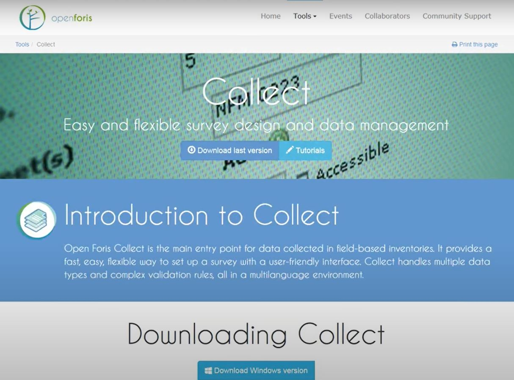

Une fois l'application "Collect" installée, trouvez l'application dans votre explorateur de fichiers et cliquez sur "Open Foris Collect" pour lancer l'application. 

La fenêtre du panneau de configuration OpenForis Collect s'ouvre et doit rester ouverte pendant toute la durée de l'utilisation de Collect. 

La fenêtre du panneau de configuration d'OpenForis Collect s'ouvre avant que le navigateur avec l'interface Collect ne s'ouvre. Cette fenêtre du panneau de configuration vous indiquera que Collect est "en cours d'exécution".

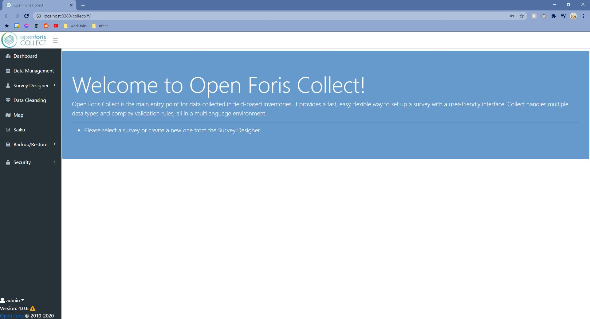

Après quelques minutes, une nouvelle fenêtre de navigateur s'ouvrira automatiquement avec l'interface Collect. 

### 3.2 Création du formulaire d'enquête 

Dans cette section, nous allons vous montrer comment créer une étude et la modifier en fonction de vos besoins et du type de données que vous essayez de collecter.

*RAPPEL: il existe également des vidéos YouTube qui montrent comment créer des études à partir  de Collect Earth, que vous trouverez ici : [Lien Creation de Survey](https://www.youtube.com/channel/UCxu8NZPvPxGBjBp0g6LCV4w).*

Aller dans le  “Survey Designer” à gauche de l'écran et cliquer sur  “New Survey”. 

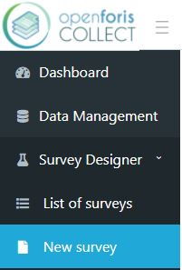

Il y a quatre champs que vous devrez remplir pour créer une étude. Premièrement, donnez un titre à votre questionnaire, par ex : "training_survey. Votre titre doit être tout en minuscules, sans espace. L'outil convertira automatiquement les majuscules en minuscules et les espaces en caractères de soulignement (_). 

Le champ " Template " comporte quatre options : Blank, Biophysical, Collect Earth, et Collect Earth + IPCC. L'option Blank créera une nouvelle étude qui ne contiendra aucune information. Les trois autres options créeront une nouvelle enquête avec certaines informations déjà remplies en fonction de l'option de modèle que vous avez choisie. Choisissez l'option "Collect Earth".

Enfin, choisissez votre langue préférée (nous utiliserons l'anglais (en)) et pour le groupe d'utilisateurs, choisissez le groupe public par défaut. Cliquez sur “New” 

Vous accédez ensuite à l'éditeur des questionnaires (Edit survey). Il y a trois onglets en haut de la page, Info, Listes de codes et Schéma. Il y a également un menu déroulant pour changer la langue de l'enquête et le menu déroulant de l'icône Paramètres avec une fonctionnalité d'importation et d'exportation.

En bas de chaque écran se trouve un bouton Enregistrer. Sauvegardez fréquemment vos modifications pour éviter de perdre votre progression.

Si votre session se termine ou si vous fermez accidentellement la fenêtre, vous pouvez revenir à la fenêtre d'édition  en cliquant sur   **_Designer_** -> **_List of surveys_** -> **_click on the name of your survey_ **-> **_Edit survey_**.

#### 3.2.1 Ajouter des informations sur le questionnaire

Dans l'onglet Info, vous pouvez modifier les détails de tout le questionnaire. Ajoutez un nom de projet et une description si vous le souhaitez (par exemple,  “Training survey located in Columbia”).

Nous ne modifierons pas les versions du formulaire, les systèmes de référence spatiaux et n'ajouterons pas d'unités pour cet exercice.

Collect Earth - Plot Layout contrôle la taille de la placette et le nombre de points d'échantillonnage pour chaque placette. Nous laisserons la superficie de la placette à 1 ha (par défaut) et modifierons le nombre de points d'échantillonnage dans chaque placette à 3 x 3. 

Collect Earth - D'autres paramètres vous permettent d'ouvrir automatiquement d'autres sources d'imagerie à partir de Collect Earth. Nous allons laisser ces paramètres par défaut.

Assurez-vous de sauvegarder votre étude en utilisant le bouton "Save" au bas de l'écran. Si vous souhaitez en savoir plus sur la conception d'une collecte, vous trouverez de plus amples informations à l'adresse suivante [Lien conception d'une collecte de data](http://www.openforis.org/tools/collect/tutorials/survey-designer.html).

#### 3.2.2 Ajouter des listes de codes

Accédez maintenant à l'onglet “Code lists”. Sur la gauche, vous pouvez voir les listes de codes prédéfinies, notamment l'élévation, l'orientation et la pente.     

Pour cette étude, il y a des listes de codes supplémentaires que nous voulons inclure, y compris la couverture du sol et le changement de couverture du sol par année. Pour ajouter une liste de codes, cliquez sur  “Add list” en bas à gauche de la page.

*NOTE: Lorsque vous créez vos listes de codes, un triangle jaune avec un point d'exclamation peut apparaître à côté des nouvelles listes que vous créez. Ne soyez pas alarmé par ce signe d'avertissement. Il vous indique si le code est déjà utilisé ou non dans votre questionnaire et n'affectera pas la facilité d'utilisation de votre liste de codes à l'avenir. 

Maintenant, nous allons ajouter la liste de codes de couverture du sol. Nommez la liste 'land_cover'. **Le nom d'une liste de codes que vous créez DOIT être tout en minuscules et sans espace**.

Cliquez sur “Add code.” Une nouvelle fenêtre s'ouvre dans laquelle vous allez renseigner les informations sur les éléments de la liste. Le premier code que nous allons ajouter est "water". Tapez "water" dans les champs de texte Code, Label et Tooltip. Cliquez sur appliquer. Répétez l'opération pour tous les autres codes de couverture terrestre : snow_ice, developed, bare, trees, shrub, grassland, crops, and other.

Une fois que vous avez terminé, cliquez sur  “Add list” et créez la liste des changements d'utilisation des sols par code d'année. Nommez la liste 'land_cover_change_yr'. Comme précédemment, ajoutez vos codes, qui seront toutes les années entre 2009 et 2020 : 2009, 2010, 2011, 2012... jusqu'à 2020. Nous ajouterons également une option "no_change".

Enfin, nous allons ajouter une liste de codes de confiance. Nommez cette liste "confidence". Le premier code que nous allons ajouter est "high" ; ajoutez "high" dans le champ Code and Label et utilisez "high confidence" pour l'infobulle. Cliquez sur appliquer. Répétez l'opération pour les valeurs moyenne et faible.

Si vous faites une erreur, vous pouvez modifier les éléments de la liste existante. Vous pouvez également cliquer et faire glisser les éléments de la liste dans un ordre différent. Revenez à la liste de codes "land_cover_change_yr" et essayez de faire glisser votre option "no_change" en haut de la liste.

*NOTE:Si vous avez déjà créé une liste dans une feuille Excel, cliquez sur "Importer" au bas de la page. Vous pouvez également exporter votre liste de codes lorsque vous avez terminé, sous forme de feuille Excel ou de fichier CSV*. 

Une fois que vous avez créé vos listes de codes supplémentaires, assurez-vous de sauvegarder votre travail au bas de la page. 

#### 3.2.3 Ajouter des questions au questionnaire

Cliquez maintenant sur l'onglet "Schéma". L'onglet "Schéma" est l'endroit où vous allez définir la structure de tout le projet et les données qui seront collectées. Comme nous avons utilisé le modèle Collect Earth, le modèle d'enquête aura déjà défini "parcelle" comme unité d'échantillonnage. Si, à l'avenir, vous souhaitez concevoir une enquête différente, vous trouverez de plus amples informations à l'adresse suivante [Lien pour ajouter des question sur le formulaire](http://www.openforis.org/tools/collect/tutorials/survey-designer.html) . 

Nous utiliserons cet onglet pour ajouter des questions sur l'occupation du sol et l'année de changement.

Pour créer une nouvelle question pour une étude, faites un clic droit sur votre unité d'échantillonnage "Plot" et sélectionnez "Ajouter un attribut". Dans la liste qui s'affiche, choisissez "Code". L'ajout d'un attribut de code vous permettra d'utiliser n'importe laquelle de vos listes de codes précédemment créées et de les saisir comme options pour vos questions d'enquête.

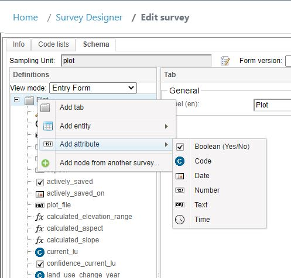

Le formulaire d'attribut de code s'affiche dans la colonne de droite. Dans le champ Nom, tapez "current_land_cover", notez que vous ne pouvez pas mettre de chiffres au début de ce champ. Ajoutez un libellé dans la section "Label" tel que "Current Land Cover" et ensuite ajoutez une description dans la section "Tooltip text" tel que "2020 land cover classes". Ensuite, pour la liste de codes, sélectionnez votre liste de codes "land_cover". Par défaut, la question de l'enquête sera obligatoire. Laissez ce paramètre par défaut. Vous pouvez ajouter un texte d'info-bulle, tel que "Quelle est l'occupation du sol en 2020 ?"

Nous allons maintenant répéter cette opération pour la liste des codes de changement de l'occupation du sol. Créez un autre attribut Code. Dans le champ Nom, tapez "land_cover_change", ajoutez une description et sélectionnez la liste de codes "land_cover_change_yr". Ajoutez une info-bulle, par exemple "Pas de changement ou indiquer l'année du changement".

Maintenant, nous allons ajouter une question d'enquête de confiance. Ajoutez un autre attribut Code. Dans le champ Nom, tapez "current_confidence", ajoutez une description et sélectionnez la liste de codes "confidence". Ajoutez le texte de l'info-bulle, par exemple "Quel est le degré de confiance concernant la couverture terrestre actuelle/le changement de couverture terrestre ?".

N'oubliez pas de sauver votre travail.

Pour les parcelles où il y a un changement de couverture du sol, nous devons ajouter une question demandant quel était le précédent changement de couverture du sol. Créez un autre attribut Code. Dans le champ Nom, tapez "previous_land_cover" et ajoutez une description pour indiquer qu'il s'agit du pas de temps précédent. Sélectionnez la liste de codes "land_cover". 

Nous voulons que cette question n'apparaisse que lorsqu'un changement de couverture terrestre s'est produit. A côté de "Relevant", cliquez sur "Only when expression is verified". Dans la boîte de fonction, tapez `land_cover_change != 'no_change'`. Si vous voulez en savoir plus sur ces fonctions, cliquez sur l'icône de fonction à droite de la zone de texte. Nous voulons masquer cette question lorsqu'elle n'est pas pertinente, alors cliquez également sur "Masquer lorsqu'elle n'est pas pertinente". Cela signifie que la question n'apparaîtra PAS si la question sur l'année de changement de la couverture terrestre est indiquée comme "Aucun changement", car s'il n'y a pas eu de changement, il n'est pas nécessaire d'identifier la couverture terrestre précédente. 

Nous voulons également ajouter une règle de validation à cette question. Nous voulons créer une erreur si les l'occupation du sol actuelle et précédente sont les mêmes, car cela signifie qu'il n'y a pas de changement. Faites défiler vers le bas et développez les “Checks (Validation Rules)”.  Cliquez sur le bouton plus vert et sélectionnez " Custom ". 

Pour cette étude, ajoutez jusqu'à trois pas de temps. Cela signifie qu'il faut ajouter des listes de codes supplémentaires ("land_cover_change2" et "land_cover_change3") avec les années de changement de la couverture végétale et créer des règles de validation supplémentaires pour chacune de ces listes de codes. 

Un aperçu des questions de l'enquête peut être vu en cliquant sur "Preview" en bas à droite de la page. N'oubliez pas de continuer à sauvegarder votre travail en bas de la page. 

### 3.3 Ajouter une grille d'échantillonnage à Collect

Collect a besoin d'une grille d'échantillonnage qui définit où nous allons collecter les données que nous venons de créer. 
Nous présentons ici deux options :

1. importer un plan d'échantillonnage existant, (vous pouvez utiliser celui qui est créé dans les tutoriels ici sur OpenMRV sous le processus " Collecte de données d'échantillon " et les outils " QGIS ", " AREA2 ", et " GEE ". Un exemple est disponible [ici](https://drive.google.com/file/d/1D56RnNziNVROjeGro1uwvJAH1DCQceck/view?usp=sharing)).
2. créer et importer une grille d'échantillonnage à l'aide du générateur de grille de Google Earth Engine.

#### 3.3.1  Importer un plan d'échantillonnage déjà constitué.

Avant d'importer un plan d'échantillonnage existant, vous devez vérifier que le fichier csv est correctement formaté. 

Le fichier csv doit contenir les catégories suivantes dans l'ordre suivant :

*  colonnes levelX_code : 1 colonne pour chaque niveau X (maximum 3 niveaux, par exemple si vous avez 2 niveaux, cluster et plot, vous aurez une colonne "level1_code" avec la valeur d'id du cluster et une colonne "level2_code" pour la valeur d'id du plot) ;
*  x: easting, ans les mêmes paramètres des systèmes de référence de coordonnées de l'enquête ;
*  y: northing, dans les mêmes paramètres de systèmes de référence de coordonnées de l'enquête 
*  srs_id: id du système de référence des coordonnées, le même que celui utilisé dans les paramètres des systèmes de référence des coordonnées de l'enquête ; et
*  Toute colonne supplémentaire (jusqu'à un maximum de 10) peut être ajoutée au fichier csv afin d'enregistrer des informations supplémentaires liées aux points d'échantillonnage (par exemple, la pente, les unités administratives, etc.)

Pour vérifier que la structure de votre fichier csv correspond à celle requise pour l'enquête Collect, vous pouvez télécharger un fichier de démonstration. Ce fichier du format csv de Collect se trouve dans l'Open Foris Collect Survey Designer. Pour trouver ce fichier de démonstration :

1. Allez sur votre page  “Edit survey” 
2. Assurez-vous d'être sur l'onglet  “Info” 
3. Accédez à la section “Attached Files” 
4. Cliquez sur le bouton vert “Add” en forme de signe plus, et une fenêtre “Survey file” apparaîtra.
5. Sélectionnez “Grid” idans le menu déroulant “Type” et un bouton à gauche de celui-ci indiquant  “Download template” apparaîtra
6. Cliquez sur “Download template” pour télécharger le fichier csv de démonstration afin de savoir comment adapter le fichier csv de la grille générée à la structure de l'enquête Collect.

Une fois que vous êtes sûr que la structure correspond, votre fichier csv de grille généré sera prêt à être utilisé dans le Collect Survey Designer.

Pour importer un plan d'échantillonnage existant, accédez à l'onglet "Info". Dans l'onglet "Info" de votre éditeur d'enquête, allez dans la section “Attached Files” et cliquez sur le bouton vert d'ajout pour joindre votre fichier de grille csv. Si votre fichier est trop volumineux, vous devrez peut-être le diviser en plusieurs fichiers. 

#### 3.3.2 Création d'une grille d'échantillonnage pour Collect Earth à l'aide du générateur de grille dans Google Earth Engine

Le générateur de grille est une application Google Earth Engine créée avec l'éditeur de code de Google Earth Engine. Cet outil vous permet de concevoir et de générer une grille pour votre projet Collect Earth. 

*NOTE: il existe également des vidéos YouTube qui montrent comment générer une grille sur le bureau de Collect Earth, que vous pouvez trouver ici : [Lien Video Youtube](https://www.youtube.com/channel/UCxu8NZPvPxGBjBp0g6LCV4w)*

Pour accéder au générateur de grilles du moteur Google Earth, visitez ce site web ([Lien Gnerateur de Grille](http://www.openforis.org/tools/collect-earth/tutorials/grid-generation-through-google-earth-engine.html)) et cliquez sur "Generated Grid through GEE". Ce site Web contient également d'autres guides qui peuvent être utiles pour l'utilisation de cette application. 

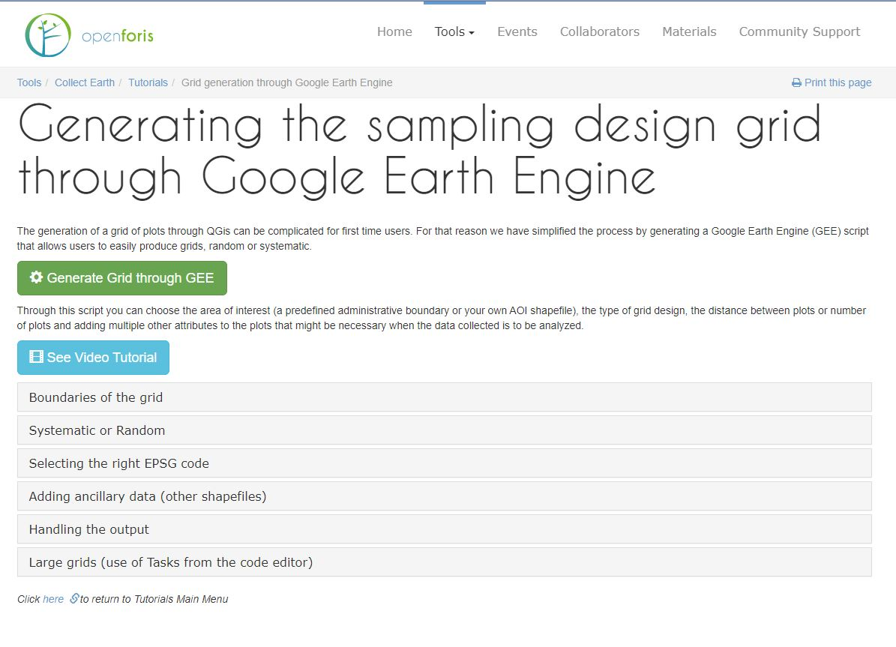

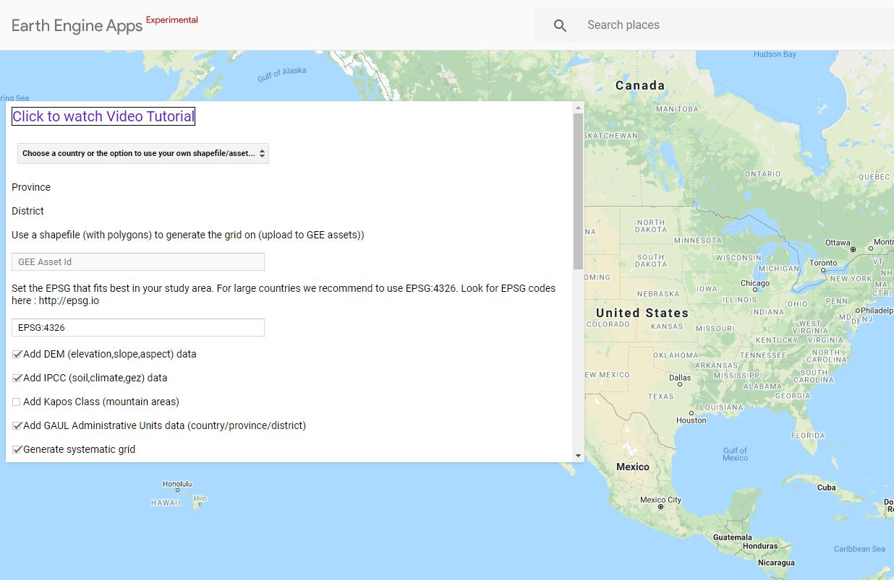

Le générateur de grille du moteur Google Earth offre différentes façons de générer une grille : vous pouvez utiliser une couche vectorielle en chargeant un shapefile dans les ressources GEE et en utilisant son ID de GEE, sélectionner manuellement la zone à l'aide de l'outil de dessin polygone/rectangle, ou sélectionner un pays dans la liste. Dans ce cas, nous allons sélectionner le pays de la Colombie. 

Pour sélectionner la Colombie, naviguez jusqu'au menu déroulant qui dit "Choose a country or the option to use your own shapefile/asset" sur le côté gauche de l'écran en haut de la fenêtre du générateur de grille. Une fois que vous avez ouvert le menu déroulant, faites défiler jusqu'a la Colombie et sélectionnez-le. Une fois la sélection effectuée, l'arrière-plan de la carte Google change et affiche l'emplacement du pays. La Colombie présente une représentation diversifiée des types de forêts, de la topographie et de la couverture des nuages, ainsi qu'un taux de déforestation très faible par rapport à la superficie du pays. 

Ensuite, vous devez définir le code EPSG pour le système de coordonnées qui correspond le mieux à votre zone d'étude. Les codes EPSG sont un registre public de données géodésiques que la plupart des systèmes d'information géographique utilisent pour identifier les systèmes de référence des coordonnées. Pour les pays proches de l'équateur, vous pouvez utiliser le code EPSG pré-rempli (EPSG:4326). EPSG:4326 est un code EPSG courant qui fait référence au système de coordonnées latitude/longitude basé sur le centre de masse de la Terre. L'utilisation d'un code EPSG dans ce cas pour Collect permet une projection précise de votre emplacement choisi sur les différentes plates-formes utilisées dans ce processus. Le Grid Generator recommande d'utiliser le code EPSG:4326 prérempli pour les grands pays. Nous pouvons donc le conserver puisque la Colombie est un pays assez grand. Avec ce système de coordonnées, la distance longitudinale entre les parcelles change au fur et à mesure que l'on s'éloigne de l'équateur. Vous pouvez visiter epsg.io pour trouver les codes EPSG.

Vous pouvez également ajouter différentes données aux parcelles de la grille que vous allez générer. Par exemple, vous pouvez ajouter les données des unités administratives GAUL qui comprennent le pays, la province et le district, vous pouvez ajouter les données du modèle numérique d'élévation (DEM) qui comprennent l'élévation, la pente et l'aspect, ou vous pouvez ajouter les données du GIEC spécifiques aux inventaires de gaz à effet de serre qui comprennent des données sur le sol, le climat et autres. Grâce à ces données, vous pouvez améliorer les informations contenues dans la grille qui sera utilisée pendant la phase d'analyse de la collecte de données avec Collect Earth. Pour ce projet, nous allons ajouter les données du GIEC à la grille que nous générons. Pour ce faire, assurez-vous de cocher la case à côté de " Add IPCC (soil,climate,gez) data ".

Ensuite, vous devrez définir le type de grille que vous souhaitez générer. Vous pouvez générer une grille systématique ou vous pouvez générer une grille aléatoire. Si vous générez une grille systématique, vous définissez la distance entre les parcelles en mètres ; cela dépendra de la taille finale de votre grille. Le Grid Generator recommande généralement une distance supérieure à 500 mètres pour une grille systématique. Dans une grille aléatoire, vous définissez le nombre de placettes qui doivent être générées dans la grille. 

Dans ce cas, nous allons générer une grille systématique avec une distance de 6000 m entre les parcelles. Pour ce faire, assurez-vous de cocher la case à côté de "Generate systematic grid" et tapez "6000" dans la zone de texte sous "Set the distance in meters of the systematic grid". 

Enfin, vous pouvez ajouter des colonnes au fichier .csv de la grille générée à partir d'autres fichiers de forme. Ceci est utile si vous voulez des informations auxiliaires sur la grille pour une utilisation ultérieure dans l'analyse. Les fichiers de forme doivent être téléchargés vers Google Earth Engine en tant qu'actifs et cette option ajoutera toutes les propriétés des polygones à la parcelle d'intersection. Dans cet exercice, nous n'utiliserons pas cette fonctionnalité. 

Après avoir tout défini, cliquez sur "Generate grid" en bas et la grille sera générée. Une fois que vous aurez cliqué sur ce bouton, une nouvelle fenêtre apparaîtra en haut à droite de la page. Cliquez ensuite sur "CLICK TO DOWNLOAD GRID" pour télécharger le fichier csv généré. Vous pouvez également télécharger les données pour le pays ou les provinces uniquement, et si les données sont trop volumineuses, vous pouvez générer la grille via l'éditeur de code de Google Earth Engine. 

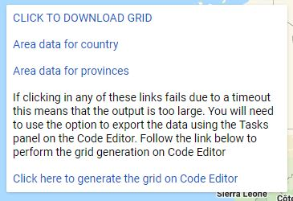

Ensuite, la structure du fichier csv devra être adaptée à la structure de l'enquête Collect. Un fichier de démonstration du format csv de Collect se trouve dans le Open Foris Collect Survey Designer. Pour trouver ce fichier de démonstration :

1. Allez sur votre page “Edit survey” 
2. Assurez-vous d'être sur l'onglet “Info”
3. Accédez à la section “Attached Files” 
4. Cliquez sur le bouton vert “Add” en forme de signe plus, et une fenêtre “Survey file” apparaîtra.
5. Sélectionnez “Grid” idans le menu déroulant “Type” et un bouton à gauche de celui-ci indiquant  “Download template” apparaîtra
6. Cliquez sur “Download template” pour télécharger le fichier csv de démonstration afin de savoir comment adapter le fichier csv de la grille générée à la structure de  Collect survey

Dans le fichier csv de démonstration, les colonnes sont intitulées "id", "YCoordinate", "XCoordinate", "elevation", "slope", et "aspect". 

Dans la grille générée pour la Colombie, vous pouvez voir que les colonnes sont libellées différemment. Vous allez maintenant devoir modifier votre grille générée pour qu'elle corresponde à la structure de l'enquête Collect survey. Pour ce faire, vous devez : 

1. Déplacer la colonne   “system:index” qui devient la colonne A et renommer le label "id". Ce sera votre identification pour chaque point. 
2. Ensuite, déplacez la colonne “latitude” pour qu'elle devienne la colonne B et renommez-la en "YCoordinate". 
3. Déplacez la colonne “longitude” cen colonne C et renommez-la en  “XCoordinate”. 
4. Déplacez la colonne “elevation”pour en faire la colonne D. 
5. Déplacer la colonne “slope” pour en faire la colonne E. 
6. Et enfin, placez la colonne  “aspect” sur la colonne F. 

Vous pouvez réorganiser ou supprimer le reste des colonnes selon vos préférences, tant que les colonnes de A à F ont le même format que le fichier csv de démonstration. Une fois que vous êtes sûr que la structure correspond, votre fichier csv de grille généré sera prêt à être utilisé dans le Collect Survey Designer.

Dans l'onglet  “Info”  de votre éditeur de survey, allez dans la section “Attached Files” et cliquez sur le bouton vert d'ajout pour joindre votre fichier de grille csv. 

Si votre fichier contient plus de 4000 points, il sera trop volumineux pour être téléchargé. Vous devrez donc le diviser en plusieurs fichiers CSV. Pour ce faire, ouvrez Collect Earth, allez dans le menu déroulant “Tools” du panneau de configuration, cliquez sur  “Utilities” puis sur  “Divide large CSV plot files”. À partir de là, vous pouvez diviser votre gros fichier CSV et le préparer pour l'importer dans Collect Survey Designer.

Maintenant que vous avez répondu aux questions de votre étude et joint les fichiers de grille pour indiquer l'emplacement de votre collecte de données, vous pouvez maintenant exporter et partager votre étude Collect Earth, ce qui est décrit dans la section suivante. 

### 3.4 Exportez et partagez votre étude sur Collect Earth 

Pour partager votre étude  sur Collect Earth, allez dans la “List of surveys” et cliquez sur “Export”. Il existe plusieurs façons d'exporter. Par exemple, si vous voulez utiliser les données dans  Collect Earth, vous devez changer le mode d'exportation pour  “Collect Earth”. ISi vous souhaitez créer une sauvegarde de l'information, sélectionnez   “Collect Desktop (backup)” comme mode d'exportation. 

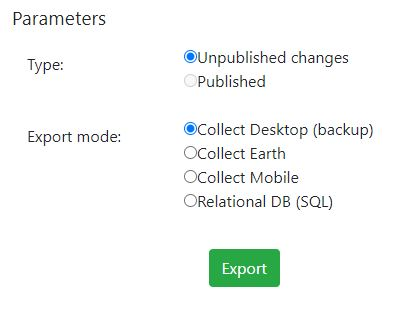

Pour cet exercice, cliquez sur “Export”, choisissez le type “Unpublished changes” isi vous n'avez pas encore publié votre étude. Utilisez le mode d'exportation  “Collect Earth,” et choisissez la langue de votre questionnaire. Les options linguistiques comprennent l'anglais, l'espagnol et le français. 

Le fichier exporté sera ensuite téléchargé sous forme de fichier .cep à l'emplacement que vous avez indiqué. Il peut ensuite être partagé et s'ouvrira directement dans Collect Earth si vous l'avez déjà téléchargé. 

### 3.5  Téléchargez et lancez Collect EarthDownload and launch Collect Earth

Vous pouvez télécharger Collect Earth sur le site Web d'Open Foris. Visitez le site [Lien site web](http://www.openforis.org/tools/collect-earth.html) .Téléchargez la dernière version, puis sélectionnez la version appropriée pour votre système d'exploitation. Installez en fonction de votre système d'exploitation. Les instructions d'installation se trouvent à l'adresse suivante  [Lien de l'adresse Web](http://www.openforis.org/tools/collect-earth/tutorials/installation.html).

Lancez Collect Earth en cliquant sur le raccourci ou en vous rendant dans le dossier Collect Earth et en double-cliquant sur le fichier batch intitulé  **CollectEarth-launcher.exe**. 

In the main Collect Earth window, set your operator name. When you run Collect Earth you need to Dans la fenêtre principale de Collect Earth, définissez votre nom d'opérateur. Lorsque vous exécutez Collect Earth, vous devez définir votre nom d'opérateur, ce qui vous permet de filtrer ultérieurement les données recueillies par la personne (opérateur) qui a recueilli les données. Il vous suffit d'inscrire votre nom ou tout autre moyen de vous identifier dans le champ de texte. Ensuite, cliquez sur mettre à jour. N'oubliez pas d'utiliser un nom d'opérateur cohérent, comportant entre 6 et 50 caractères.

Collect Earth lancera automatiquement Google Earth. Collect Earth et Google Earth constituent un moyen facile d'examiner systématiquement les images satellite et d'évaluer l'utilisation des terres

### 3.6 Collecter des données

*NOTE: En plus de ces documents, il existe également des vidéos YouTube qui montrent comment collecter des données dans Collect Earth desktop, que vous trouverez ici: [Lien Video](https://www.youtube.com/channel/UCxu8NZPvPxGBjBp0g6LCV4w)*

Dans la fenêtre principale de Collect Earth, naviguez vers  “File” et cliquez sur  “Import CEP file” pour importer une étude de collecte de données réalisée précédemment. Localisez le questionnaire que vous venez d'exporter de l'application Collect.

Une fois que votre fichier .cep s'ouvre dans Google Earth Pro, cliquez sur un point dans la fenêtre de droite et la carte naviguera jusqu'au point. Cliquez ensuite sur le point réel sur la carte. Les questions de l'enquête s'afficheront en plus des cartes dans votre navigateur qui ont été choisies précédemment lors de la conception du questionnaire. 

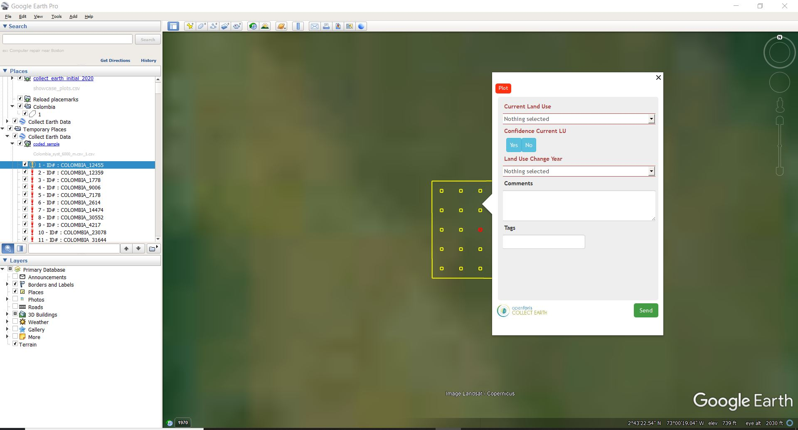

Dans ce cas, Collect Earth Plot Imagery and Statistics, NICFI Planet basemaps, et Earth Map s'ouvrent automatiquement dans votre navigateur. Connectez-vous à ces cartes en conséquence et utilisez ces cartes pour répondre aux questions de votre étude. Les cartes de base Planet de NICFI s'ouvrent automatiquement. Earth Map vous permettra de vous connecter ou de continuer en tant qu'invité. Il n'est pas nécessaire d'avoir un compte pour ces sites. Ces cartes vous aideront à mieux comprendre les changements survenus dans les occupations du sol pour ce point particulier de la placette. int. 

Pour analyser une placette, utilisez les cartes qui s'affichent et les données correspondantes pour déterminer l'utilisation actuelle des sols et les changements qui ont pu s'y produire. 

Par exemple, nous analysons ici la parcelle numéro COLOMBIA_1778. 

Après avoir examiné l'imagerie plus en détail, en utilisant les cartes additionnelles, vous pouvez conclure que cette zone possède un mélange d'espèces d'arbres. Dans le menu déroulant  “Current Land Use” vous pouvez alors choisi  “TREES: Mixed”. La question  “Confidence Current LU” yes or no veut savoir si vous êtes confiant dans votre choix d'utilisation du sol. Dans ce cas, nous pouvons choisir  “Yes” parce que nous sommes assez sûrs que cette image montre un mélange d'espèces d'arbres. 

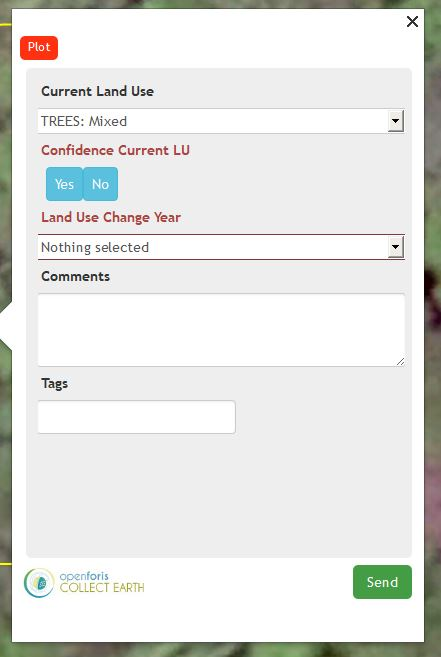

Si vous regardez la fenêtre de Earth Map et que vous examinez les données, vous pouvez voir qu'il n'y a pas eu de changement dans les occupations des sols au cours des années, donc dans le menu déroulant   “Land Use Change Year” vous pouvez choisir   “There has been no change in Land Use in the previous years”

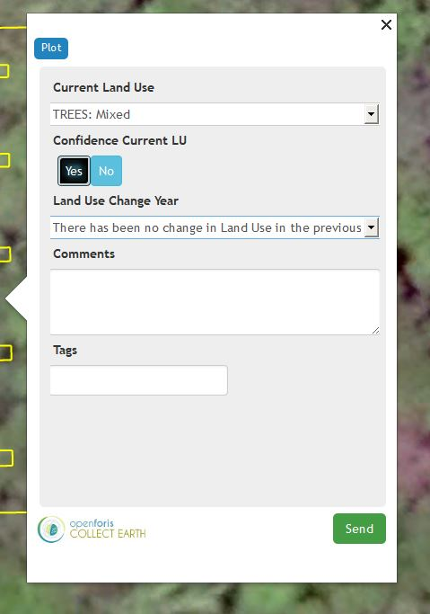

Comme vous pouvez le voir, une fois que vous avez répondu aux questions requises, le titre passe du rouge au noir. Vous pouvez également inclure des commentaires ou des balises s'il y a des informations supplémentaires que vous souhaitez inclure lors de votre collecte de données. Une fois que vous avez terminé de remplir le formulaire, cliquez sur “Send” idans le coin inférieur droit de la fenêtre pop-up. Vous verrez alors que vos données ont été sauvegardées et que la placette dans la liste des placettes de droite est maintenant cochée en vert. Lorsque vous cliquez sur  “Ok” l'application vous fait passer à la placette suivante. 

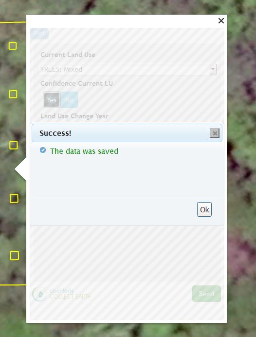

Continuez avec le reste des points  de cette façon. Vous aurez terminé votre inventaire lorsque la liste de droite comportera une coche verte à côté de chaque placette. 

#### Astuces pour l'interprétation des images

* Des problèmes de saisonnalité peuvent survenir lorsque différentes utilisations du sol semblent différentes selon les saisons. Par exemple, une prairie peut être d'un vert vif au printemps, mais paraître brune en été. Si vous ne voyez que l'image brune, vous pourriez penser que le brun est de la terre et classer à tort la prairie comme de la terre stérile.
* Le zoom avant et arrière pour recueillir des indices contextuels du paysage est important pour plusieurs types d'utilisation et de la surface du sol. Par exemple :
- L'eau des grands plans d'eau apparaît souvent noire ou sombre jusqu'à ce que vous fassiez un dézoom.
- Les plantations d'arbres peuvent ressembler à des forêts jusqu'à ce que vous fassiez un zoom arrière pour voir le motif régulier des arbres plantés.

### 3.7 Exportez vos données  

Lorsque vous avez terminé votre collecte de données et que vous voulez exporter vos données Collect Earth, allez à votre fenêtre principale Collect Earth et cliquez sur “Data Import/Export” dans le menu Tools menu. Vous pouvez alors exporter votre fichier au format CSV, XML, Collect Backup ou Fusion Table. Nommez et sauvez votre fichier. 

Le fichier CSV, qui peut être ouvert dans Excel, présente sous forme de tableau toutes les données qui ont été saisies dans Collect Earth, y compris celles qui n'ont pas été activement sauvegardées et validées. Certaines métadonnées sont également fournies, comme les coordonnées de la parcelle et le nom de l'opérateur. L'exportation de données vers Fusion Table génère également un fichier CSV, mais il diffère de l'exportation CSV normale en ce qu'il contient une colonne supplémentaire avec les coordonnées complètes de chaque parcelle. Le format XML est le seul qui soit configuré pour enregistrer les métadonnées de Collect Earth en plus des données saisies manuellement par les utilisateurs. 

## 4 Foire aux questions

**Quand dois-je utiliser  le CE?**

Utilisez-le lorsque vous voulez travailler hors ligne (CE), et si vous avez besoin de plus de possibilités d'exportation de données que le sous le format .csv (CE).

**Comment installer CE ?**

Naviguez vers http://www.openforis.org/tools/collect.html. Vous pouvez y télécharger l'application  “Collect” en cliquant sur  “Download last version” et en sélectionnant la bonne version.Téléchargez et installez Collect sur votre ordinateur. Si nécessaire, veuillez consulter l'aide à l'installation disponible à l'adresse   http://www.openforis.org/tools/collect/tutorials/installation.html.

**Quelles sont les règles pour nommer mon étude?**

Votre titre doit être tout en minuscules, sans espace. L'outil convertit automatiquement les majuscules en minuscules et les espaces en caractères de soulignement (_).

**À quelle fréquence devrais-je sauvegarder mon projet?**

Chaque fois que vous apportez un changement qui affecte votre enquête, pensez à sauvegarder. Vous pouvez également sauvegarder toutes les quelques minutes lorsque vous travaillez activement.

**Si ma session se termine, comment puis-je revenir à ma fenêtre d'enquête ?**

Si votre session se termine ou si vous fermez accidentellement la fenêtre, vous pouvez revenir à la fenêtre d'édition de l'enquête en cliquant sur  Survey Designer -> List of surveys -> click on the name of your survey -> Edit survey.

**Existe-t-il des règles pour les noms des listes de codes?**

Le nom de toute liste de codes que vous créez DOIT être tout en minuscules et sans espace. 

**Existe-t-il des règles pour l'importation d'un plan d'échantillonnage existant ?**

Le fichier csv doit contenir les catégories suivantes dans l'ordre suivant :

- levelX_code columns: 1 colonne pour chaque level X (maximum 3 levels, par exemple  si vous avez 2  levels, cluster et  plot, vous aurez une colonne  "level1_code" avec la valeur de l' id du cluster et une colonne "level2_code" pour la valeur de l'id du plot);
- x: easting,en utilisant les mêmes configurations de systèmes de référence de coordonnées de l'enquête ;
- y: northing, en utilisant les mêmes configurations de systèmes de référence de coordonnées de l'enquête ;
- srs_id: l'identifiant du système de référence des coordonnées, le même que celui utilisé dans les configurations des systèmes de référence des coordonnées de l'enquête ; et
- Des colonnes supplémentaires (jusqu'à un maximum de 10) peuvent être ajoutées au fichier csv afin d'enregistrer des informations complémentaires relatives aux points d'échantillonnage (par exemple, la pente, les unités administratives, etc.)

**Quels sont les astuces d'interprétation des images?**

Voici quelques astuces pour l'interprétation des images :

- Les problèmes de saisonnalité peuvent survenir lorsque différentes utilisations du sol semblent différentes selon les saisons. Par exemple, une prairie peut être d'un vert vif au printemps, mais paraître brune en été. Si vous ne voyez que l'image brune, vous pourriez penser que le brun est de la terre et classer à tort la prairie comme de la terre aride.
- Il est important de faire des zooms avant et arrière pour recueillir des indices contextuels du paysage pour plusieurs types d'utilisation et de couverture des sols. Par exemple :
  - L'eau des grands plans d'eau apparaît souvent noire ou sombre jusqu'à ce que vous fassiez un zoom arrière.
  - Les plantations d'arbres peuvent ressembler à des forêts jusqu'à ce que vous fassiez un zoom arrière pour voir le motif régulier des arbres plantés.

**Où puis-je trouver de l'aide supplémentaire?**

Pour obtenir une aide supplémentaire sur l'utilisation de Collect Earth, rendez-vous sur openforis.org et cliquez sur "Community Support" dans la barre de navigation supérieure.

## 5 Terminologie relative aux techniques d'échantillonnage

Une liste de termes relatifs aux techniques d'échantillonnage et d'inférence est fournie dans la documentation d'AREA2 : https://area2.readthedocs.io/en/latest/definitions.html Vous trouverez ci-dessous quelques termes supplémentaires qui ne figurent pas dans la documentation d'AREA2.

### 5.1 Plan de réponse

Défini par (Stehman and Czaplewski, 1998): “La référence ou classe réelle est obtenue pour chaque unité d'échantillonnage sur la base de l'interprétation de photographies aériennes ou de vidéographies, d'une observation au sol ou d'une combinaison de ces sources. Les méthodes utilisées pour déterminer cette référence de classification sont appelées "plan de réponse". Le plan d'intervention comprend les procédures de collecte des informations relatives à la détermination de la occupation du sol de référence, et les règles d'attribution d'une ou plusieurs [labels] de référence à chaque unité d'échantillonnage.” Connu sous le nom de “plan de mesure” par Särndal et al. (1992).

### 5.2 Echantillon

Un sous-ensemble de la population sélectionné parmi les unités de la population.

### 5.3 Plan d'échantillonnage

Synonyme de plan d'échantillonnage (Sampling Design), qui est le terme préféré dans la littérature de référence (Cochran, 1977, Särndal et al., 1992). Le terme apparaît chez Rice (1995) ui utilise à la fois “plan d'echantillonnage” et “plan d'echantillon”.

### 5.4 Plan d'échantillonnage

“Le concept de plan d'échantillonnage (sampling design ) est le protocole par lequel les unités de référence de l'échantillon sont sélectionnées” (Stehman and Czaplewski, 1998). Le terme “Sampling design” est également utilisé par Cochran (1977) and Särndal et al. (1992) -- Le premier utilise également “sampling plan”.
Des tutoriels traitant du plan d'échantillonnage peuvent être trouvés ici sur OpenMRV sous le processus "Plan d'échantillonnage".

### 5.5 Sondage/Enquêtee

Särndal et al. (1992) définissent une enquête comme une “investigation partielle d'une population finie”, et précisent que “les concepts d ‘enquête’ et ‘enquête par sondage’ sont utilisés pour désigner des enquêtes statistiques présentant les caractéristiques méthodologiques suivantes: [...] échantillonnage aléatoire [...] plan de mesure [et] estimation”. de facon plus precise une enquete par sondage ou un sondage est une enquête effectuee sur une partie de la population. Cette fraction de la population constitue l'échantillon et les méthodes qui permettent de construire cet echantillon s'appellent méthode d'échantillonnage.

### 5.6 Plan d'enquête

UN “plan de sondage total” définit les procédures pour “obtenir la plus grande précision possible dans les estimations de l'enquête tout en trouvant un équilibre entre les erreurs d'échantillonnage et les erreurs non dues à l'échantillonnage [...] Le plan de sondage donne lieu à des opérations d'enquête” sélection de l'échantillon (Särndal et al., 1992). Lohr (1999) décrit un plan de sondage total comme “Une philosophie de conception d'enquête visant à minimiser les erreurs de non-échantillonnage ainsi que les erreurs d'échantillonnage..” De plus, dans Lohr (1999) “plan d'enquête” est synonyme de plan d'échantillonnage.

### 5.7 Données de référence

Données caractérisant l'évaluation la plus précise possible de la condition réelle à l'emplacement de l'échantillon (exemple : imagerie satellite à haute résolution).

### 5.8 Les observations de référence 

L'évaluation la plus exacte possible de l'état réel d'une unité de population.

### 5.9 Référence classification 

La classification de référence appliquée à la collection de toutes les unités d'échantillonnage.

## 6 Références

Cochran, W.G., 1977. *Sampling Techniques*, John Wiley & Sons, New York, NY.

Lohr, S.L., 1999. *Sampling: Design And Analysis,* CRC Press.

Olofsson, P., Foody, G.M., Herold, M., Stehman, S.V., Woodcock, C.E. and Wulder, M.A., 2014. Good practices for estimating area and assessing accuracy of land change. Remote Sensing of Environment, 148, pp.42-57. https://doi.org/10.1016/j.rse.2014.02.015

Rice, J.A., 1995. *Mathematical Statistics and Data Analysis* (2nd ed.), Duxbury Press, Belmont, CA.

Särndal, C.E., Svensson, B.H., & Wretman, J.H., 1992. *Model assisted survey sampling*, Springer Science & Business Media, New York, NY.

Stehman, S.V., & Czaplewski, R.L., 1998. Design and analysis for thematic map accuracy assessment: fundamental principles. *Remote Sensing of Environment*, 64(3), 331-344. https://doi.org/10.1016/S0034-4257(98)00010-8

-----

 

Ce travail est autorisé sous une licence  [Creative Commons Attribution 3.0 IGO](https://creativecommons.org/licenses/by/3.0/igo/) 

Copyright 2021, World Bank 

Ce travail a été développé par Justine Bui et Karen Dyson dans le cadre d'un contrat de la Banque mondiale avec GRH Consulting, LLC pour le développement de nouvelles ressources - et la collecte de ressources existantes - liées à la mesure, la notification et la vérification pour soutenir la mise en œuvre du MRV dans les pays. 

Matériel révisé par :   
Ana Mirian Villalobos, El Salvador, Ministry of Environment and Natural Resources  
Carole Andrianirina, Madagascar, National Coordination Bureau REDD+ (BNCCREDD)  
Jennifer Juliana Escamilla Valdez, El Salvador, Ministry of Environment and Natural Resources   
Phoebe Oduor, Kenya, Regional Centre For Mapping Of Resources For Development (RCMRD)   
Tatiana Nana, Cameroon, REDD+ Technical Secretariat 

Attribution   
Bui, J., Dyson, K. 2021. Response Design in Collect Earth Desktop. © World Bank. License:  [Creative Commons Attribution license (CC BY 3.0 IGO)](http://creativecommons.org/licenses/by/3.0/igo/)  

